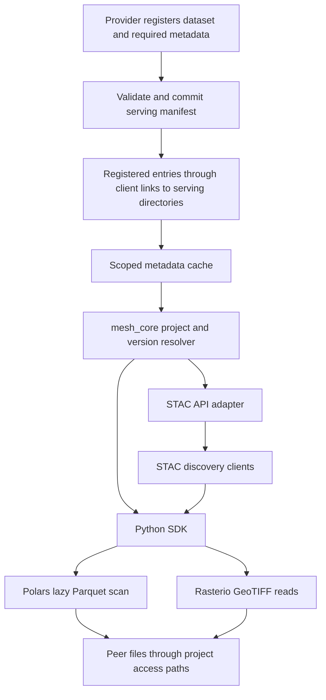

# Feather Mesh programmatic peer data access

Assessment and design proposal: **2026-09-19**. This document builds on [map.md](map.md), the current Rust implementation, and the user's clarified priorities: **Python notebooks and HPC jobs**, accessing peer data through symbolic links inside a project directory; **STAC for TIFF-based raster discovery/access**, and **Polars for tabular products restricted to Parquet**. Proposed APIs and commands below do not exist yet.

**Confirmed publication model:** a client project's peer symlink points to a specific **serving directory inside a provider's project**. The provider must explicitly register each dataset with the required metadata before Feather Mesh recognizes it. File presence in that directory alone does not publish a dataset. Provider and client are roles in a sharing relationship; a project can perform both roles.

For implementation, follow [AGENTS.md](AGENTS.md), the [workplan](data_access_implementation_workplan.md), and the [shared peer-access skill](.codex/skills/feam-peer-data-access/SKILL.md). Explicit user instructions take precedence. Confirmed requirements here govern over proposed defaults; once P0 creates `docs/data_access_contract.md`, use it for settled schema/API and migration decisions. Current source behavior and older PDDs/plans are not substitutes for this feature contract.

## 1. Recommended direction

Make Feather Mesh responsible for discovering a permitted peer product, resolving a pinned version into usable project-local paths, and supplying its metadata. Let established libraries read the actual data:

- **Raster:** STAC describes and discovers raster assets; Rasterio/GDAL opens their GeoTIFF files through the project symlink.
- **Table:** Feather Mesh resolves a version's Parquet files; Polars scans them directly and returns a lazy query that the notebook/job can extend.
- **Shared foundation:** both use the same project context, namespace visibility, version identity, asset resolver, and provenance information.

STAC API and Polars play different roles. STAC API is an HTTP interface for discovering catalog objects and their asset links; it does not itself read pixels or perform raster analysis. Polars is a dataframe/query library that reads the table bytes. The raster counterpart to Polars' data-reading role is Rasterio or another raster library. [STAC API overview](https://github.com/radiantearth/stac-api-spec/blob/main/overview.md), [Rasterio reading guide](https://rasterio.readthedocs.io/en/stable/quickstart.html).

**Direct reads should be a first-class access mode for these workflows.** A user should not need to copy an entire raster or table before querying it. Keep managed copy as an explicit staging operation when a job needs a private snapshot or different storage locality. This extends the existing product documentation, which centers consumption on copying.

## 2. Serving directory and provider registration

The serving directory is the provider's publication boundary. An illustrative layout is:

```text
client-project/
├── .feam/
│   ├── project.toml           # namespace and peer-root configuration
│   └── catalog-reference     # identifies the derived cache location
├── peers/
│   └── climate -> /hpc/projects/provider-project/serving/
├── notebooks/
└── outputs/

/hpc/projects/provider-project/
├── notebooks/
├── working-data/
└── serving/
    ├── manifest.json         # provider-registered datasets and versions
    ├── stac/                 # derived from registered raster records
    ├── datasets/
    │   ├── temperature/v1/temperature.tiff
    │   └── observations/v3/
    │       ├── part-000.parquet
    │       └── part-001.parquet
    └── draft.tiff            # unregistered: absent from Feather Mesh discovery
```

The filenames and manifest format are proposals; the link-to-serving-directory relationship and provider registration requirement are confirmed. Data remains provider-owned. This layout exposes assets beneath the serving root. If providers expose further symlinks to their storage, those nested links need a defined resolution policy too.

The client-visible file is, for example, `client-project/peers/climate/datasets/temperature/v1/temperature.tiff`. Python libraries can read filesystem paths through symlinks using the job's existing permissions. Feather Mesh supplies the registered identity, version, and reuse context needed to select that file without asking the provider for its location or interpretation.

Use a namespace-qualified product reference such as `product://climate/observations` plus a separate version `v3`. Record the provider namespace in the registration rather than inferring it solely from the client's symlink name. Store asset paths relative to the provider's serving root, then resolve them against the client's configured peer link. Preserve the provider's original path separately when needed for provenance. This avoids treating a provider's absolute path as universally valid for every client.

Symbolic links do not grant filesystem permissions by themselves. Feather Mesh should restrict its discovery and resolution to configured peers, while the operating system enforces actual file access. Such application scoping does not prevent someone from opening an otherwise permitted filesystem path outside Feather Mesh.

### Registration is the discovery gate

The provider workflow should be:

1. Prepare a complete dataset version in the serving directory's supported asset layout.
2. Run a Feather Mesh registration/publication operation with the dataset identity and required reuse metadata. The existing `serve` command is the natural CLI entry point to extend.
3. Validate the supplied metadata, dataset format, declared files, and format-specific descriptors. Automatically extract technical fields where possible.
4. Atomically commit the validated dataset/version record to the provider's authoritative serving manifest. Failed registration must leave no discoverable partial entry.
5. Make that record available to clients when they refresh through their link to this serving directory. Generate STAC records and table descriptors from the registered record.

Clients enumerate **registered manifest entries**, not every TIFF or Parquet file they can find. A directory scan may assist a provider in preparing a registration, but must not silently publish files. Adding another Parquet shard or TIFF to the directory must not silently alter an already registered version's asset list.

The same gate applies to all Feather Mesh entry points: STAC search, table discovery, the Python resolver, and CLI inspection. An explicit request to resolve an unregistered path should return “dataset not registered,” even if that path happens to be readable through the symlink. External tools can still open files directly when filesystem permissions allow it.

### Proposed required metadata contract

The requirement to register with metadata is confirmed; the following field contract is a proposal to make registration sufficient for self-service:

| Metadata group | Required content | How it is obtained |
| --- | --- | --- |
| Identity | Provider namespace, stable dataset ID, name, version | Provider chooses dataset identity/version; Feather Mesh validates uniqueness and namespace context |
| Reuse context | Description, intended use, limitations or an explicit statement that none are declared | Provider input; templates can reduce repetition |
| Ownership | Owner team, producer, contact | Provider/project defaults, checked against the provider context |
| Governance | Usage policy, classification, data-quality tier | Provider input using documented vocabularies where applicable |
| Asset inventory | Raster/table kind, physical format, exact files with serving-root-relative paths and asset roles | Provider selection plus automatic format/path inspection |
| Provenance | Publication timestamp, upstream dependencies with pinned versions where available; explicit empty dependency list allowed | Timestamp generated by Feather Mesh; dependencies supplied by provider |
| Raster descriptor | CRS, footprint, dimensions, bands, nodata declaration, and meaningful temporal metadata for the STAC profile | Extract technical fields; require provider input for missing scientific context |
| Table descriptor | Column names/types, column meaning and units where applicable, declared partition layout, schema compatibility across files | Extract physical schema; provider supplies semantics and units |

Required fields must be checked before publication rather than left for the client to infer. Validation should report specific missing fields and unsupported files. Unknown scientific information must be represented explicitly under the agreed profile instead of guessed. These requirements should be enforced in the publication service so CLI and future SDK callers cannot bypass them.

The authoritative registered record should be sufficient to choose the reader, locate the exact version's files, interpret its columns or raster bands, understand usage conditions, and identify whom to contact. STAC and Polars adapters then present the same publication through their respective interfaces.

## 3. A shared resolution API

Introduce a reusable core operation conceptually equivalent to:

```text
resolve(project_context, product_reference, version) -> ResolvedProduct

ResolvedProduct
  namespace, product_id, version, manifest_revision
  data_kind: raster | table
  data_format: geotiff | parquet
  assets[]: asset_id, project_access_path, media_type, size, optional_digest
  raster_metadata or table_metadata
  lineage, usage_policy, cache_refreshed_at
```

Keep `data_kind` and `data_format` distinct from the current physical `asset_type`: a directory can contain a Parquet table or a raster collection, so `directory` alone cannot select a reader.

The resolver should:

1. Anchor operations to an explicit project root, independent of notebook or job working directory.
2. Determine the namespace and which configured peer links are currently available.
3. Find a valid provider-registered product/version in the serving manifest or its derived cache. Reject unregistered assets and unknown or withdrawn versions according to a documented lifecycle policy; do not fall back to directory globbing.
4. Map only its registered assets through the project's peer link to that provider's serving directory. Validate declared serving roots, path traversal, broken links, and link cycles while allowing intentional links outside the project directory.
5. Return a fixed asset list and metadata suitable for either adapter. Surface stale catalog state separately from inaccessible data.

Keep the project access route in the returned descriptor. A canonical physical path can help validate identity, but retaining it as an unrestricted fallback after a peer link disappears would bypass Feather Mesh's own visibility model.

This is primarily new work in `mesh_core`. The CLI, Python SDK, and STAC service should call the same core rules so they cannot disagree about which product or version a path represents.

## 4. Raster access through STAC and GeoTIFF

### Publication and metadata

For the initial geospatial workflow, support **GeoTIFF** explicitly. A `.tif` or `.tiff` suffix alone does not establish useful spatial metadata. Validate the file with a raster reader and extract its coordinate reference system, geotransform, bounds, dimensions, bands, data types, and nodata information. Require missing scientific context from the producer, including the time or interval the data represents where applicable; file modification time should not silently stand in for observation time. [GDAL GeoTIFF documentation](https://gdal.org/en/stable/drivers/raster/gtiff.html).

A suggested STAC mapping is:

| Feather Mesh concept | STAC representation |
| --- | --- |
| Raster product family | Collection, with stable namespace-qualified identity |
| A published spatial/temporal granule or observation | Item; IDs must distinguish published versions |
| Actual TIFF file or associated mask/quality file | Named Asset with media type and role |
| Footprint and observation period | Geometry/bounding box and temporal properties |
| Feather Mesh ownership/version/provenance | Explicit namespaced properties and appropriate links/extensions |

A multi-file product may have multiple Items, or one Item with several related Assets, depending on the scientific meaning. Avoid automatically equating every product directory with a single TIFF. STAC already separates Items, Collections, and Assets for these purposes. [STAC specification overview](https://stacspec.org/en/about/stac-spec/).

Use the provider's serving manifest as the authoritative Feather Mesh record and generate/index the STAC representation only from valid registered raster versions. Unregistered TIFFs must not produce STAC Items. Avoid separately editable manifests and STAC records that can disagree about a version. For published static STAC documents, relative asset links can keep references usable when the serving directory is reached through different client symlinks; those links resolve relative to the Item document. [PySTAC catalog and HREF concepts](https://pystac.readthedocs.io/en/stable/concepts.html).

### An actual STAC API

Because STAC API is a stated requirement, include a read-only STAC HTTP interface over the project-scoped metadata cache. Static STAC JSON is a useful first checkpoint, but does not implement the HTTP search API.

Expose the chosen STAC conformance classes, including catalog/collection browsing and Item Search, with spatial/temporal filtering and pagination. A proposed command is `feam stac serve --project /path/to/project`; it would be distinct from the existing `feam serve` publication command. Pin the supported specification versions and test against their schemas and API behavior. [STAC API conformance and endpoints](https://github.com/radiantearth/stac-api-spec/blob/main/overview.md).

For the initial HPC use case, the endpoint can run alongside the user's notebook/job and return assets accessible in that same filesystem context. It needs the same namespace restrictions as the SDK. On a shared node, loopback binding alone does not identify which user is connecting; the service must have an appropriate caller-access mechanism.

Asset links need an explicit transport contract: a relative URL returned by an HTTP API resolves against HTTP, not automatically against a project directory. Either return documented client-visible local file URIs, with a tested conversion to filesystem paths, or provide a separate asset-serving endpoint. For this initial scope, local asset resolution avoids transferring raster bytes through an HTTP service. Clients on another machine without the same filesystem view are outside that contract.

### Reading pixels

After discovery, resolve the selected STAC Asset through Feather Mesh and open its local path with Rasterio. Support reading individual bands and windows; do not implicitly load an entire large TIFF. Windowed reads are supported by Rasterio, although actual I/O depends on the raster's block layout. [Rasterio windowed reading](https://rasterio.readthedocs.io/en/stable/topics/windowed-rw.html).

Cloud Optimized GeoTIFF is a useful optional publication profile for tiled, overview-equipped imagery. Ordinary valid GeoTIFF can remain supported initially; measure access on the target HPC filesystem before making COG conversion mandatory. [GDAL COG documentation](https://gdal.org/en/stable/drivers/raster/cog.html).

Illustrative SDK usage, **not currently implemented**:

```python
from feam import Project
import rasterio
from rasterio.windows import Window

project = Project.open("/work/client-project")
asset = project.resolve_asset(
    "product://climate/temperature",
    version="v1",
    asset="data",
)

with rasterio.open(asset.path) as raster:
    pixels = raster.read(1, window=Window(0, 0, 512, 512))
```

The same resolver should accept the product/version/asset identity returned by STAC search. Standard HTTP clients such as `pystac-client` can perform discovery once the endpoint exists; the SDK should make the subsequent local asset resolution straightforward. [pystac-client usage](https://pystac-client.readthedocs.io/en/stable/usage.html).

## 5. Tabular access through Polars and Parquet

Enforce Parquet when publishing a table, before adding it to the authoritative manifest. Validation should open each declared file's metadata/footer, verify a readable Parquet schema, and enforce the dataset's schema rules. Checking only the extension would accept renamed CSV files. Footer/schema validation is not a full integrity scan of every data page; an optional deeper verification mode can address that separately.

Record column names/types, row counts where available, partition layout, and a schema fingerprint with the product version. Choose an explicit policy for schema differences across files. A straightforward initial rule is consistent physical columns/types across shards, with separately declared partition columns; incompatible changes require a new product version and clear consumer errors.

Resolve a version to an explicit file list. Feed that list into `polars.scan_parquet` and return a `LazyFrame`, allowing users to add filters, projections, joins, and aggregations before execution. Polars can push filters and selected columns into the scan to reduce reading and memory use. [Polars scan_parquet reference](https://docs.pola.rs/api/python/stable/reference/api/polars.scan_parquet.html).

Illustrative SDK usage, **not currently implemented**:

```python
from feam import Project
import polars as pl

project = Project.open("/work/client-project")
table = project.resolve_table(
    "product://climate/observations",
    version="v3",
)

result = (
    pl.scan_parquet(table.paths, glob=False)
    .filter(pl.col("station_id") == "OTTAWA")
    .select("date", "temperature")
    .collect()
)
```

A convenience `project.scan_table(...)` could perform resolution and return the same native Polars object. Avoid converting through CSV, Python row lists, or an eager dataframe inside Feather Mesh; keeping the scan lazy preserves query optimization. [Polars Parquet guide](https://docs.pola.rs/user-guide/io/parquet/).

Prefer manifest-listed files to a broad `**/*.parquet` glob: newly added or unrelated files should not silently change a pinned version. Add Hive-style partition pruning after the partition contract is defined and tested. Large outputs may need streaming execution or a Parquet sink, but laziness alone does not guarantee a job stays within its memory allocation.

## 6. Python integration and Rust ownership

Build a new supported Python SDK for the Rust implementation. Keep namespace and access rules in Rust; the SDK should call those services rather than implement a second set of rules.

Two practical integration stages are:

| Stage | Integration | Tradeoff |
| --- | --- | --- |
| Initial delivery | Python calls a new Rust resolution command with structured JSON, then hands paths to Polars/Rasterio | Small integration surface; process startup per resolution; requires a stable JSON/error contract |
| Established SDK | Bind the Rust resolution/service API directly into Python | Lower call overhead and typed integration; adds native package/build/distribution work |

The first approach can prove the workflow without adding a Rust dataframe engine or raster processing stack to the minimal core. Optional SDK dependencies can separate table access from raster/STAC access. Format validation and metadata extraction should still be invoked consistently for all publication entry points; a Python-only check that the Rust CLI bypasses would not enforce Parquet.

A useful module split is:



## 7. Current product gaps

These findings come from the current source and the earlier runtime probes recorded in [map.md](map.md). This review did not implement or execute a STAC/Polars integration.

| Gap | Current evidence | Consequence for this feature |
| --- | --- | --- |
| Project/namespace resolver | Rust operates on one chosen SQLite database and supplied source paths; no project context or peer configuration | Cannot consistently resolve `product://peer/product` from notebooks/jobs |
| Peer manifests and visibility | No manifest reader/writer, scoped peer discovery, or cache refresh | Cannot build the project's permitted cross-team dataset view |
| Provider serving-directory registration | `serve` records arbitrary paths in SQLite; no provider-project serving-root contract or manifest publication gate | Cannot make provider registration the consistent prerequisite for STAC, Polars, and SDK discovery |
| Self-service metadata completeness | `intended_use` is optional; no required contact, column/band semantics, or format-derived descriptor contract | Clients still need provider knowledge to interpret and access a dataset reliably |
| Programmatic access contract | Rust services exist, but no supported Python SDK or resolved-asset descriptor | Consumers must currently know physical paths and bypass catalog semantics |
| Direct-access workflow | `consume` always copies source bytes and writes a receipt | No supported API to resolve a version for reading in place |
| Physical-format enforcement | Validation checks metadata strings, not file structure; no Parquet/GeoTIFF integration | `asset_type=table` does not guarantee a usable Parquet dataset |
| Multi-asset model | Each version has one generic `source_path`; no explicit asset inventory or format-specific schema | Cannot reliably describe raster bands/granules or a fixed set of table shards |
| Raster metadata and search | No geometry, CRS, band, spatial index, or temporal query model | STAC spatial/temporal discovery cannot be expressed through current search |
| STAC implementation | No STAC objects, HTTP server, conformance declarations, pagination, or asset-link mapping | Standard STAC API clients cannot use Feather Mesh |
| Table metadata and adapter | No Parquet schema/partition contract, schema evolution rules, or Polars integration | Cannot promise consistent lazy table queries across versions/files |
| Stable versions and identity | CLI publication always creates a new product; source paths are globally unique; source bytes can change | A version label is insufficient for repeatable notebook/job inputs |
| Filesystem correctness | Relative paths can resolve to the wrong file; directory copying rejects nested links | Path resolution must be corrected before adapters reuse it |
| Copy safety | Source-equals-output with overwrite can delete the source | Explicit staging remains unsafe even if direct reads avoid that code path |
| Freshness and provenance | No peer cache age/revocation handling; receipts always have null checksums | Consumers cannot establish which manifest revision and asset set a result used |
| Acceptance fixtures | Current demonstration uses a CSV and a simple file copy | No evidence yet for TIFF windows, Parquet queries, partitions, or cross-group execution |

Key implementation locations: [request DTOs and workflows](feather-mesh/mesh_core/src/services/registry_service.rs), [source validation and asset types](feather-mesh/mesh_core/src/domain.rs), [version model](feather-mesh/mesh_core/src/models/entities/data_product_version.rs), [schema](feather-mesh/mesh_core/src/db.rs), [CLI](feather-mesh/mesh_cli/src/main.rs), and [current workflow tests](feather-mesh/mesh_cli/tests/cli_workflow_tests.rs).

## 8. Reproducibility and HPC behavior to settle early

- **Lazy execution:** creating a Polars query does not read all data immediately. Files, links, or permissions can change before `.collect()`. Require stable published asset paths and document failures at execution time. Returning a native `LazyFrame` does not give Feather Mesh a callback before every later read.
- **Version integrity:** an explicit file list pins membership, not bytes. Define producer immutability guarantees and integrity metadata. Computing full hashes on every query could defeat efficient partial reads; publication-time digests and optional verification are a practical starting point.
- **Access changes:** recheck configured peer visibility when resolving new access and refreshing STAC results. Do not promise that removing a symlink revokes already-open file handles or data already loaded by a process.
- **Metadata versus bytes:** stale discovery may be usable with a freshness warning, while consuming an unavailable or withdrawn version needs a defined failure. Cached paths should not become a fallback around a removed peer grant.
- **Cache deployment:** the current registry enables SQLite WAL. A shared cache accessed from multiple HPC nodes needs a different placement/access contract; SQLite WAL requires its participating processes to be on the same host. Use a supported per-host/process cache strategy or another explicitly validated approach. [SQLite WAL documentation](https://www.sqlite.org/wal.html).
- **Publication concurrency:** write manifests atomically, coordinate concurrent publishers, and expose a new version only after its file inventory is complete. Readers should never discover partially published tables.

## 9. Suggested milestones and acceptance tests

| Milestone | Deliverable | Evidence of completion |
| --- | --- | --- |
| 1. Resolve a peer asset | Project context, configured peer links, qualified IDs, version descriptors, stable path handling | The same product resolves correctly from different working directories; unavailable/unconfigured peers fail predictably |
| 2. Publish typed datasets | Required provider metadata, atomic serving-manifest registration, fixed asset lists, GeoTIFF and Parquet validation | Unregistered files stay invisible; incomplete metadata and invalid formats fail without a published entry; a valid registration becomes discoverable after refresh |
| 3. Read tables with Polars | Python descriptor API and lazy scan helper | Filter/project a known Parquet fixture through a peer link with expected values and pinned membership |
| 4. Read rasters with STAC metadata | Valid STAC Items/Collections, project-aware asset resolution, Rasterio example | Read a known raster band/window through its STAC-selected asset and verify pixels/CRS |
| 5. Expose STAC API | Scoped HTTP adapter, required conformance behavior, search and pagination | A standard STAC client searches by extent/time and resolves only configured peer assets |
| 6. Prove HPC operation | Separate producer/consumer users or groups, job examples, cache and failure behavior | Run the two access paths on the target filesystem, including removed links, permission denial, and publication during discovery |

Parquet is likely the smaller first integration because it needs the common resolver, schema validation, and a thin Python adapter. STAC additionally needs a spatial/temporal metadata model and an HTTP contract. Both should share the foundational work from the start.

The first end-to-end demonstration should contain a provider project with a serving directory and a client project linked to it, one small georeferenced TIFF, and one versioned Parquet dataset. First place the files in the serving directory without registering them and verify that neither appears through Feather Mesh. Reject an incomplete registration, then register each dataset with valid required metadata. Refresh from the client, discover the raster through STAC, read a window, and run a filtered Polars query. Record the provider namespace, product versions, manifest revisions, and asset identities used. Also verify that an unrelated file added later is excluded, an unconfigured peer is absent, and failures do not modify provider data.
