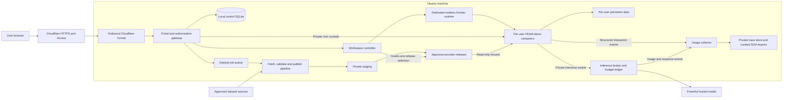

# Ubuntu web demo environment

Status: proposed design; no services have been installed or exposed.

Updated: 2026-09-24. Machine baseline inspected on 2026-09-23 at repository revision `eceddcc`; this revision updates the design in `d093c47`.

## Recommendation

Use this Ubuntu machine to run a small, invite-only FEAM service: **Cloudflare Tunnel + Cloudflare Access email PIN login + one isolated container per demo user, with powerful hosted model assistance enabled by default**. Phase 1 demonstrates the strongest useful assistance supported by FEAM and records user workflows and outcomes to inform Phase 2 small language model (SLM) development. Admins manage users, sandboxes, model budgets, dataset jobs, and dataset access through a dashboard. A separate pipeline loads and validates datasets, publishes versioned FEAM provider releases, and makes approved releases available read-only to authorized sandboxes.

Keep infrastructure inexpensive while reserving model spending for the purpose of the demo. Cloudflare lists a **$0 Zero Trust plan for up to 50 users**, enough for 10 demo users and a small number of admins. The host software is open source; the baseline needs no paid VM, managed database, email service, analytics service, or managed pipeline service. **Hosted inference is a separate, expected usage cost**, alongside domain, electricity, internet, and backup storage. External plan prices and limits below were checked on 2026-09-23 and must be rechecked before deployment. [Cloudflare pricing](https://www.cloudflare.com/plans/)

Email PIN login is close to the requested allowlist/sign-in-link experience, but it requires entering a code. If a clickable magic link is essential, use the alternative in [Authentication](#authentication). Do not deploy both authentication stacks initially.

## Requirements and scope

Confirmed requirements:

- Use this Ubuntu machine as the web-accessible demo host.
- Support admins and regular users, targeting up to 10 users in FEAM sandboxes.
- Regular users use the FEAM CLI/TUI and available datasets. Admins only manage the demo environment; the admin role does not allocate a development workspace or editor.
- A dataset-loading pipeline prepares datasets on the demo host and makes them accessible to selected sandboxes.
- Phase 1 provides powerful hosted model assistance as the normal demo experience, captures user usage patterns, and produces evidence and reusable, eligible examples for Phase 2 SLM development.
- Prefer free and low-cost options. Email allowlisting with passwordless login is a suitable authentication direction.

Proposed operating defaults:

- Capacity target: 10 simultaneous lightweight demo sandboxes and a management dashboard, with at most one bounded dataset-loading job when headroom permits.
- Each regular user owns one persistent demo workspace containing synthetic practice fixtures and writable outputs. Pipeline-loaded datasets are stored once per release and shared read-only with authorized sandboxes.
- Regular users may run shell commands inside their container. Treat browser terminal access as code execution even when the launcher opens the TUI first.
- Idle workspaces stop after 30 minutes; data remains for 30 days after last use, with advance notice before deletion. Explicit reset requires confirmation.
- Hosted assistance is on by default. Sandboxes have no general internet access; model traffic passes through a private, authenticated inference broker with server-side budgets.
- Structured interaction capture is part of Phase 1. Explain collection and obtain participant consent before a recorded session; keep account/billing records separate from the pseudonymous research corpus.
- This is a single-machine demo service with scheduled maintenance and no high-availability promise. It does not establish HPC deployment acceptance.

## Existing machine and FEAM implementation

Read-only inspection produced the following snapshot; it is not a load test.

| Item | Observed | Design implication |
| --- | --- | --- |
| OS | Ubuntu 24.04.5 LTS, x86-64 | Pin and test compatible container/runtime packages. |
| CPU | Ryzen 5 3600, 6 physical cores / 12 threads | Suitable candidate for interactive demos; bound dataset-processing concurrency. |
| RAM | About 16 GiB total; about 12 GiB available during inspection | Budget sandboxes and the dataset pipeline separately. |
| Swap | 4 GiB | Emergency margin; exclude it from capacity calculations. |
| Root disk | 183 GiB filesystem, 136 GiB available | Keep bounded system logs and image caches. |
| Home disk | ext4, about 1.7 TiB total / 1.5 TiB available | Put FEAM service storage on this disk, in its own service directory. |
| Resource controls | cgroup v2 | Verify actual CPU/memory/PID delegation before admitting users. |
| Existing runtime | Docker and containerd services active; Docker executable present | A dedicated rootless runtime remains to be configured and tested. |
| Web tooling | No `cloudflared`, `ttyd`, Caddy, or nginx found on the inspected PATH; checked web service units inactive | Plan the tunnel, terminal, and portal as new deployment components. |

The current shell sandbox failed to start with a network-namespace permission error. Inspection therefore used approved read-only commands outside that sandbox. This is a deployment preflight concern, not proof that Docker containers cannot run. Test the intended runtime and namespace policy explicitly; do not globally disable host protections to make the service work.

The [workspace README](../feather-mesh/README.md), [peer-access contract](data_access_contract.md), and [TUI demo runbook](tui_agent_stage1_demo.md) establish these integration constraints:

- FEAM's current interactive interface is an optional Rust TUI; there is no existing multi-user web portal in the inspected implementation.
- The Cargo binary is `mesh_cli`; the installed user command should be `feam`.
- Peer operations require `--project ROOT`. Authoritative data publication is in each provider's `serving/manifest.json`; legacy SQLite is separate.
- The demo script already creates a provider and a `client with spaces`, including Parquet and GeoTIFF fixtures and an intentionally unavailable peer.
- STAC is a loopback, bearer-token-protected metadata service returning local file URIs. It is not an internet dataset-download service.
- The [Stage-1 assistant contract](tui_agent_stage1_contract.md) already defines a hosted router, bounded tools, local mutation reviews, outbound filtering, and per-session usage. A shared inference broker, durable multi-user telemetry, and SLM export pipeline are new components; the existing recovery journal is not a training corpus.
- Existing [footprint measurements](tui_agent_stage1_acceptance.md#footprint-and-conditions) are small, sampled, single-user macOS measurements. They do not prove Ubuntu peak memory or 10-user capacity.

## Architecture



Cloudflare Tunnel connects outward from the machine and does not require a public IP or router port forwarding. Cloudflare supports proxied WebSockets, which the terminal needs. Test reconnects through the complete deployed path. [Tunnel documentation](https://developers.cloudflare.com/tunnel/), [WebSocket documentation](https://developers.cloudflare.com/network/websockets/)

| Component | Responsibility |
| --- | --- |
| Cloudflare DNS, Tunnel, Access | Public HTTPS, email verification, coarse access policy, routing to the private origin. |
| Portal/gateway, new component | Validate identity, enforce roles and ownership, present workspace controls, proxy authenticated HTTP/WebSockets. A small Go service with server-rendered pages is a proposed implementation; no SPA is required. |
| Local control SQLite | Accounts, roles, workspace assignments, dataset jobs, release assignments, grants, revocation state, audit events. It is separate from FEAM's legacy registry and is not a dataset publication authority. |
| Workspace controller, new component | Reconcile lifecycle jobs, enforce grants when selecting dataset mounts, and invoke only approved runtime templates. The gateway never gets the Docker socket. |
| Rootless Docker under a dedicated service account | Run demo containers without using the personal account's home or existing daemon as the control plane. |
| `ttyd` + FEAM | Provide an interactive terminal inside each demo container. |
| Dataset pipeline, new component | Run approved fetch/validation jobs, publish through FEAM, prepare complete releases, and report results to admins. Separate service credentials and private staging from sandboxes. |
| Shared provider storage | Hold versioned dataset releases and their authoritative `serving/manifest.json` files; authorized sandboxes receive read-only mounts. |
| Inference broker, new component | Keep upstream API keys outside sandboxes; enforce the selected model/provider, disclosure policy, active-user checks, shared budget reservations, concurrency, and usage accounting. |
| Usage collector and private trace store, new components | Correlate sanitized interactions with tools, reviews, actual outcomes, model usage, and feedback; prepare reviewed exports for Phase 2. |
| systemd, journald, timers | Supervision, bounded logs, idle stopping, backups, and cleanup. |

Use example hostnames such as `feam.example.org` for the user portal, `admin.example.org` for all management pages/APIs, and `u-<opaque-id>.example.org` for a demo workspace. These are placeholders, not configured domains. Keep workspace content on separate origins from the portal; never proxy arbitrary user content under the portal's origin.

Configure explicit hostname routes for the initial small user pool, with an unmatched-host deny rule. All routes terminate at the authorization gateway, which listens only on loopback or a private Unix socket. Every workspace hostname maps to one server-side workspace record. A hostname or unguessable ID is not an access credential. Cache bypass applies to authenticated pages, terminal traffic, and authentication responses.

The controller accepts workspace IDs and fixed actions, not arbitrary host paths, image names, command strings, or mount specifications. Lifecycle requests use structured arguments and idempotency keys. Separate Unix socket permissions restrict controller access to the gateway. Neither service runs as host root; initial OS/runtime/storage provisioning belongs to the machine operator.

## Roles and user experience

| Capability | Regular user | Admin | Machine operator |
| --- | --- | --- | --- |
| Start, stop, reset own demo | Yes | Manages users' sandboxes; none allocated by the admin role | Recovery access |
| Use FEAM CLI/TUI; edit data in own sandbox | Yes | Management dashboard only | Recovery access |
| Read another user's workspace | No | No by default; explicit audited support action only | Technically possible on the host |
| List users, assign role, disable access | No | Yes | Bootstrap/recovery |
| Stop/reset another workspace | No | Yes, with confirmation for reset | Recovery access |
| Set quotas within host policy; view utilization and job status | Own usage only | Yes | Set host-wide ceilings |
| Run approved dataset-loading jobs and approve releases | No | Yes | Configure pipeline templates and source credentials |
| Assign/revoke dataset bundles for sandboxes | No | Yes | Recovery access |
| Use hosted assistance within assigned budget | Yes | Configure the demo model/profile and spending limits | Provision upstream credentials |
| View aggregate usage; curate/export consented traces | Own session status | Yes, with a separate research-export permission | Configure storage and recovery |
| Change demo release | No | Select an already tested, approved image | Prepare/approve releases |
| Host sudo, arbitrary mounts, Docker socket, personal SSH keys | No | No through the website | Local administration only |

The machine operator is an operational responsibility, not a third public signup role. Initially it can be the owner of this machine. Website admin status does not automatically grant host administration.

Regular-user flow: open the site, authenticate by email, review the hosted-model disclosure and recording notice, then select **Open assisted FEAM**. Start the TUI with hosted assistance already enabled and explain how to ask for help. Show the selected model, assigned datasets, usage/budget status, recording status, and reset behavior. Users ask the assistant to discover and explain data, resolve a pinned version, stage a private copy, and prepare publication/withdrawal actions for local review. Keep the shell and manual controls available for exploration or recovery. Manual fallback during an outage is clearly labeled and is not counted as a successful hosted demo.

Admin flow: use the management dashboard to approve users, set sandbox quotas and model budgets, stop/reset sessions, select approved FEAM images and model profiles, and inspect health, task outcomes, and audit history. A **Datasets** page manages loading jobs, validation, release approval, assignment, and withdrawal. A **Usage** page shows adoption, common tasks, friction, completion, latency, and cost, with controlled trace review/export for Phase 2. Routine management uses these controls and does not require a shell, source checkout, or editor.

## Authentication

### Recommended: allowlisted email PINs

Cloudflare Access emails a one-time code only when the email satisfies its Access policy; codes are single-use and expire after 10 minutes. The login page returns a generic message for disallowed addresses. This avoids operating an SMTP service or implementing token issuance. [Cloudflare email PIN documentation](https://developers.cloudflare.com/cloudflare-one/integrations/identity-providers/one-time-pin/)

1. Bootstrap the first admin locally; provide no public signup or self-promotion endpoint.
2. An admin adds an exact email address and role in the control database. Assign an immutable local user ID; do not use email strings as directory names.
3. A reconciliation task updates the corresponding Cloudflare policy using a narrowly scoped API credential provisioned by the operator. New accounts remain `pending` until the edge policy and any regular-user workspace assignment are ready; admin accounts require no workspace. Admins see synchronization status in the dashboard. An operator command provides recovery if automatic reconciliation fails.
4. Users enter their email at Access, receive a PIN if allowed, and submit it to authenticate.
5. The gateway validates the Access JWT's signature, issuer, intended application audience, and time bounds using a maintained JWT library and the documented key endpoint. It then looks up the active local account and checks the requested role/workspace. Plain email headers are never authentication. [Access JWT validation](https://developers.cloudflare.com/cloudflare-one/access-controls/applications/http-apps/authorization-cookie/validating-json/)
6. Use a separate Access application/audience for the admin host, with an exact admin email list and a proposed one-hour session. User portal/demo sessions may last eight hours. Require the audience matching the requested host; a regular-user token cannot authorize an admin route or enqueue a dataset-loading job.

The control database is authoritative for application authorization; Access is an additional gate. Keep policy changes versioned in private configuration, report synchronization failures, and never broaden policy to all email users or an entire domain to resolve a mismatch. Normalize email consistently with the identity provider; do not collapse dots or plus-address aliases. Bind the verified identity to the local record and handle email changes administratively.

At the tunnel, require Access JWT validation for protected hostnames as well as gateway validation. Restrict expected hostnames and proxy headers; unknown routes fail closed. Tunnel connectivity alone is not authentication. [Tunnel origin Access settings](https://developers.cloudflare.com/tunnel/reference/origin-parameters/)

Maintain local authorization on every request and WebSocket upgrade. Track open streams by local account and workspace; periodically recheck eligibility and token expiry. Disablement increments an account authorization version, rejects new traffic immediately, closes active streams within 30 seconds, and stops its containers. Edge policy/token revocation follows even if a provider API call initially fails. Removing a user from a list must not leave an already-open terminal usable.

Use host-only secure cookies for any local gateway session, with `HttpOnly`, `SameSite`, and the `__Host-` prefix; do not issue shared parent-domain portal cookies. Strip Access assertions, identity headers, and gateway cookies before proxying into user-controlled containers. The gateway consumes authentication material; sandbox processes do not need it. Enforce exact Origin checks on WebSockets and CSRF protection on lifecycle/admin actions, including sibling-subdomain requests. Administrative state changes use POST and require a fresh authorized session.

Require MFA on the Cloudflare account that controls DNS and Access. Email-only admin login is an initial synthetic-demo tradeoff; an MFA-enabled identity provider can replace it without changing workspace ownership. If stronger admin authentication is required, make provider-enforced MFA a launch condition rather than assuming mailbox verification supplies a second factor.

### Alternative: actual clickable magic links

Use **Supabase Auth Free + a free transactional email tier**, retaining the same gateway, local roles, and containers. In this variant Cloudflare Tunnel remains, but Cloudflare Access email login is replaced for these routes to avoid two sign-ins.

Supabase supports single-use magic links and `shouldCreateUser: false`; also disable public signup in provider configuration so this is enforced beyond the UI. Pre-create only allowlisted accounts administratively. [Passwordless email](https://supabase.com/docs/guides/auth/auth-email-passwordless), [signup configuration](https://supabase.com/docs/guides/auth/general-configuration)

The application checks its active allowlist before asking the provider to send a link, returns a generic response, and checks eligibility again after server-side verification. Bind the resulting verified provider user ID to the local account. Use server-held sessions and revocation; do not trust roles in user-editable profile metadata. Proposed controls: 10-minute link expiry, fixed HTTPS callback destinations, per-email and per-IP request limits, and no token/query logging. The initial GET displays a confirmation page; a deliberate POST redeems the link to reduce consumption by email scanners. [Email template and prefetch guidance](https://supabase.com/docs/guides/auth/auth-email-templates)

The built-in Supabase mail service is restricted and unsuitable for sending to arbitrary demo invitees; configure custom SMTP. Resend currently lists a free transactional allowance of 3,000 emails/month and 100/day, subject to its current plan and verified sender-domain setup. Configure SPF/DKIM and test delivery to the intended users. [Supabase SMTP](https://supabase.com/docs/guides/auth/auth-smtp), [Resend pricing](https://resend.com/pricing)

Supabase Free currently includes 50,000 monthly active users, but free projects can pause after a week of low activity. That adds a pre-demo readiness check and makes this option less convenient for an infrequently used demo. It also adds another identity service, SMTP configuration, callback/session handling, and auth-provider outage dependency. [Supabase pricing](https://supabase.com/pricing), [free-project pausing](https://supabase.com/docs/guides/platform/free-project-pausing)

Choose this alternative only if clickable links are worth the additional implementation and operations. It can fit free allowances at this scale, but does not eliminate domain, power, or backup costs.

## Sandbox boundary and FEAM integration

Use one container per demo user, including that user's private practice provider and client projects. Separate containers have separate writable filesystems, process namespaces, terminal sessions, and caches. Pipeline-loaded providers are shared through read-only mounts selected by the controller's grant checks. This models isolated FEAM workflows with shared inputs; it does not pretend to be a multi-node shared HPC filesystem.

The runtime should be rootless under a dedicated `feam-runner` account, with a non-root process inside each container. Use a read-only image, drop Linux capabilities, set `no-new-privileges`, retain applicable seccomp/AppArmor protection, and impose resource limits. Do not mount the personal home, host root, devices, SSH agents, runtime sockets, or controller secrets. Rootless containers reduce host privilege but share the host kernel: this boundary is appropriate for invited demo users and synthetic data, not an unrestricted hostile-code hosting service. [Docker rootless mode](https://docs.docker.com/engine/security/rootless/)

Regular demo containers use `--network none`. `ttyd` can listen on a Unix domain socket; mount only that workspace's socket directory so the gateway can reach it without giving the sandbox network access. Enable writable terminal input and origin checks, disable URL-supplied command arguments, and allow at most two browser terminal connections per workspace. The server chooses the fixed FEAM launcher or shell command. [ttyd options](https://github.com/tsl0922/ttyd)

Use restrictive per-workspace socket directories and explicit UID/GID mappings or ACLs. Back each writable socket directory with a small bounded filesystem, such as an operator-provisioned 1 MiB tmpfs with an inode limit, so it cannot bypass workspace storage limits. Prove that the gateway can connect and another sandbox cannot; do not solve rootless permission problems with world-writable sockets. Put no controller or Docker socket in these directories. Treat upstream responses as untrusted: filter authentication-related response cookies/headers and bound response sizes/timeouts.

An example container layout is:

```text
/opt/feam/                       immutable release, SDK, demo script and fixtures
/workspace/demo/provider/       this user's provider and serving manifest
/workspace/demo/client with spaces/
/datasets/demo-climate/          assigned shared provider serving root, read-only
/workspace/cache/               this user's FEAM_CACHE_DIR
/workspace/exports/             explicitly exported user results
/tmp/                          size-limited temporary filesystem
/run/feam-terminal/             this workspace's terminal socket only
/run/feam-model/                this workspace's private inference socket only
/run/feam-events/               this workspace's private event-ingestion socket
```

Build the release once outside demo sessions:

```bash
# Existing repository command; run from feather-mesh/ in a controlled build.
cargo build --release -p mesh_cli --features agent-hosted
```

Install the resulting `target/release/mesh_cli` as `/usr/local/bin/feam` in the image. Generate the existing binary fixtures during image build, install the supported Python SDK and pinned example dependencies, and package the demo script with the fixture tree it expects. Configure `FEAM_EXECUTABLE` and `FEAM_WORKSPACE` to point at that packaged layout. Users do not install packages or compile Rust to start a demo.

On first start, run the existing demo generator **inside the container** against `/workspace/demo`, then launch:

```bash
feam tui --project '/workspace/demo/client with spaces' \
  --agent hosted --agent-profile phase1-demo
```

Generate the practice demo at its final container path because the script writes a provider symlink. Copy its small source fixtures into each user's workspace; never share a writable provider manifest between users. The provisioning wrapper then adds the granted pipeline-provider links and peer configuration described below. This wrapper is new work; the existing demo generator does not attach external datasets. Preserve FEAM's project paths, manifest authority, review confirmations, and recovery journal semantics.

The private demo volume is disposable; reset stops the container, closes its sessions, creates a clean replacement generation, initializes it, reattaches currently granted datasets, verifies health, and switches the workspace record. Shared dataset releases remain intact. A failed initialization leaves the old stopped volume recoverable, but recovery must still enforce current grants. The controller operates on its own recorded volume IDs, never on a browser-supplied path or a user-controlled symlink. Garbage-collect old generations under a bounded retention rule.

If users try STAC, run its service and Python client in the same container, with a private token file, so loopback and local file URIs have the correct meaning. Do not publish STAC directly to the internet as a substitute for the terminal. A future web dataset viewer or download API is a separate design.

Provision the `phase1-demo` profile outside the writable project, using the broker connection described below. The image includes the hosted feature and the launch profile; users do not need to supply an API key or manually turn assistance on. Existing TUI confirmations and core access rules still govern every operation.

## Dataset-loading pipeline and shared access

Run the pipeline as a local supervised worker with a SQLite job queue and optional systemd schedule. An admin selects a registered source, dataset definition, and audience, then starts or schedules a job from the dashboard. This needs no managed ETL platform or admin development workspace. A trusted CI system can later submit the same job specification through a scoped service identity; browser-user credentials do not become pipeline credentials.

The data definition records a source identifier and pinned object/version or checksum, exact asset inventory, FEAM product/version identity, required reuse metadata, expected size, and intended audience. It also records whether metadata may be disclosed to the hosted model and whether resulting traces are eligible for research/export. Access to a dataset does not itself grant permission to send its contents to a model or use it for training. Source credentials remain in the pipeline's service configuration.

Use a **dataset bundle** as the initial filesystem access unit: one provider namespace and serving root containing products approved for the same audience. Mount only granted bundles. Users with a shell can read every file in a mounted bundle directly, so filtering the FEAM catalog is not an access-control boundary. Split differently restricted datasets into separate bundles/namespaces. Never mount the parent directory containing every bundle or any private staging directory.

Pipeline stages:

1. **Fetch into private staging.** Download from a registered source or import an operator-provided local artifact. Pin source identity and verify expected hashes; enforce byte, time, file-count, and expanded-size limits. Fetch workers may reach only approved upstreams; validate redirects and resolved addresses, and block host/LAN/metadata destinations. Dataset definitions are data, not executable scripts. Do not execute source-provided commands or unsafe archive entries.
2. **Prepare a candidate provider release.** For a new bundle, initialize a FEAM provider project with its unique namespace. For an update, copy the previous release into a private candidate, preserving its manifest revision, product/version records, and tombstones. Add new assets under new version paths. The initial implementation uses ordinary copies rather than writable hard links to released bytes. Candidate construction and quota checks account for the complete retained bundle, not only the incoming files.
3. **Validate and register through FEAM.** Call existing `validate-metadata`/`serve` workflows against the explicit candidate project root with complete metadata. Rust services enforce Parquet or GeoTIFF inspection, declared inventory, namespace, path, and version rules. Unsupported source formats require a separately tested importer to prepare supported outputs and provenance. Never publish by placing files in a directory, editing SQLite, or hand-writing a manifest. See the [peer-access contract](data_access_contract.md).
4. **Check the candidate as a consumer.** Resolve the exact registered inventory through a fresh client peer link; exercise known-value table queries or bounded raster windows and verify integrity as appropriate. The mounted serving tree must contain only bytes intended for that bundle's audience and required FEAM metadata/projections. Unregistered drafts, input credentials, and validation scratch stay outside it. Present the report, release hash, metadata, provenance, and size to the admin.
5. **Approve and promote a complete release.** Record approval for the exact candidate hash, make the payload immutable to sandbox/runtime accounts, and atomically rename it into a unique release directory on the same filesystem. Only then record it as an assignable release. A crash after the rename leaves a private orphan for reconciliation, not a partial visible release; a failed validation or publication leaves current assignments unchanged. Serialize updates per bundle and recheck the parent release before promotion to prevent concurrent jobs from losing each other's versions or withdrawals.
6. **Assign and attach.** Admins grant a bundle/release to all demo users or selected sandboxes. The controller verifies the current grant, namespace, release integrity/status, and canonical recorded source path, then attaches that release's `serving/` directory read-only. Newly started or recreated containers receive the selected release and peer configuration. Existing sessions remain pinned until the announced update/restart, except for access revocation below.

FEAM's atomic manifest write is the publication boundary inside each candidate; the pipeline's release promotion controls which complete provider snapshot is exposed to sandboxes. These are separate commits. Record job IDs and candidate hashes so a retry reconciles an uncertain commit instead of blindly repeating `serve` and creating a duplicate-version conflict. A failed derived projection must not be reported as an uncommitted manifest write. The control DB tracks deployment and grants; the mounted provider manifest remains FEAM's authority for registered products.

Example host layout and client mapping, all proposed:

```text
/home/feam-service-data/datasets/
  staging/<job-id>/provider/                 private candidate, never mounted
  releases/<bundle-id>/<release-id>/provider/
    .feam/project.toml                      pipeline/provider configuration
    serving/manifest.json                   authoritative registered inventory
    serving/datasets/<product>/<version>/   immutable released data

Sandbox:
  /datasets/demo-climate/                    read-only mount of assigned serving/
  /workspace/demo/client with spaces/peers/demo-climate
    -> /datasets/demo-climate
```

The provisioning wrapper appends the following peer to the existing client configuration, preserving its practice-demo peers:

```toml
[[peers]]
alias = "demo-climate"
namespace = "demo-climate"
path = "peers/demo-climate"
```

There must be only one attached release per provider namespace in a client. Use a namespace distinct from the practice fixture's `climate`. Run `feam refresh` for the explicit client project after attachment. Users read shared assets directly through the resolver/SDK; `consume` remains an explicit copy into their private quota. Transformations and outputs belong in that private space. Ten readers of one release share one stored payload rather than requiring ten full dataset copies.

Use explicit read-only bind mounts, private mount propagation, and no nested writable submounts. Validate read-only behavior with actual shell writes, including attempts through symlinks. A read-only mount does not stop its host owner from modifying the source, so pipeline policy and host ownership must also prevent mutation of released payloads. [Docker bind-mount semantics](https://docs.docker.com/engine/storage/bind-mounts/)

Changing a host symlink or release pointer does not update an existing container's pinned bind mount. Grant changes and release upgrades therefore recreate affected containers while preserving private volumes. Missing assigned storage fails startup visibly; never fall back to an ungranted release or expose the entire dataset store. Sandbox reset recreates only private data and reattaches current grants.

For removal, reject new attachments immediately, close affected sessions within 30 seconds, stop their containers, and recreate them without the removed bundle. For FEAM withdrawal, prepare a successor release using `withdraw` so tombstones persist; drain affected old snapshots and prohibit assignments/rollback that would reactivate withdrawn versions. If bytes must become inaccessible through direct shell reads, remove that bundle's mount as well; a tombstone alone governs FEAM access, not filesystem reads. Already staged copies or exported data cannot be recalled merely by withdrawing a product or removing a mount.

Retain at least the current and previous permitted release for rollback when capacity allows. Keep any additional release still referenced by a workspace or required recovery record. Garbage collection requires zero live assignments and no active preparation job, respects withdrawal restrictions, and uses recorded release IDs. Back up irreplaceable inputs/releases; a URL alone is not a reproducible backup.

## Phase 1: powerful hosted assistance

Phase 1 is a quality-oriented demonstration and observation period. Select a powerful tool-capable hosted model using representative FEAM tasks, then pin its exact model/provider and profile for a cohort. Optimize demonstrated task completion and useful assistance first; keep infrastructure cheap and govern inference spending explicitly. The earlier [small hosted screening](tui_agent_model_screening.md) is not proof of the best possible model or configuration, and its cheap-model choices do not constrain this demo.

The assistant should demonstrate discovery, explanation of reuse metadata, clarification of ambiguous requests, pinned resolution, reviewed staging, publication-draft preparation/validation, withdrawal proposals, and recovery guidance. It uses the current [Stage-1 tools and boundaries](tui_agent_stage1_contract.md). It cannot administer users, grant datasets, execute arbitrary shell code, bypass local reviews, or modify a shared provider. More powerful inference does not change those permissions.

Evaluate context size, output limits, reasoning settings, and timeout on realistic multi-turn tasks rather than retaining limits chosen for an inexpensive probe. The current profile supports at most eight tool calls, 120 seconds per request, and 4,096 output tokens. If the strongest useful profile needs a transport feature or larger bound, record that as a tested implementation extension before advertising it; a model's capability alone does not make the current harness support it. Keep the exact settings with each trace and avoid silently routing to a cheaper model.

### Model connection and credentials

Run a private inference broker outside user containers. It owns the real upstream key and accepts only the FEAM model protocol, with approved tools and a server-selected model/provider. It enforces account status, workspace ownership, disclosure rules, payload limits, and budgets independently of settings a shell user can edit. It provides no arbitrary HTTP proxy, filesystem access, or model administration API.

Keep demo containers on `--network none`. A small in-container adapter exposes an HTTPS loopback endpoint and forwards requests over that workspace's private Unix socket to the broker. Install a scoped trust certificate for the adapter in the image; keep both links private and preserve the current HTTPS profile requirement. The proposed `phase1-demo` profile points to this endpoint and obtains a short-lived **broker capability**, not an upstream API key, through the named environment variable. A shell user can read that capability, so bind it to their workspace/account, allowed operation, authorization version, expiry, and budget. Do not treat it as a secret that can grant more authority than that user already has.

The controller provisions the socket and capability and revokes them on stop, reset, or account disablement. Only this workspace's socket directory is mounted, with bounded storage and restrictive permissions. The adapter/broker must preserve streamed responses, complete tool-call arguments, provider request IDs, usage frames, cancellation, and typed errors expected by `mesh_agent`. This bridge is new implementation work and needs a real end-to-end compatibility test. The existing adapter follows the [router tool protocol](https://openrouter.ai/docs/guides/features/tool-calling); enforce provider restrictions in the broker using the [routing controls](https://openrouter.ai/docs/guides/routing/provider-selection).

Separate conversation histories and request IDs per user/session; never reuse one user's context in another's request. The broker records and verifies the actual provider/model used, rejects unapproved fallback, and redacts credentials and disallowed paths/content before persistence or external transfer. Preserve the existing harness's outbound filter as well. Pipeline-approved metadata may be included according to its disclosure policy; mounted datasets are not automatically uploaded. Select provider retention/data-collection settings explicitly; the router documents that policies vary by provider. [Provider logging policies](https://openrouter.ai/docs/guides/privacy/provider-logging)

### Spend and concurrency

Proposed starting admission limits are one in-flight model request per user and three across the host, with a visible fair queue. Ten users can have active assisted sessions while inference requests queue; ten simultaneous provider generations are not assumed. Cancel queued requests when their session expires, and verify account/grants again before dispatch.

Enforce per-request, per-user/day, and project/month spending envelopes in the broker. Reserve the configured worst-case request cost transactionally before dispatch, including billed reasoning/output and applicable fees, then reconcile with returned usage. Uncertain billing retains its reservation and is marked unknown until reconciled; timeouts, disconnects, and client retries must not reset spending. Cache/reasoning token accounting and model prices belong to the pinned profile. Local `:usage` is a useful display, not the shared spending authority. Use provider-side account limits where available and make budget exhaustion a clear, recorded state rather than silently swapping models.

The model ID, provider, and monetary caps are deployment settings to settle before live traffic. Their absence keeps the service in a visible not-ready state for assisted demos; it does not change the design back to an unassisted demo. Authoring this document does not run inference or authorize a specific billable evaluation.

## Usage capture and Phase 2 SLM development

Collect structured FEAM interactions so Phase 2 can learn what users actually attempt, where assistance works, and which tasks need a smaller model. Keep the same FEAM tool/service boundary for hosted and future local inference, as described in the [TUI/agent design](../tui_agent_harness_design.md). Raw terminal transcripts, broad keystroke recording, and the recovery journal are poor substitutes for structured workflow events.

| Event/data | Capture | Purpose |
| --- | --- | --- |
| Context | Pseudonymous participant ID, session/turn/task IDs, consent version, FEAM image/tool-schema/profile versions, dataset bundle release and manifest revisions | Reconstruct the relevant environment without account email or host paths. |
| Request and response | Redacted user request and visible assistant answer, clarification turns, explicit edits/corrections | Identify intents, helpful explanations, ambiguity, and repair patterns. |
| Tools and reviews | Proposed tool/arguments, validation result, filtered tool result, review presented, accepted/rejected/edited/cancelled decision | Distinguish suggestions from approved actions and learn safe tool selection. |
| Outcomes | Commit/receipt or journal outcome where verifiable, typed failure, abandonment, manual fallback, optional user rating | Measure task success independently of model claims. |
| Usage | Observed model/provider, provider generation ID, input/output/available reasoning/cache token counts, reserved/final/unknown cost, queue/first-token/total latency | Compare quality, cost, speed, and future SLM requirements. |

Capture model exchange/accounting at the broker and application actions at explicit TUI/harness/service instrumentation points. Application events use a separate per-workspace Unix socket, so collection needs no general sandbox network access. Apply the same bounded-directory permissions and revocable workspace identity as the model bridge; expose only event submission, not trace queries or exports. The collector correlates IDs, deduplicates retries, orders events, and records missing spans. Reviews and later user actions cannot be inferred from broker traffic alone. Existing `:usage` and journal records do not contain this complete sequence; event emission and collection are new work.

Store bounded, sanitized events in a private append-only event stream with a small local SQLite index and a separate transactional broker budget ledger. Keep these stores outside sandbox/reset volumes. The collector authenticates event sources and enforces quotas, schema versions, and record-size limits. Mark broker-observed, client-reported, and independently verified fields separately: sandbox users can alter their software and fabricate application events. Verify important success labels against applicable manifests/receipts where possible; a reported success is not automatically a training target. Capture gaps must be visible in admin metrics and exclude incomplete examples from trusted exports. Ledger failure rejects new billable requests; telemetry failure visibly pauses recorded sessions or requires an explicitly labeled unrecorded mode, with no silent loss presented as complete evidence.

On first use, explain that requests, visible answers, tool choices, review decisions, and outcomes will be retained to improve FEAM and support SLM development. Show the hosted provider and recording status, record consent/version, and allow withdrawal from future research collection. Users may use an unrecorded/manual path under the deployment's participation policy; mark it accordingly and do not fabricate missing research data. Keep minimum operational accounting separate from optional research content. Proposed retention is 90 days for sanitized session events and 30 days for operational logs; curated exports have an explicit owner, purpose, expiry, and deletion policy rather than indefinite retention.

Exclude API keys, auth tokens, emails, private paths, raw dataset payloads, and hidden model reasoning from the research corpus. Store only visible responses and structured actions/outcomes. Maintain the participant-to-account mapping separately with restricted access, and require a separate research-export permission for trace content. Process participant deletion/withdrawal across active events, derived datasets, and expiring backups; record export lineage and the practical limits of retracting already distributed artifacts or trained models. Review dataset/model-output reuse conditions before treating traces as training material; demonstration permission and provider-side no-training settings are not the same as permission for our own training reuse.

Phase 2 uses the collected evidence in this sequence:

1. Summarize real task frequencies, clarification needs, failure/denial patterns, manual corrections, and latency/cost. Use these findings to set the SLM's supported scope and improve deterministic tools or UI where that is more effective.
2. Build versioned, reviewed examples from eligible traces: task context, user request, allowed tool choices, validated arguments/results, concise answer, and verified expected outcome. Keep rejected/failed proposals with explicit negative labels; never convert them into successful demonstrations. Retain provenance to source events, model/profile, consent, dataset release, and reviewer.
3. Deduplicate and split by participant/project, dataset family, and task template to reduce leakage. Freeze a held-out evaluation set before prompt tuning or training, and keep it out of teacher-generation prompts and training exports. Report the small cohort's coverage limitations and label synthetic augmentation separately.
4. Benchmark candidate SLMs against the powerful hosted baseline using the same supported tools, fixtures, and task-outcome rubric. Try prompt/context/schema improvements first; use eligible examples for supervised adaptation/distillation if justified. Report completion, clarification quality, denied/unauthorized actions, tool validity, latency, and CPU/RAM footprint. Model outputs alone are not correctness labels.
5. Train or fine-tune in a separate development/training environment; it is not an admin workspace on the demo host. Version the resulting model, prompt/template, quantization, tool contract, and evaluation report. Promote an SLM only after it meets agreed quality and target-resource gates, preserving the same permissions and review semantics. Keep hosted Phase 1 and local/HPC Phase 2 results distinct.

## Capacity, storage, and admission

The following numbers are proposed initial limits, not measured consumption.

| Workload | Count | Memory hard limit | CPU ceiling | Persistent storage |
| --- | ---: | ---: | ---: | ---: |
| Regular demo | Up to 10 | 512 MiB each | 0.5 logical CPU each | 2 GiB each |
| Dataset-loading worker | At most 1 | 2 GiB | 1 logical CPU | 50 GiB staging budget, reserved before each job |
| Tunnel, gateway, controller, inference broker, collector, databases | Shared | Combined budget 2 GiB | Bound background work; prioritize interactive traffic | 5 GiB operational storage plus 20 GiB trace-store budget |
| Shared dataset releases | Shared across granted sandboxes | File cache accounted in measured host/container usage | I/O bounded by job and reader limits | 100 GiB initial retained-release budget |
| OS, desktop, page cache, reserve | Shared | Approximately 7 GiB remains on a 16 GiB host | Remaining capacity | Existing host storage |

Ten demo limits total 5 GiB; adding one dataset worker and the control plane yields about 9 GiB. Hosted model inference runs remotely, so Phase 1 reserves no local model weights or GPU. Account for runtime overhead and memory already used by other host applications. The controller admits a new workspace or pipeline job only when both the configured aggregate budget and current host headroom permit it; show a queue or capacity message otherwise. Model-request admission and spending reservations are separate broker checks. Do not rely on every process staying below its limit by chance.

Set 128 PIDs per demo container, bounded file descriptors, and size-limited `/tmp` and `/dev/shm`; tmpfs usage counts against the memory budget. Disable additional container swap allowance so a runaway sandbox cannot create a host-wide swap storm. Add an aggregate demo cgroup ceiling, and retain host headroom even if every user reaches their cap. A 512 MiB limit is for the TUI, hosted-request handling, and bounded fixture queries; it does not make arbitrary large Polars/raster processing safe. Measure with the actual approved model profile and dataset workloads before increasing demo scope.

Rootless Docker resource flags require cgroup v2 and systemd, with appropriate controller delegation. Verify `memory`, `cpu`, and `pids` enforcement by measurement, not just accepted configuration. Ubuntu's restrictions on unprivileged namespaces may require the supported runtime/AppArmor packaging. [Docker resource controls](https://docs.docker.com/engine/security/rootless/tips/), [Ubuntu rootless prerequisites](https://docs.docker.com/engine/security/rootless/troubleshoot/)

Store service data in a dedicated directory on the large home filesystem, such as `/home/feam-service-data`, with owner-only subdirectories. The actual location is an operator deployment choice; it must not expose `/home/saif` to containers. Container memory limits do not enforce disk quotas. For an initial ten-user pool, provision fixed-size ext4 workspace image files, mounted by the operator, and bind their mountpoints into containers. Preallocate storage rather than relying on unbounded sparse growth. The web controller cannot mount arbitrary images or paths. A dedicated quota-enabled filesystem is a later alternative; existing ext4 quota support has not been verified.

Maintain a small preallocated spare pool for safe reset, serialize reset jobs if needed, and include spare volumes, Docker image storage, logs, and backups in the disk budget. Container root filesystems remain read-only so persistent writes cannot bypass the assigned workspace limit. Bound and rotate terminal/runtime logs; disable shell transcript logging by default. Refuse new starts/reset jobs when host free space falls below 15% or 20 GiB, whichever is larger, on the relevant filesystem.

Put dataset staging and releases on the same dedicated, size-bounded filesystem to support atomic rename promotion. An initial 150 GiB dataset filesystem can cover the proposed 50 GiB staging and 100 GiB retained-release budgets. Reserve space for the complete candidate, incoming source, and required rollback versions before fetching; refuse a job that cannot fit. Enforce total filesystem capacity as well as per-job byte/file-count limits. Keep the trace store independently bounded, with retention and visible backpressure rather than silent event loss. Dataset retention and research-event retention are separate from the 30-day private-workspace policy.

Prefer preprocessed, modest-size dataset subsets for the initial cohort, with larger inputs added only after measurement. Stream validation and conversion where possible, cap ingestion I/O, and schedule heavy jobs outside advertised demos if they affect interaction latency. Builds and SLM training run in the project's separate engineering environment or available CI; the web service hosts management, demos, bounded ingestion, and telemetry.

## Software and model-profile releases

FEAM software releases, dataset releases, and hosted model profiles are independently versioned. Loading a dataset does not require rebuilding the FEAM image. Record all three in session events so comparisons and rollback remain interpretable.

Release workflow:

1. The engineering pipeline builds and tests an image with the hosted feature, fixtures, SDK, terminal tooling, and broker adapter. Record source commit, dependencies, schemas, and image digest.
2. Test it in a disposable staging sandbox through the actual browser, broker, and collector path, including the selected powerful model and assigned dataset release. Run live checks only with the chosen account and budget configured.
3. Mark the image and model profile as approved. Admins select approved versions and see their compatibility and expected cost; they do not execute build scripts from the dashboard.
4. Start new sessions with the approved image/profile and current grants. Model-profile changes begin a new conversation context and clear pending proposals, preserving current TUI review semantics.
5. Drain sessions before software migration. Keep the previous compatible image and data backup for rollback. Apply current account/grant/withdrawal rules after any restore; a rollback never restores revoked access.

Host-side automation pulls or installs approved artifacts with narrowly scoped credentials. The admin website and user containers receive no runtime socket, arbitrary deployment authority, or upstream model key. Pipeline/collector restarts must not restart unrelated sandboxes, and broker restart must preserve spending reservations and cancellation state.

## Lifecycle and control data

Use a small local SQLite database on the local filesystem. Proposed records:

| Record | Minimum fields |
| --- | --- |
| Account | Immutable ID, exact email, verified provider identity, role, pending/active/disabled state, authorization version, timestamps. |
| Workspace | ID, owner ID, hostname, assigned image digest/model profile, dataset grants and release assignments, recorded volume/socket IDs, generation, state, last activity. |
| Lifecycle job | ID, action, workspace ID, idempotency key, expected generation, status, bounded error detail. |
| Dataset job/release | Job/source IDs, definition hash, bundle namespace, parent release, candidate/release hash, source provenance, checksums, validation/approval state, size, manifest revision, withdrawal restrictions. |
| Dataset grant | Bundle and selected release, audience/user/workspace IDs, status, grant version, effective time, actor. |
| Model request/budget | Account/workspace/request IDs, profile, reservation, observed usage/cost or unknown state, queue/dispatch/completion times, provider generation ID. |
| Research consent/export | Pseudonymous participant mapping, consent version/state, event references, corpus/schema version, retention, export provenance and permissions. |
| Audit event | Time, actor ID, action, target ID, outcome, correlation ID; no credentials or terminal contents. |

Serialize start/reset/delete per workspace and reserve capacity transactionally to prevent duplicate containers from concurrent requests. Reconcile database state against container labels on controller restart; clean up orphan runtime resources only when ownership is proven. States should distinguish `stopped`, `starting`, `running`, `stopping`, `resetting`, `failed`, and `pending-delete`.

Browser disconnect should preserve a short reconnect window, using a private `tmux` session if persistent terminals are desired. Count user input or explicit activity, not transport heartbeat traffic, for idle stopping. Track an active model/tool operation explicitly so it is not mistaken for idle transport, but bound its lifetime. Cancel queued/in-flight inference as appropriate on stop and reconcile any billable work. Warn before idle shutdown. Stop gracefully so FEAM can finish or journal an in-flight mutation, then enforce a shutdown timeout. An idle stop preserves files; reset replaces private demo data and reattaches current grants; account disable revokes sessions and broker capabilities and stops workloads. Dataset and trace retention follow their own policies.

## Operations and recovery

- **Reachability:** the host must remain powered, awake, and connected during advertised demo hours. Use stable wired networking when available. Check tunnel egress, approved pipeline/model egress, DNS, IPv4/IPv6 firewall behavior, and recovery after reboot. No public Docker, database, raw terminal, inference, or SSH listener is required.
- **Supervision:** systemd starts the tunnel, gateway, controller, pipeline, broker, collector, and rootless runtime independently. Configure service-account startup at boot and fail closed when authorization or spending storage is unavailable. A local-only health endpoint reports assisted-demo readiness, including broker/provider health and collector capacity, without exposing secrets.
- **Monitoring:** show active sessions, resource/OOM/disk use, grant/policy sync, pipeline failures, model queue length, provider errors, known/unknown cost, budget remaining, event capture gaps, and backup age. An external availability check is needed to detect complete host loss; local monitoring cannot do that.
- **Audit:** retain bounded local admin and lifecycle audit logs for a proposed 30 days. Redact JWTs, email codes, cookies, secrets, and authentication URL queries. Do not rely solely on free-provider log retention.
- **Backups:** make nightly consistent backups of control/event databases, spending ledger, consent/export records, private configuration, pipeline definitions/provenance, and user exports. Back up irreplaceable shared releases/source artifacts and eligible trace data; synthetic fixtures are reconstructible. Keep seven daily encrypted copies on separate existing storage, with deletion/retention rules applied to research data. Another directory on this machine is not disaster recovery. Backup credentials remain inaccessible to workspaces.
- **Recovery target:** initial data RPO 24 hours and RTO one working day, subject to a tested restore and replacement hardware. Restore control configuration, reconcile dataset releases/grants and research deletions, and invalidate old sessions/capabilities. Reconcile provider billing against the restored ledger before enabling model requests; restoring an old budget snapshot must not grant the same allowance again. Recreate runtime from pinned images and verify ownership/disclosure rules before reopening.
- **Dependencies:** internet, Cloudflare, power, or host loss makes browser access unavailable. Hosted-provider loss prevents the intended assisted demo even if manual FEAM remains available. Preserve private operator recovery access; auth or provider outages must not trigger an unapproved bypass or model fallback.
- **Data handling:** browser traffic passes through Cloudflare; filtered model context passes through the selected router/provider. Shared datasets and research traces remain on this machine except for approved backups/exports. Apply each loaded dataset's audience, disclosure, and research-use policy.
- **Maintenance:** patch the OS/runtime and rebuild images on a scheduled basis; announce planned restarts. Store a short operator runbook with backup restore, policy reconciliation, release rollback, account disablement, and disk/OOM recovery.

## Cost and alternatives

| Item | Baseline cost | Qualification |
| --- | --- | --- |
| Existing Ubuntu hardware | No new compute rental | Power, wear, and internet remain real costs. |
| Cloudflare Zero Trust Free | $0 subscription for this user count | Current limit is 50 users; no paid features assumed. |
| Tunnel connector and host software | No software subscription proposed | Docker Engine/rootless, ttyd, Go, SQLite, systemd; local pipeline/broker/collector implementation and maintenance still take time. |
| Domain | $0 incremental if a suitable domain is already owned | Otherwise an annual registration/renewal is required; choose based on current renewal price. |
| Backups | $0 incremental if existing separate storage is available | New disks or cloud storage may cost extra. |
| Email delivery | No separate SMTP service in the recommended path | Access supplies the email PIN flow. |
| Hosted model API | Metered Phase 1 expense | Select a powerful model; broker budgets and provider limits control spend. It is not assumed free. |
| Dataset ingestion and trace storage | No managed service required | Source licensing/egress and any extra backup capacity may cost money; use approved local/public data where suitable. |

For electricity planning, measure wall power: average watts × operating hours ÷ 1,000 gives kWh; multiply by the applicable tariff. Do not present existing hardware as cost-free to operate. Avoid auto-upgrading services to paid plans; show quota failures explicitly and review limits before increasing scale. [Cloudflare plan limits](https://www.cloudflare.com/plans/)

Estimate model spending from measured requests per task, tasks per user, and billed tokens/fees for the pinned profile, including reasoning and cache behavior where applicable. Set a finite pilot budget before invitations. Keep model quality as the Phase 1 selection criterion within that budget; constrain session volume or cohort duration before substituting an unvalidated weaker model. No current price for an unspecified model is assumed.

| Alternative | When it helps | Why it is not the starting point |
| --- | --- | --- |
| Supabase + free SMTP magic links | Clickable links are a firm requirement | More services, mail setup, callbacks, and free-project pause behavior. |
| Direct HTTPS reverse proxy on this machine | Public address/port forwarding already works; avoid a tunnel provider | Requires ingress and certificate operations, plus a separate identity layer. |
| Private VPN access | Small trusted internal team | Adds client setup; less convenient for a browser-only external demo. |
| Full workspace platform | Many hosts or richer workspace provisioning | More deployment scope than ten assisted terminals and a management dashboard. |
| VM or microVM per user | Users are mutually untrusted or need unrestricted code execution | Stronger boundary, with more memory and operational overhead. |
| Cloud VM | Host availability becomes the limiting factor | Recurring compute/storage expense; defer until measured need. |

## Delivery milestones and acceptance

All items below are future work. Document creation did not perform any installation, external account setup, deployment, or load testing.

These milestones implement Phase 1; Phase 2 SLM development follows the evidence workflow above.

| Milestone | Deliverable | Exit condition |
| --- | --- | --- |
| 1. Local proof | Hosted-capable FEAM image, one rootless demo container, private socket terminal, fixed-size persistent volume | FEAM walkthrough works; reset is confined; actual resource limits and namespace permissions pass. |
| 2. Identity and gateway | Domain/tunnel, user/admin Access policies, validated identity, local ownership store, minimal portal | Unlisted identities are denied; two listed users cannot reach each other's HTTP or WebSocket endpoints; admin separation passes. |
| 3. Management and datasets | Lifecycle controller, quotas, policy reconciliation, dataset pipeline, immutable releases and grants | Admins manage the environment without a workspace; imports, shared read-only access, updates, resets, and revocation pass. |
| 4. Hosted assistance and evidence | Broker, powerful model selection, spend ledger, event instrumentation/collector, consent and export controls | Real hosted tool/review exchange, isolation, budget enforcement, and correlated durable traces pass before user rollout. |
| 5. Ten-user acceptance | Concurrent assisted sessions with shared datasets, queued inference, bounded ingestion, and fault checks | Meets the gates below with actual machine/model evidence and capture coverage. |
| 6. Cohort handoff | Backup/restore, pinned release/rollback, reboot recovery, admin runbook, curated Phase 2 export procedure | Restore/rollback demonstrated; cohort budget/model/recording policy set; initial export validated before SLM work. |

Required acceptance scenarios:

1. **Authentication and roles:** allowed email succeeds; unlisted email is denied; expired/replayed PIN fails; forged identity headers and wrong-audience JWTs fail. A regular user cannot open admin APIs, run dataset jobs, change grants/model budgets, or export others' traces. Admin signup allocates no workspace. Removal during a session disconnects it within 30 seconds, revokes broker capabilities, and prevents reconnection.
2. **Ownership and origins:** users A and B attempt each other's guessed hostname/IDs, reset endpoints, downloads if introduced, and WebSocket upgrades. All fail. Cross-origin/sibling-origin CSRF and terminal upgrade attempts fail. Sandbox-controlled responses cannot obtain portal authentication material. Direct origin/port access offers no authentication bypass.
3. **Isolation and quotas:** verify A cannot read/write B's private data, ungranted bundles, host home, pipeline staging, provider credentials, trace stores, other users' inference sockets, or host services. Exhaust memory, PIDs, CPU, disk, and event quotas separately; contain failure without starving other users. Shared mounts reject writes through shell and symlink paths. The model bridge cannot proxy arbitrary destinations or cross-account requests.
4. **FEAM and datasets:** run refresh, detail, pinned resolve, direct SDK reads, explicit private staging, and practice publication/withdrawal/recovery. Test successful load plus corrupt formats, missing metadata, namespace conflicts, duplicate versions, concurrent jobs, partial fetch/publication, and failed promotion. Grant a bundle only to A and verify B cannot read it even by path. Restart applies the selected release; removal rejects future access and stops old mounts; reset A leaves shared releases and B unchanged. Rollback cannot resurrect withdrawn access.
5. **Hosted quality and budgets:** complete a representative live benchmark with the selected powerful model/profile through the actual broker. Use the existing Stage-1 ≥90% end-to-end task-completion target and zero unauthorized writes/disclosures as initial measured gates, with corpus/version, sample counts, failures, settings, and finite-test limits reported. Test multi-turn clarification, tool results, user denial/edit, cancellation, malformed streams, provider rate limits, unknown cost, and concurrent budget reservations. Client changes cannot lift limits, choose an unapproved model, or reveal the upstream key. Fake transport alone does not pass this gate.
6. **Usage evidence:** correlate a user's request through proposal, review/edit, confirmed outcome, feedback, model identity, latency, and known/unknown cost. Verify redaction, consent withdrawal, duplicate/missing events, client-report trust labels, collector failure, retention/deletion, and private export controls. A sandbox reset preserves eligible history but cannot bypass a participant's deletion request. Produce a small reviewed corpus with provenance and a held-out split; exclude hidden reasoning and unverified success labels.
7. **Concurrent load:** ten assisted sessions run a 60-minute representative workload with shared-data reads, staggered starts, and model/tool bursts. Proposed targets: warm start p95 ≤5 seconds, first initialization p95 ≤15 seconds, terminal input echo p95 ≤250 ms on a documented nearby connection, no host OOM, and no sustained swap thrashing. Record queue wait, first-token and full-task latency separately from UI responsiveness, plus per-container/host peaks, provider concurrency, costs, and event coverage. Calibrate acceptable model latency with the selected profile; do not promise a model completion SLA from local TUI numbers. Repeat with one bounded ingestion job and defer heavy jobs if it degrades the demo.
8. **Failure and recovery:** exercise disconnects, expiry, idle stop, gateway/controller/broker/collector crashes, provider outage, host reboot, disk-full, failed policy sync, interrupted reset/import, and corrupted release metadata. Preserve ownership and honest accounting/capture status. Demonstrate backup restore and independent software/model-profile/dataset rollback under current grants and withdrawal rules.

A successful localhost page or ten open idle tabs is insufficient evidence of ten usable sandboxes. Keep the acceptance report separate from this proposed design.

## Decisions needed before deployment

- Which existing domain can be used, or whether a new domain should be registered.
- Initial admin and regular-user email addresses, and advertised demo hours.
- Whether the recommended email PIN experience is sufficient or clickable links are required.
- Whether the proposed 30-day private-workspace retention and existing separate backup storage are suitable.
- Initial dataset sources, supported sizes/formats, audiences, and model-disclosure/research-use permissions.
- The powerful hosted model/provider, tested profile, cohort size/duration, and per-user/project monetary caps.
- Participant notice/consent, the proposed 90-day research-event retention, export reviewers, and Phase 2 evaluation/training ownership.
- Whether users remain an invited, limited-trust group; stronger isolation is required before broad public enrollment.

The local image, management portal, dataset pipeline, broker/collector integration, and isolation proof can be developed using synthetic fixtures and fake provider responses before deployment inputs are settled. Live hosted validation, domain/account provisioning, email invitations, and exposing the service are subsequent implementation actions. Phase 1 is complete only when the hosted assistance and usage-evidence gates pass; an unassisted terminal alone does not meet the objective.
