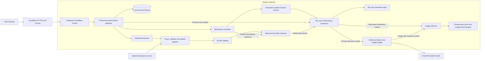

# Ubuntu web demo environment

Status: proposed design, including the IaC evaluation and deployment contract; deployment artifacts and services remain unimplemented.

Updated: 2026-09-25. The owner switched the upcoming demo back to `613202690.xyz` and confirmed that Cloudflare shows the domain as Active. The portal is `feam.613202690.xyz`, with separate first-level admin/workspace hostnames. Owner decisions require on-demand, disposable demos on either Ubuntu or a low-cost cloud host, with no fixed demo hours, Canadian-region requirement, or cloud recovery workflow. These decisions supersede the earlier 15-minute failover design. Ubuntu preflight evidence is recorded in the [workplan](ubuntu_web_dev_demo_workplan.md#8-execution-record); runtime provisioning remains pending.

Implementation sequence and progress: use the [development workplan](ubuntu_web_dev_demo_workplan.md) for checkable tasks, Mac versus Ubuntu execution boundaries, dependencies, and evidence gates. This design remains the architectural source of truth; task completion is recorded in the workplan.

## Recommendation

Use this Ubuntu machine to run a small, invite-only FEAM service: **Cloudflare Tunnel + Cloudflare Access email PIN login + one isolated container per demo user, with powerful hosted model assistance enabled by default**. Phase 1 demonstrates the strongest useful assistance supported by FEAM and records user workflows and outcomes to inform Phase 2 small language model (SLM) development. Admins manage users, sandboxes, model budgets, dataset jobs, and dataset access through a dashboard. A separate pipeline loads and validates datasets, publishes versioned FEAM provider releases, and makes approved releases available read-only to authorized sandboxes.

Keep infrastructure inexpensive while reserving model spending for the purpose of the demo. Cloudflare lists a **$0 Zero Trust plan for up to 50 users**, enough for 10 demo users and a small number of admins. The Ubuntu deployment needs no rented VM, managed database, email service, analytics service, or managed pipeline service; cloud fallback has separate costs. **Hosted inference is a separate, expected usage cost**, alongside domain, electricity, internet, and backup storage. The edge-plan baseline was checked on 2026-09-23; the domain/source comparisons were checked on 2026-09-24. Recheck external prices and limits before deployment. [Cloudflare pricing](https://www.cloudflare.com/plans/)

Make the installation reproducible with **Ansible for Ubuntu configuration, systemd for ordinary service supervision, and Terraform CLI for Cloudflare and disposable cloud resources**. An operator chooses Ubuntu or cloud, starts a fresh demo from versioned configuration and seed data, and tears it down when finished. There is no automatic host failover, synchronized demo database, recovery runner, standby VM, or recovery-time promise. See [On-demand deployment lifecycle](#on-demand-deployment-lifecycle).

Access email PIN login is accepted by the owner; clickable magic links are not required. Use `feam.613202690.xyz` in the owner's active Cloudflare zone; registration stays at Spaceship. See [Domain and hostname choice](#domain-and-hostname-choice).

## Requirements and scope

Confirmed requirements:

- Use this Ubuntu machine as the web-accessible demo host.
- Support admins and regular users, targeting up to 10 users in FEAM sandboxes.
- Regular users use the FEAM CLI/TUI and available datasets. Admins only manage the demo environment; the admin role does not allocate a development workspace or editor.
- A dataset-loading pipeline prepares datasets on the demo host and makes them accessible to selected sandboxes.
- Phase 1 provides powerful hosted model assistance as the normal demo experience, captures user usage patterns, and produces evidence and reusable, eligible examples for Phase 2 SLM development.
- Prefer free and low-cost options. Email allowlisting with passwordless login is a suitable authentication direction.
- Reproduce the installation through IaC on Ubuntu or a low-cost cloud host. Run on demand with disposable contents; ordinary restarts within an active deployment remain safe.

### Confirmed cohort and deployment decisions

| Topic | Owner-confirmed decision |
| --- | --- |
| Initial accounts | Four admins and three regular users, all in Ottawa. Admins receive management access, not workspaces. Keep capacity for ten regular users. |
| Enrollment and login | Invitation only, exact-email allowlists, Cloudflare Access email PINs; no public enrollment or whole-domain grants. |
| Retention and access | The proposed workspace retention, role permissions, separate audiences, and dataset-grant model are accepted. |
| Initial data | Small Government of Canada open-data climate datasets; valid GeoTIFF `.tiff` rasters and Parquet-only published tables. |
| Hosted model | `deepseek/deepseek-v4.1-flash` through OpenRouter, using the evaluated `deepinfra/fp8` route with provider fallback disabled. |
| Project model allowance | US$100 total, following OpenRouter's default currency. Pause new requests until an admin increases the allowance; no automatic monthly reset. |
| Participation | Owner confirms consent has already been obtained. Do not add a participant-notice or repeat-consent onboarding gate for this cohort. |
| Domain | Use `feam.613202690.xyz`, `admin.613202690.xyz` and `u-<opaque-id>.613202690.xyz`. Owner confirms Cloudflare Active status; public DNS returns the assigned Cloudflare nameservers. Route, HTTPS, Tunnel and Access verification remain W8 work. |
| Cloud service | Operator-started alternative host for the same ten-user demo; choose by total cost and measured responsiveness. Canada is not mandatory. No automatic cloud recovery or 15-minute target. |
| Demo contents | Workspaces and runtime demo state are disposable. Recreate from current private enrollment/policy configuration and approved seeds; no cross-host copy or live migration. Keep project spending independent of disposable state. |
| Operating schedule | On demand, with explicit start/stop/teardown; no advertised hours required. |
| Research preservation | Collected research traces and reviewed exports survive demo shutdown and teardown in separate durable storage. Retention duration and export reviewers remain to be configured. |
| Setup and accounts | SSH key access is verified. Owner reports no workload requiring preservation, will run reviewed sudo bootstrap commands, and will supply the OpenRouter key when needed. No cloud account exists yet. |

The exact seven email addresses are retained in the ignored local planning file `.local/demo-deployment/participants.yaml`, with owner-only permissions. This is not executable IaC or an encrypted backup. Move it into encrypted operator configuration before provisioning; do not commit identities into this public design, Terraform configuration/state, images, or research exports. Bootstrap all four admins and three users idempotently by exact identity, then let the control database and membership reconciler own changes. Repeated provisioning must not recreate removed accounts or overwrite later roles. No invitations or account creation have been performed.

Proposed operating defaults:

- Capacity target: 10 simultaneous lightweight demo sandboxes and a management dashboard, with at most one bounded dataset-loading job when headroom permits.
- Each regular user owns one workspace that persists within the current demo deployment, containing synthetic practice fixtures and writable outputs. Pipeline-loaded datasets are shared read-only. Explicit deployment teardown may discard these contents.
- Regular users may run shell commands inside their container. Treat browser terminal access as code execution even when the launcher opens the TUI first.
- Idle workspaces stop after 30 minutes; within a retained deployment, inactive data is kept up to 30 days with advance warning before deletion. Explicit reset or deployment teardown may discard it earlier and requires the corresponding confirmation. Research traces/exports follow their own durable retention policy.
- Hosted assistance is on by default. Sandboxes have no general internet access; model traffic passes through a private, authenticated inference broker with server-side budgets.
- Structured interaction capture is part of Phase 1. Record the owner's confirmation of existing consent in private deployment records, without a new participant notice or repeat-consent gate; keep account/billing records separate from the pseudonymous research corpus.
- One demo deployment serves the public hostnames at a time. Routine restarts may reuse that deployment's files; a fresh deployment may discard them. Stop/revoke the previous deployment before switching hosts. No host continuity or cloud recovery is required; acceptance still distinguishes actual Ubuntu/cloud tests from local automation and HPC evidence.

## Existing machine and FEAM implementation

Read-only inspection produced the following snapshot; it is not a load test.

| Item | Observed | Design implication |
| --- | --- | --- |
| OS | Ubuntu 24.04.5 LTS, x86-64 | Pin and test compatible container/runtime packages. |
| CPU | Ryzen 5 3600, 6 physical cores / 12 threads | Suitable candidate for interactive demos; bound dataset-processing concurrency. |
| RAM | About 16 GiB total; about 12 GiB available during inspection | Budget sandboxes and the dataset pipeline separately. |
| Swap | 4 GiB | Emergency margin; exclude it from capacity calculations. |
| Physical storage | Owner confirms a 2 TB SSD on 2026-09-24 | Ample nominal capacity for the initial allocation; map the device to mounted filesystems and measure current free space during preflight. |
| Root disk | 183 GiB filesystem, 136 GiB available | Keep bounded system logs and image caches. |
| Home disk | ext4, about 1.7 TiB total / 1.5 TiB available | Put FEAM service storage on this disk, in its own service directory. |
| Resource controls | cgroup v2 | Verify actual CPU/memory/PID delegation before admitting users. |
| Existing runtime | Docker and containerd services active; Docker executable present | A dedicated rootless runtime remains to be configured and tested. |
| Web tooling | No `cloudflared`, `ttyd`, Caddy, or nginx found on the inspected PATH; checked web service units inactive | Plan the tunnel, terminal, and portal as new deployment components. |

During the recorded Ubuntu inspection, the shell sandbox failed to start with a network-namespace permission error. Inspection therefore used approved read-only commands outside that sandbox. This is a historical deployment preflight concern, not proof that Docker containers cannot run. Test the intended runtime and namespace policy explicitly; do not globally disable host protections to make the service work.

The [workspace README](../feather-mesh/README.md), [peer-access contract](data_access_contract.md), and [TUI demo runbook](tui_agent_stage1_demo.md) establish these integration constraints:

- FEAM's current interactive interface is an optional Rust TUI; there is no existing multi-user web portal in the inspected implementation.
- The Cargo binary is `mesh_cli`; the installed user command should be `feam`.
- Peer operations require `--project ROOT`. Authoritative data publication is in each provider's `serving/manifest.json`; legacy SQLite is separate.
- The demo script already creates a provider and a `client with spaces`, including Parquet and GeoTIFF fixtures and an intentionally unavailable peer.
- STAC is an unauthenticated, exact-IPv4-loopback metadata service returning local file URIs. It is not an internet dataset-download service and must remain inside the isolated workspace container.
- Existing [footprint measurements](tui_agent_stage1_acceptance.md#footprint-and-conditions) are small, sampled, single-user macOS measurements. They do not prove Ubuntu peak memory or 10-user capacity.

## IaC evaluation and ownership

The original tool split is suitable after separating resource provisioning, host configuration, application state, and process recovery. IaC can recreate the environment; the controller and durable stores must recover interrupted application work. Rerunning an infrastructure apply is not the routine restart mechanism.

| Option | Assessment for this demo | Decision |
| --- | --- | --- |
| Ansible + systemd | Fits an existing Ubuntu installation: packages, service identities, fixed storage, unit files, and repeatable configuration. systemd can recover services without an operator laptop or provisioning runner. | Primary host implementation. Use the same roles for local and cloud inventories. |
| Terraform CLI | Fits API-managed DNS, tunnels, Access applications/policy structure, backup storage, and cloud VM/volume/firewall resources. Host package installation through shell provisioners would duplicate Ansible's job. | Use for external resources; no Terraform Docker provider for users' live containers and no host setup through `remote-exec`. |
| OpenTofu | An alternative with an MPL-2.0 open-source license. Its licensing/governance is a reason to choose it, but it does not save a Terraform CLI fee for this deployment. | Keep as an alternative, not a second supported engine. A future switch requires state/provider compatibility tests. |
| Docker Compose | Useful for a fixed local development stack. It does not replace host mounts, cgroup delegation, application recovery, or the grant-aware workspace controller. | Optional engineering convenience; systemd and the controller own the deployed lifecycle. |
| cloud-init / image baking | Optional ways to speed repeat provisioning. | Start with shared Ansible roles and pinned Linux artifacts. A prebuilt VM image is an optimization, not a recovery prerequisite. |
| Kubernetes / a multi-host scheduler | Adds a control plane while persistent workspaces, authorization, and billing still need a recovery design. | Defer; ten terminals on one active host do not require it. |

**Terraform cost:** running Terraform CLI to manage this demo does not require a paid Terraform subscription. HCP Terraform and Terraform Enterprise are separate offerings; HCP is optional for this plan. Current Terraform uses the Business Source License, whose restrictions concern specified competitive offerings; OpenTofu uses MPL-2.0. Select Terraform here because no requirement calls for the alternative license. Cloud resources, storage, network usage, and hosted inference remain chargeable independently of the IaC engine. [HashiCorp licensing FAQ](https://www.hashicorp.com/en/license-faq), [Terraform editions](https://developer.hashicorp.com/terraform/intro/terraform-editions), [OpenTofu FAQ](https://opentofu.org/faq/)

Assign each changing resource one writer:

| Owner | Managed state | Boundary |
| --- | --- | --- |
| Terraform, run by the operator | Dedicated DNS, tunnels, Access applications/static policy structure, cloud VM/volume/firewall resources and selected route target | One operator owns the selected public deployment; import existing resources before managing them. No live workspace rows, mutable membership, budget balances or data bytes in Terraform. |
| Ansible, run by the operator | FEAM service accounts, package versions, subordinate UID/GID assignments, storage pool and mount definitions, unit files, configuration, approved artifacts | Mutations stay within recorded FEAM resources. A normal converge cannot reset workspaces, restore databases, reformat existing storage, or replace the host's existing Docker service. |
| Application services | Accounts, mutable edge allowlists, grants, lifecycle jobs, container generations, dataset publication, consent, traces, and spending | Database state and application recovery rules govern; the gateway cannot run Ansible/Terraform or obtain operator credentials. |
| systemd | Service start/stop, restart backoff, mount ordering, timers | Boot uses installed configuration and pinned local artifacts. No source builds, migrations, dataset imports, or IaC applies on every boot. |

Resolve the Access-policy ownership conflict before implementing either writer. Terraform owns applications and policies that reference dedicated user/admin Access group IDs. The account reconciler owns those groups and their exact-email membership through the API; Terraform must not also declare the same group resources. Bootstrap creates the groups under the operator's control while public routing is disabled, records their IDs in private configuration, and then creates the referencing policies. Only the active deployment runs the reconciler. Represent zero members with a tested denying group configuration if the API rejects an empty include list; never broaden admission to make an empty group valid. Verify that removing a user followed by a Terraform apply does not restore access. Cloudflare supports reusable groups and programmatic policies; validate the selected provider schema and account permissions in the implementation. [Access policies](https://developers.cloudflare.com/cloudflare-one/access-controls/policies/), [Cloudflare Access group schema](https://registry.terraform.io/providers/cloudflare/cloudflare/latest/docs/resources/zero_trust_access_group)

Keep Terraform state and private deployment inputs on the operator Mac with restricted permissions, encryption at rest, and a single-writer workflow. Keep durable edge configuration separate from disposable cloud-host state so teardown cannot delete the domain or reusable Access configuration. No paid remote-state service is required for this single-operator demo; a remote backend is optional if multiple operators later need it. Do not put state, saved plans, real inventories, secrets, or participant identities into Git or ordinary CI artifacts. Losing state requires inspecting/importing existing resources before another apply, not blindly recreating them. [Terraform sensitive data](https://developer.hashicorp.com/terraform/language/manage-sensitive-data)

Use a private encrypted Ansible inventory/vault for host addresses, enrollment/policy configuration and secrets. Keep the decryption credential with the operator. Install runtime secrets only for the consuming service, suppress secret task logs/diffs, and scope credentials for the pipeline, broker, tunnel and membership reconciler. The owner will run a reviewed sudo bootstrap command when needed; passwordless root access and sharing the sudo password are not prerequisites. Record tool, package, artifact and image versions. The OpenRouter key will be requested only when its configured integration or live validation is ready.

## IaC on the existing Ubuntu machine

**Assessment: a good fit for in-place Ansible provisioning; W0 preflight is complete and W1 runtime proof remains required.** Read-only checks verified SSH, the 2 TB non-rotating device mapping, ext4 `/home`, its private filesystem UUID, about 1.5 TiB available and synchronized time. Root has about 136 GiB free and cannot hold the proposed service allocation. Noninteractive sudo remains unavailable; the owner's supplied privileged output reports no Docker container rows/errors, the existing daemon at `/var/lib/docker`, Snap-only loop devices and loaded AppArmor. Preserve these existing host resources and policies. The owner-authorized disposable QEMU VM and separate native build pass W0 checks, recorded in the [acceptance index](ubuntu_web_dev_demo_acceptance.md). Actual demo runtime enforcement and reviewed host bootstrap remain W1. No reinstall or repartition is proposed.

| Recorded condition | Ubuntu provisioning decision | Evidence required before deployment |
| --- | --- | --- |
| Ubuntu 24.04.x, x86-64 | Target this OS family and `linux/amd64` artifacts; read actual release/kernel/package facts before selecting versions. | Python/Ansible compatibility, package origins, package conflicts, kernel, systemd, and rootless prerequisites recorded. |
| Existing Docker/containerd services | Create a dedicated `feam-runner` rootless daemon, private socket, and data root. Inspect current packages before adding compatible rootless tools. | Existing containers/services remain unaffected; controller inspection proves it addresses only the dedicated daemon. |
| Restricted user namespaces | Use supported RootlessKit packaging and its applicable host AppArmor policy. | An actual container starts under the dedicated identity; no host-wide namespace/AppArmor relaxation. |
| cgroup v2 | Enable lingering for the runner's systemd user manager and delegate required controllers to that identity. | Boot without interactive login works; measured memory/CPU/PID limits and aggregate ceilings hold. |
| 2 TB SSD; recorded large ext4 home filesystem | Record the filesystem UUID and mountpoint; create only the dedicated service directory and fixed backing images there. Put Docker's data root there too. | Available bytes/inodes, filesystem identity, loop-device support, mount behavior, ownership/ACLs, and non-overlapping subordinate ID ranges pass. |
| 16 GiB RAM, shared physical host | Retain the documented admission budgets; build artifacts elsewhere and run backups outside busy demo periods. | Measure existing load plus the actual cohort; a historical free-memory sample is insufficient. |
| Physical host and home internet | Supervise services at boot; configure on-demand start/stop and power availability with the machine operator. | Reboot/login independence, sleep behavior, external reachability, and power-return behavior are tested; firmware or network recovery may need manual setup. |

Docker documents that rootless resource controls require cgroup v2 **and** systemd; accepted CLI flags alone do not prove limits. Install the daemon as a systemd **user** service with lingering, rather than a system service carrying `User=feam-runner`. Constrain the runner's user slice and verify container processes land beneath it; a separate slice for gateway/broker/collector/pipeline does not automatically constrain rootless containers. Ubuntu's RootlessKit AppArmor allowance concerns creating user namespaces; it must not be described as proof of per-container AppArmor confinement, which rootless Docker lists as unsupported. Retain supported seccomp and other sandbox controls and measure the resulting boundary. [Rootless Docker operation and cgroups](https://docs.docker.com/engine/security/rootless/tips/), [Ubuntu prerequisites and rootless limitations](https://docs.docker.com/engine/security/rootless/troubleshoot/)

The read-only preflight should collect `/etc/os-release`, kernel/systemd versions, filesystem UUIDs/mounts and free bytes/inodes, current Docker services/package sources, service-account/subordinate-ID collisions, cgroup controllers, AppArmor/user-namespace state, time synchronization, operator access, and required egress. Useful existing commands on Ubuntu include `uname -r`, `systemd --version`, `lsblk -f`, `findmnt -T /home`, `df -hT / /home`, and `df -i / /home`. Record evidence without dumping credentials or personal files. The first runtime test is a separate, bounded provisioning step.

### Storage provisioning contract

Parameterize the host storage root; `/home/feam-service-data` is the local proposal. Keep paths **inside** containers unchanged when moving to a cloud block volume. Fixed recorded identities and subordinate ID mappings make owned files restorable; where a replacement host has a collision, use an explicit ownership migration for restored service files. Never recursively change ownership of the personal home or an existing Docker data root.

Provision a fixed pool of ten 2 GiB workspace files and two 2 GiB reset spares on the dedicated service path. Track each pool slot, backing-file identity, filesystem UUID, and assigned generation. Format only a newly allocated, unassigned file whose ownership is proven; an existing or unexpected filesystem stops provisioning. The operator mounts this finite pool; the controller only assigns/recycles recorded slots after stopped generations meet retention rules. Normal deployment preserves assignments and bytes. If retained generations consume both spares, reset queues until a slot is eligible; it never creates unbounded extra volumes.

Use a proposed 200 GiB dataset filesystem for the 50 GiB staging and 100 GiB retained-release budgets, including headroom for filesystem overhead and admission thresholds. Those logical limits remain subject to actual free-space and complete-candidate reservation checks. The previous 150 GiB filesystem proposal left no margin at the configured maxima. Ten workspaces plus two spares reserve 24 GiB; adding the dataset filesystem, 5 GiB operations, 20 GiB traces, and a proposed 20 GiB image/runtime allowance gives approximately **269 GiB before additional backup scratch and underlying-filesystem reserve**. Final physical allocations must also cover metadata and the chosen enforcement method. This fits comfortably within the stated 2 TB SSD and recorded home free space, subject to preflight; do not reserve seven uncompressed local copies of the dataset pool.

Mount staging and releases on the same dataset filesystem so promotion remains an atomic rename. System mount units identify storage explicitly and order it before consumers; verify required paths are the expected mounted filesystems, not just existing directories. Order the runner's system user-manager instance after its required host storage, then start its rootless user service. Cross-manager dependencies need a tested bridge: a user unit cannot simply require a system mount unit. Mount loss closes admission and stops affected workloads without writing into underlying empty mountpoint directories. Boot-time socket tmpfs mounts and ACLs are recreated from the finite workspace inventory.

### Proposed repository artifacts and operator workflow

W0 now implements the operator README, read-only preflight and example inventory,
tool/version locks, disposable VM/native-build helpers and offline checks. The
remaining host/deploy/lifecycle, Terraform, image and runtime-role paths below
are deliverables to implement, **not existing deployment entrypoints**:

```text
infra/demo/
  README.md                         operator lifecycle and evidence
  terraform/
    edge/                           DNS, tunnels, Access applications/policies
    research-storage/               durable traces/exports; separate lifecycle
    cloud-host/                     on-demand full-capacity VM, data volume, firewall
  ansible/
    inventories/                    sanitized local/cloud inventory examples
    roles/                          preflight, accounts, runtime, storage, services, archive, lifecycle
    preflight.yml                   read-only host assessment
    host.yml                        converge recorded host resources
    lifecycle.yml                   start/stop/teardown the selected demo
    deploy.yml                      install approved release, migrate, health-check
  images/                           FEAM terminal image and optional cloud image manifests
  tests/                            provision/reboot, intentional stop and clean recreation checks
```

The control machine is the operator's Mac with the locked toolchain. Ansible reaches Ubuntu over verified private SSH or through an operator invocation on Ubuntu. Separate preflight, host converge, release deployment and lifecycle operations. Bootstrap a new demo only through explicit initialization; missing state in an existing generation must not silently reset its permissions or spending.

Before exposure: review preflight, configure runtime/storage, install approved artifacts and current private inputs, initialize the demo, apply the edge plan, and validate identity/application readiness before routing traffic. The Mac runs plan/apply outside the user-facing service. Keep durable research storage and reusable edge resources independent of disposable compute. Cloud provisioning needs an approved account and bounded budget; no independent recovery runner is required.

Implementation CI must add Terraform format/validation and provider-lock checks, Ansible syntax/lint checks, secret scanning, and unit-file validation when the artifacts arrive. Test a disposable Ubuntu VM with real systemd/cgroups/loop mounts; container-only CI does not establish those behaviors. Require initial/repeat converge, active/stopped reboot, fresh recreation, trace/export retrieval after teardown, and safe cleanup. Ansible check mode is only a preview: unsupported tasks can be skipped and tasks can override it. Restrict overrides to audited read-only probes and use `no_log`/disabled diffs for secret-bearing tasks. [Ansible check/diff mode](https://docs.ansible.com/projects/ansible/latest/playbook_guide/playbooks_checkmode.html)

## Architecture

W0 selects Go for host services/orchestration and Python for bounded climate
conversion. The [implementation contract](ubuntu_web_dev_demo_contract.md)
records process/database ownership, typed IPC, settings and operator run-budget
records. The [web baseline](../web_demo/README.md) and
[operator tools](../infra/demo/README.md) now exist; runtime services and
provisioning roles remain later implementation, tracked by the workplan.



Cloudflare Tunnel connects outward from the machine and does not require a public IP or router port forwarding. Cloudflare supports proxied WebSockets, which the terminal needs. Test reconnects through the complete deployed path. [Tunnel documentation](https://developers.cloudflare.com/tunnel/), [WebSocket documentation](https://developers.cloudflare.com/network/websockets/)

| Component | Responsibility |
| --- | --- |
| Cloudflare DNS, Tunnel, Access | Public HTTPS, email verification, coarse access policy, routing to the private origin. |
| Portal/gateway, new component | Validate identity, enforce roles and ownership, present workspace controls, proxy authenticated HTTP/WebSockets. A small Go service with server-rendered pages is a proposed implementation; no SPA is required. |
| Local control SQLite | Accounts, roles, workspace assignments, dataset jobs, release assignments, grants, revocation state, audit events. It is separate from FEAM's legacy registry and is not a dataset publication authority. |
| Workspace controller, new component | Reconcile lifecycle jobs, enforce grants when selecting dataset mounts, and invoke only approved runtime templates. The gateway never gets the Docker socket. |
| Rootless Docker under a dedicated service account | Run demo containers without using the personal account's home or existing daemon as the control plane. |
| `ttyd` + FEAM | Provide an interactive terminal inside each demo container. |
| Dataset pipeline, new component | Run approved fetch/validation jobs, publish through FEAM, prepare complete releases, and report results to admins. Separate service credentials and private staging from sandboxes. |
| Shared provider storage | Hold versioned dataset releases and their authoritative `serving/manifest.json` files; authorized sandboxes receive read-only mounts. |
| Inference broker, new component | Keep upstream API keys outside sandboxes; enforce the selected model/provider, disclosure policy, active-user checks, shared budget reservations, concurrency, and usage accounting. |
| Usage collector and private trace store, new components | Correlate sanitized interactions with tools, reviews, actual outcomes, model usage, and feedback; prepare reviewed exports for Phase 2. |
| systemd, journald, timers | Supervision, bounded logs, idle stopping, backups, and cleanup; units/mounts/configuration installed by Ansible. |

Use `feam.613202690.xyz` for the user portal, `admin.613202690.xyz` for all management pages/APIs, and `u-<opaque-id>.613202690.xyz` for a demo workspace. These are planned routes, not verified endpoints. Keep workspace content on separate origins from the portal; never proxy arbitrary user content under the portal's origin.

Configure explicit hostname routes for the initial small user pool, with an unmatched-host deny rule. All routes terminate at the authorization gateway, which listens only on loopback or a private Unix socket. Every workspace hostname maps to one server-side workspace record. A hostname or unguessable ID is not an access credential. Cache bypass applies to authenticated pages, terminal traffic, and authentication responses.

The controller accepts workspace IDs and fixed actions, not arbitrary host paths, image names, command strings, or mount specifications. Lifecycle requests use structured arguments and idempotency keys. Separate Unix socket permissions restrict controller access to the gateway. Neither service runs as host root; initial OS/runtime/storage provisioning belongs to the machine operator.

### Domain and hostname choice

GitHub Pages provides free `<owner>.github.io` static hosting, not a DNS zone the project can delegate to Cloudflare or point at its Ubuntu/cloud tunnel. It could host a separate public landing page linking to the demo, but does not remove the protected backend's hostname requirement. The selected browser-only Tunnel/Access flow publishes applications under a domain on Cloudflare. [GitHub Pages](https://docs.github.com/en/pages/getting-started-with-github-pages/what-is-github-pages), [Cloudflare published applications](https://developers.cloudflare.com/learning-paths/clientless-access/connect-private-applications/create-tunnel/)

Use the `613202690.xyz` Cloudflare zone with single-level `feam`, `admin`, and `u-<opaque-id>` hostnames. Manage only demo records, Tunnel routes and Access applications; preserve the registration, zone, nameservers and unrelated resources, including during teardown. Leave the owner's `saifshaikh.ca` zone untouched. Retain the same names and Access audiences across fresh deployments and host changes. A Quick Tunnel's random `trycloudflare.com` URL is for development/testing, not this stable invited service. [Quick Tunnel limitations](https://developers.cloudflare.com/cloudflare-one/networks/connectors/cloudflare-tunnel/do-more-with-tunnels/trycloudflare/)

The owner explicitly switched back to **`613202690.xyz` on 2026-09-25** after confirming that Cloudflare shows it as Active. Read-only NS queries through both `1.1.1.1` and `8.8.8.8` returned `mark.ns.cloudflare.com` and `norah.ns.cloudflare.com`; see the [activation record](ubuntu_web_dev_demo_workplan.md#domain-activation-and-hostname-switch-2026-09-25). This supersedes the temporary `demo.saifshaikh.ca` selection. DNS routes, certificates, Tunnel, Access and application readiness still require W8 verification. Keep the admin/workspace names as first-level siblings: default Universal SSL in a full DNS setup does not cover nested names such as `admin.feam.613202690.xyz`. [Cloudflare certificate coverage](https://developers.cloudflare.com/ssl/edge-certificates/universal-ssl/limitations/)

The owner purchased `613202690.xyz` through Spaceship, which remains the registrar while Cloudflare supplies DNS. The [domain note](ubuntu_web_dev_demo_options.md#domain-candidates) retains that history and earlier price comparisons; actual renewal terms remain an operator record to capture. No further domain purchase or nameserver change is required. Verify Ottawa participants' institutional browser access during acceptance. Registrar ownership, DNS activation and a working protected application are separate milestones.

## Roles and user experience

| Capability | Regular user | Admin | Machine operator |
| --- | --- | --- | --- |
| Start, stop, reset own demo | Yes | Manages users' sandboxes; none allocated by the admin role | Recovery access |
| Use FEAM CLI/TUI; edit data in own sandbox | Yes | Management dashboard only | Recovery access |
| Read another user's workspace | No | No by default; explicit audited support action only | Technically possible on the host |
| List users, assign role, disable access | No | Yes | Bootstrap/recovery |
| Stop/reset another workspace | No | Yes, with confirmation for reset | Recovery access |
| Set quotas within host policy; view utilization and job status | Own usage only | Yes | Set host-wide ceilings |
| Run approved dataset-loading jobs and approve releases | No | Yes | Configure pipeline templates and source credentials |
| Assign/revoke dataset bundles for sandboxes | No | Yes | Recovery access |
| Use hosted assistance within assigned budget | Yes | Configure the demo model/profile and spending limits | Provision upstream credentials |
| View aggregate usage; curate/export consented traces | Own session status | Yes, with a separate research-export permission | Configure storage and recovery |
| Change demo release | No | Select an already tested, approved image | Prepare/approve releases |
| Host sudo, arbitrary mounts, Docker socket, personal SSH keys | No | No through the website | Local administration only |

The machine operator is an operational responsibility, not a third public signup role. Initially it can be the owner of this machine. Website admin status does not automatically grant host administration.

Regular-user flow: open the site, authenticate by email PIN, then select **Open assisted FEAM**. Existing consent is recorded administratively; no participant notice or repeat-consent dialog blocks entry. Start the TUI with hosted assistance already enabled and explain how to ask for help. Show the selected model, assigned datasets, usage/budget status, recording status, and reset behavior as ordinary service status. Users ask the assistant to discover and explain data, resolve a pinned version, stage a private copy, and prepare publication/withdrawal actions for local review. Keep the shell and manual controls available for exploration or recovery. Manual fallback during an outage is clearly labeled and is not counted as a successful hosted demo.

Admin flow: use the management dashboard to approve users, set sandbox quotas and model budgets, stop/reset sessions, select approved FEAM images and model profiles, and inspect health, task outcomes, and audit history. A **Datasets** page manages loading jobs, validation, release approval, assignment, and withdrawal. A **Usage** page shows adoption, common tasks, friction, completion, latency, and cost, with controlled trace review/export for Phase 2. Routine management uses these controls and does not require a shell, source checkout, or editor.

## Authentication

### Recommended: allowlisted email PINs

Cloudflare Access emails a one-time code only when the email satisfies its Access policy; codes are single-use and expire after 10 minutes. The login page returns a generic message for disallowed addresses. This avoids operating an SMTP service or implementing token issuance. [Cloudflare email PIN documentation](https://developers.cloudflare.com/cloudflare-one/integrations/identity-providers/one-time-pin/)

1. Bootstrap the four supplied admins locally from private configuration; provide no public signup or self-promotion endpoint. Initialize the three supplied regular users through the same exact-email reconciliation path.
2. An admin adds an exact email address and role in the control database. Assign an immutable local user ID; do not use email strings as directory names.
3. A reconciliation task updates the corresponding dedicated Cloudflare Access group's exact-email membership using a narrowly scoped API credential provisioned by the operator. Terraform manages the referencing applications/policies, not these mutable groups, as specified in [IaC evaluation and ownership](#iac-evaluation-and-ownership). New accounts remain `pending` until the edge membership and any regular-user workspace assignment are ready; admin accounts require no workspace. Admins see synchronization status in the dashboard. An operator command provides recovery if automatic reconciliation fails.
4. Users enter their email at Access, receive a PIN if allowed, and submit it to authenticate.
5. The gateway validates the Access JWT's signature, issuer, intended application audience, and time bounds using a maintained JWT library and the documented key endpoint. It then looks up the active local account and checks the requested role/workspace. Plain email headers are never authentication. [Access JWT validation](https://developers.cloudflare.com/cloudflare-one/access-controls/applications/http-apps/authorization-cookie/validating-json/)
6. Use a separate Access application/audience for the admin host, with an exact admin email list and a proposed one-hour session. User portal/demo sessions may last eight hours. Require the audience matching the requested host; a regular-user token cannot authorize an admin route or enqueue a dataset-loading job.

The control database is authoritative for application authorization; Access is an additional gate. Keep policy changes versioned in private configuration, report synchronization failures, and never broaden policy to all email users or an entire domain to resolve a mismatch. Normalize email consistently with the identity provider; do not collapse dots or plus-address aliases. Bind the verified identity to the local record and handle email changes administratively.

At the tunnel, require Access JWT validation for protected hostnames as well as gateway validation. Restrict expected hostnames and proxy headers; unknown routes fail closed. Tunnel connectivity alone is not authentication. [Tunnel origin Access settings](https://developers.cloudflare.com/tunnel/reference/origin-parameters/)

Maintain local authorization on every request and WebSocket upgrade. Track open streams by local account and workspace; periodically recheck eligibility and token expiry. Disablement increments an account authorization version, rejects new traffic immediately, closes active streams within 30 seconds, and stops its containers. Edge policy/token revocation follows even if a provider API call initially fails. Removing a user from a list must not leave an already-open terminal usable.

Use host-only secure cookies for any local gateway session, with `HttpOnly`, `SameSite`, and the `__Host-` prefix; do not issue shared parent-domain portal cookies. Strip Access assertions, identity headers, and gateway cookies before proxying into user-controlled containers. The gateway consumes authentication material; sandbox processes do not need it. Enforce exact Origin checks on WebSockets and CSRF protection on lifecycle/admin actions, including sibling-subdomain requests. Administrative state changes use POST and require a fresh authorized session.

Require MFA on the Cloudflare account that controls DNS and Access. Email-only admin login is the accepted invited-demo tradeoff; an MFA-enabled identity provider can replace it without changing workspace ownership. If stronger admin authentication is later required, make provider-enforced MFA a launch condition rather than assuming mailbox verification supplies a second factor.


## Sandbox boundary and FEAM integration

Use one container per demo user, including that user's private practice provider and client projects. Separate containers have separate writable filesystems, process namespaces, terminal sessions, and caches. Pipeline-loaded providers are shared through read-only mounts selected by the controller's grant checks. This models isolated FEAM workflows with shared inputs; it does not pretend to be a multi-node shared HPC filesystem.

The runtime should be rootless under a dedicated `feam-runner` account, with a non-root process inside each container. Use a read-only image, drop Linux capabilities, set `no-new-privileges`, retain supported seccomp protection, and impose resource limits. Apply the host RootlessKit AppArmor prerequisites described in [IaC on the existing Ubuntu machine](#iac-on-the-existing-ubuntu-machine); do not claim per-container AppArmor confinement for rootless Docker. Do not mount the personal home, host root, devices, SSH agents, runtime sockets, or controller secrets. Rootless containers reduce host privilege but share the host kernel: this boundary is intended for the invited limited-trust cohort using synthetic practice fixtures and approved public climate data, not unrestricted hostile-code hosting. [Docker rootless mode](https://docs.docker.com/engine/security/rootless/)

Regular demo containers use `--network none`. `ttyd` can listen on a Unix domain socket; mount only that workspace's socket directory so the gateway can reach it without giving the sandbox network access. Enable writable terminal input and origin checks, disable URL-supplied command arguments, and allow at most two browser terminal connections per workspace. The server chooses the fixed FEAM launcher or shell command. [ttyd options](https://github.com/tsl0922/ttyd)

Use restrictive per-workspace socket directories and explicit UID/GID mappings or ACLs. Back each writable socket directory with a small bounded filesystem, such as an operator-provisioned 1 MiB tmpfs with an inode limit, so it cannot bypass workspace storage limits. Prove that the gateway can connect and another sandbox cannot; do not solve rootless permission problems with world-writable sockets. Put no controller or Docker socket in these directories. Treat upstream responses as untrusted: filter authentication-related response cookies/headers and bound response sizes/timeouts.

An example container layout is:

```text
/opt/feam/                       immutable release, SDK, demo script and fixtures
/workspace/demo/provider/       this user's provider and serving manifest
/workspace/demo/client with spaces/
/datasets/demo-climate/          assigned shared provider serving root, read-only
/workspace/cache/               this user's FEAM_CACHE_DIR
/workspace/exports/             explicitly exported user results
/tmp/                          size-limited temporary filesystem
/run/feam-terminal/             this workspace's terminal socket only
/run/feam-model/                this workspace's private inference socket only
/run/feam-events/               this workspace's private event-ingestion socket
```

Build the release once outside demo sessions:

```bash
# Existing repository command; run from feather-mesh/ in a controlled build.
cargo build --release -p mesh_cli --features agent-hosted
```

Install the resulting `target/release/mesh_cli` as `/usr/local/bin/feam` in the image. Generate the existing binary fixtures during image build, install the supported Python SDK and pinned example dependencies, and package the demo script with the fixture tree it expects. Configure `FEAM_EXECUTABLE` and `FEAM_WORKSPACE` to point at that packaged layout. Users do not install packages or compile Rust to start a demo.

On first start, run the existing demo generator **inside the container** against `/workspace/demo`, then launch:

```bash
feam tui --project '/workspace/demo/client with spaces' \
  --agent hosted --agent-profile phase1-demo
```

Generate the practice demo at its final container path because the script writes a provider symlink. Copy its small source fixtures into each user's workspace; never share a writable provider manifest between users. The provisioning wrapper then adds the granted pipeline-provider links and peer configuration described below. This wrapper is new work; the existing demo generator does not attach external datasets. Preserve FEAM's project paths, manifest authority, review confirmations, and recovery journal semantics.

The private demo volume is disposable; reset stops the container, closes its sessions, creates a clean replacement generation, initializes it, reattaches currently granted datasets, verifies health, and switches the workspace record. Shared dataset releases remain intact. A failed initialization leaves the old stopped volume recoverable, but recovery must still enforce current grants. The controller operates on its own recorded volume IDs, never on a browser-supplied path or a user-controlled symlink. Garbage-collect old generations under a bounded retention rule.

If users try STAC, run its service and Python client in the same isolated container so loopback and local file URIs have the correct meaning. It has no application token and rejects non-`127.0.0.1` binds. Do not publish STAC directly to the internet as a substitute for the terminal. A future web dataset viewer or download API is a separate design.

Provision the `phase1-demo` profile outside the writable project, using the broker connection described below. The image includes the hosted feature and the launch profile; users do not need to supply an API key or manually turn assistance on. Existing TUI confirmations and core access rules still govern every operation.

## Dataset-loading pipeline and shared access

Run the pipeline as a local supervised worker with a SQLite job queue and optional systemd schedule. An admin selects a registered source, dataset definition, and audience, then starts or schedules a job from the dashboard. This needs no managed ETL platform or admin development workspace. A trusted CI system can later submit the same job specification through a scoped service identity; browser-user credentials do not become pipeline credentials.

The data definition records a source identifier and pinned object/version or checksum, exact asset inventory, FEAM product/version identity, required reuse metadata, expected size, and intended audience. It also records whether metadata may be disclosed to the hosted model and whether resulting traces are eligible for research/export. Access to a dataset does not itself grant permission to send its contents to a model or use it for training. Source credentials remain in the pipeline's service configuration.

Use a **dataset bundle** as the initial filesystem access unit: one provider namespace and serving root containing products approved for the same audience. Mount only granted bundles. Users with a shell can read every file in a mounted bundle directly, so filtering the FEAM catalog is not an access-control boundary. Split differently restricted datasets into separate bundles/namespaces. Never mount the parent directory containing every bundle or any private staging directory.

### Initial Canadian climate bundle

Use `demo-climate` for an initial bundle available read-only to all invited regular users. The owner accepts the proposed audience and permission model: admins approve exact releases, public descriptive metadata may be disclosed to the selected model, and eligible sanitized interactions may enter the existing-consent research workflow. Raw source or dataset payloads are not automatically uploaded to the model. More restricted future datasets require separate bundles and explicit policies.

These are verified source-catalog candidates, **not downloaded, size-measured, or FEAM-validated releases**:

| Source | Bounded first import | Published format and validation |
| --- | --- | --- |
| [AAFC 30-year Average Maximum Temperature](https://open.canada.ca/data/en/dataset/b3fda923-a875-4dde-bb67-873f9684a031) | One monthly 1991–2020 climate-normal raster, preferably an eastern Ontario/Ottawa-area subset; the catalog offers prepackaged 10 km GeoTIFF grids. | A georeferenced `.tiff` with explicit CRS, nodata, temperature units and climatology interval; verify a known bounded window. |
| [ECCC Daily Climate Observations](https://open.canada.ca/data/en/dataset/5f963c2d-d4ed-5a79-8a31-c9c582ca5098) | One verified Ottawa-area station and one complete historical year of temperature/precipitation observations. Pin station identity and actual available date range during import. | Parquet only, with typed dates, station identifier, units, null/missing-value and quality-flag handling; compare row counts and known values to the source. |

Propose a 250 MiB combined published seed-bundle ceiling, with separate bounded source-download/expanded-size limits; this is an admission limit, not a measured source size. Select a smaller source/subset if necessary. Pin the exact resource URL, retrieval time, upstream version where available, source/output SHA-256, license/attribution, and importer version. Preserve immutable prepared releases off-host so failover does not depend on downloading or processing a live government source.

ECCC's catalog supplies CSV/API data, not a ready-made Parquet release. A tested pipeline importer may fetch that source into private staging and convert it; CSV/JSON are never accepted as published tabular assets or mounted source files. Likewise, a `.tiff` suffix alone is insufficient: FEAM must validate actual GeoTIFF content and metadata. The current [STAC contract](data_access_contract.md#python-and-stac-adapters) limits native geometry to WGS84; inspect the AAFC raster and, if necessary, produce a tested EPSG:4326 derivative in the importer with recorded transform/resampling/nodata provenance, not a relabeled CRS. Keep original immutable source bytes privately for reproducibility. Importer implementation and real SDK/Rasterio checks remain delivery work.

Pipeline stages:

1. **Fetch into private staging.** Download from a registered source or import an operator-provided local artifact. Pin source identity and verify expected hashes; enforce byte, time, file-count, and expanded-size limits. Fetch workers may reach only approved upstreams; validate redirects and resolved addresses, and block host/LAN/metadata destinations. Dataset definitions are data, not executable scripts. Do not execute source-provided commands or unsafe archive entries.
2. **Prepare a candidate provider release.** For a new bundle, initialize a FEAM provider project with its unique namespace. For an update, copy the previous release into a private candidate, preserving its manifest revision, product/version records, and tombstones. Add new assets under new version paths. The initial implementation uses ordinary copies rather than writable hard links to released bytes. Candidate construction and quota checks account for the complete retained bundle, not only the incoming files.
3. **Validate and register through FEAM.** Call existing `validate-metadata`/`serve` workflows against the explicit candidate project root with complete metadata. Rust services enforce Parquet or GeoTIFF inspection, declared inventory, namespace, path, and version rules. Unsupported source formats require a separately tested importer to prepare supported outputs and provenance. Never publish by placing files in a directory, editing SQLite, or hand-writing a manifest. See the [peer-access contract](data_access_contract.md).
4. **Check the candidate as a consumer.** Resolve the exact registered inventory through a fresh client peer link; exercise known-value table queries or bounded raster windows and verify integrity as appropriate. The mounted serving tree must contain only bytes intended for that bundle's audience and required FEAM metadata/projections. Unregistered drafts, input credentials, and validation scratch stay outside it. Present the report, release hash, metadata, provenance, and size to the admin.
5. **Approve and promote a complete release.** Record approval for the exact candidate hash, make the payload immutable to sandbox/runtime accounts, and atomically rename it into a unique release directory on the same filesystem. Only then record it as an assignable release. A crash after the rename leaves a private orphan for reconciliation, not a partial visible release; a failed validation or publication leaves current assignments unchanged. Serialize updates per bundle and recheck the parent release before promotion to prevent concurrent jobs from losing each other's versions or withdrawals.
6. **Assign and attach.** Admins grant a bundle/release to all demo users or selected sandboxes. The controller verifies the current grant, namespace, release integrity/status, and canonical recorded source path, then attaches that release's `serving/` directory read-only. Newly started or recreated containers receive the selected release and peer configuration. Existing sessions remain pinned until the announced update/restart, except for access revocation below.

FEAM's atomic manifest write is the publication boundary inside each candidate; the pipeline's release promotion controls which complete provider snapshot is exposed to sandboxes. These are separate commits. Record job IDs and candidate hashes so a retry reconciles an uncertain commit instead of blindly repeating `serve` and creating a duplicate-version conflict. A failed derived projection must not be reported as an uncommitted manifest write. The control DB tracks deployment and grants; the mounted provider manifest remains FEAM's authority for registered products.

Example host layout and client mapping, all proposed:

```text
/home/feam-service-data/datasets/
  staging/<job-id>/provider/                 private candidate, never mounted
  releases/<bundle-id>/<release-id>/provider/
    .feam/project.toml                      pipeline/provider configuration
    serving/manifest.json                   authoritative registered inventory
    serving/datasets/<product>/<version>/   immutable released data

Sandbox:
  /datasets/demo-climate/                    read-only mount of assigned serving/
  /workspace/demo/client with spaces/peers/demo-climate
    -> /datasets/demo-climate
```

The provisioning wrapper appends the following peer to the existing client configuration, preserving its practice-demo peers:

```toml
[[peers]]
alias = "demo-climate"
namespace = "demo-climate"
path = "peers/demo-climate"
```

There must be only one attached release per provider namespace in a client. Use a namespace distinct from the practice fixture's `climate`. Run `feam refresh` for the explicit client project after attachment. Users read shared assets directly through the resolver/SDK; `consume` remains an explicit copy into their private quota. Transformations and outputs belong in that private space. Ten readers of one release share one stored payload rather than requiring ten full dataset copies.

Use explicit read-only bind mounts, private mount propagation, and no nested writable submounts. Validate read-only behavior with actual shell writes, including attempts through symlinks. A read-only mount does not stop its host owner from modifying the source, so pipeline policy and host ownership must also prevent mutation of released payloads. [Docker bind-mount semantics](https://docs.docker.com/engine/storage/bind-mounts/)

Changing a host symlink or release pointer does not update an existing container's pinned bind mount. Grant changes and release upgrades therefore recreate affected containers while preserving private volumes. Missing assigned storage fails startup visibly; never fall back to an ungranted release or expose the entire dataset store. Sandbox reset recreates only private data and reattaches current grants.

For removal, reject new attachments immediately, close affected sessions within 30 seconds, stop their containers, and recreate them without the removed bundle. For FEAM withdrawal, prepare a successor release using `withdraw` so tombstones persist; drain affected old snapshots and prohibit assignments/rollback that would reactivate withdrawn versions. If bytes must become inaccessible through direct shell reads, remove that bundle's mount as well; a tombstone alone governs FEAM access, not filesystem reads. Already staged copies or exported data cannot be recalled merely by withdrawing a product or removing a mount.

Retain the current and previous permitted release during an active demo when capacity allows. Garbage collection requires zero live assignments and no active preparation job, respects withdrawal restrictions, and uses recorded release IDs. Pin seed source objects, importer settings and checksums so a fresh demo can reconstruct its inputs. Preserving runtime datasets across teardown is not required; retained prepared seed artifacts are an optional startup optimization.

## Phase 1: powerful hosted assistance

Phase 1 is a quality-oriented demonstration and observation period. The owner selected **DeepSeek V4.1 Flash through OpenRouter**, model ID `deepseek/deepseek-v4.1-flash`. Reuse the evaluated `deepinfra/fp8` provider pin, disabled provider fallbacks, and no automatic retries. Model selection is settled; rechecking current endpoint availability and validating the new broker integration remain necessary.

The repository's [fresh Stage-1 acceptance](tui_agent_stage1_acceptance.md#final-fresh-acceptance) records **97/100 tasks**, 169 requests, 90 tool actions, 2,436 ms median task latency, and no detected unauthorized actions in completed state/disclosure assertions. The [report](evaluations/stage1-2026-09-23/live-heldout-v3.json) records US$0.0163681504 known cost. This is bounded, historical, synthetic-fixture evidence for the FEAM harness, not proof of arbitrary scientific workloads, multi-user broker isolation, Ubuntu capacity, current pricing, or a cloud deployment. Earlier failed/regression attempts and unknown-cost cases remain in the acceptance record; do not replace that history with the best score.

The assistant should demonstrate discovery, explanation of reuse metadata, clarification of ambiguous requests, pinned resolution, reviewed staging, publication-draft preparation/validation, withdrawal proposals, and recovery guidance. It uses the current [Stage-1 tools and boundaries](tui_agent_stage1_contract.md). It cannot administer users, grant datasets, execute arbitrary shell code, bypass local reviews, or modify a shared provider. More powerful inference does not change those permissions.

Start from the [evaluated profile](tui_agent_stage1_acceptance.md#live-evaluation-and-all-attempt-accounting): temperature 0, reasoning disabled, 1,024 output tokens, 48,000 context characters, 16,000 response characters, 128 KiB request/response bounds, eight tool calls, and a 120-second request envelope. The recorded price ceilings were US$0.14 input / US$0.42 output per million tokens; these are historical profile caps, not a new price quote. Recheck them before traffic and fail visibly if the pinned route is unavailable or exceeds an approved ceiling. The upstream route did not support the optional `parallel_tool_calls` parameter; preserve the tested omission and serialized local execution. Change settings only as a versioned, re-evaluated profile; do not silently route to a different provider or cheaper model.

### Model connection and credentials

Run a private inference broker outside user containers. It owns the real upstream key and accepts only the FEAM model protocol, with approved tools and a server-selected model/provider. It enforces account status, workspace ownership, disclosure rules, payload limits, and budgets independently of settings a shell user can edit. It provides no arbitrary HTTP proxy, filesystem access, or model administration API.

Keep demo containers on `--network none`. A small in-container adapter exposes an HTTPS loopback endpoint and forwards requests over that workspace's private Unix socket to the broker. Install a scoped trust certificate for the adapter in the image; keep both links private and preserve the current HTTPS profile requirement. The proposed `phase1-demo` profile points to this endpoint and obtains a short-lived **broker capability**, not an upstream API key, through the named environment variable. A shell user can read that capability, so bind it to their workspace/account, allowed operation, authorization version, expiry, and budget. Do not treat it as a secret that can grant more authority than that user already has.

The controller provisions the socket and capability and revokes them on stop, reset, or account disablement. Only this workspace's socket directory is mounted, with bounded storage and restrictive permissions. The adapter/broker must preserve streamed responses, complete tool-call arguments, provider request IDs, usage frames, cancellation, and typed errors expected by `mesh_agent`. This bridge is new implementation work and needs a real end-to-end compatibility test. The existing adapter follows the [router tool protocol](https://openrouter.ai/docs/guides/features/tool-calling); enforce provider restrictions in the broker using the [routing controls](https://openrouter.ai/docs/guides/routing/provider-selection).

Separate conversation histories and request IDs per user/session; never reuse one user's context in another's request. The broker records and verifies the actual provider/model used, rejects unapproved fallback, and redacts credentials and disallowed paths/content before persistence or external transfer. Preserve the existing harness's outbound filter as well. Pipeline-approved metadata may be included according to its disclosure policy; mounted datasets are not automatically uploaded. Select provider retention/data-collection settings explicitly; the router documents that policies vary by provider. [Provider logging policies](https://openrouter.ai/docs/guides/privacy/provider-logging)

### Spend and concurrency

Proposed starting admission limits are one in-flight model request per user and three across the host, with a visible fair queue. Ten users can have active assisted sessions while inference requests queue; ten simultaneous provider generations are not assumed. Cancel queued requests when their session expires, and verify account/grants again before dispatch.

The confirmed allowance is **US$100 across the project**, not per user, per host, or a renewing monthly allowance. OpenRouter credits are USD-denominated. Alert at proposed 75% and 90% thresholds; pause new dispatch whenever finalized spend plus outstanding/unknown reservations plus the new request's worst-case cost would exceed the current allowance. Existing admitted requests remain reserved and reconcile normally. An authorized admin can raise the total ceiling through an audited action; restarting, resetting a workspace, changing month, rotating keys, or moving to cloud never replenishes it. Show the pause and remaining/reserved amount clearly; manual FEAM remains available without being counted as hosted success. [OpenRouter credit currency](https://openrouter.ai/support/)

Enforce per-request and configurable per-user/day guardrails inside that project allowance. Reserve worst-case request cost transactionally before dispatch, including billed reasoning/output and applicable usage fees, then reconcile with returned usage. Uncertain billing retains its reservation and is marked unknown until reconciled; timeouts, disconnects, and client retries must not reset spending. Cache/reasoning token accounting and model prices belong to the pinned profile. Local `:usage` is a useful display, not the shared spending authority. Use a dedicated provider key/account limit as a secondary safeguard; do not assume an account balance shared with other projects is this project's ledger. Reconcile existing attributable project charges when initializing it. Track credit-purchase fees/taxes separately from metered usage rather than treating the US$100 credit allowance as an all-inclusive infrastructure budget.

The model, provider route, project currency/allowance, and pause-until-admin-increase behavior remain settled. Before a live run, the operator records a bounded allocation against the existing project allowance outside the disposable host; the broker enforces that run's allocation transactionally. Reconcile final usage on shutdown; an inaccessible or uncertain run keeps its full outstanding allocation reserved until verified. Fresh demos cannot replenish the US$100 allowance. An operator-held ledger and per-run allocations avoid a distributed billing/recovery journal. Verify the allocation, attributable prior charges, current prices and requested finite test spend before dispatch. Missing/unreconciled accounting denies new spending. No billable evaluation is authorized by this design.

## Usage capture and Phase 2 SLM development

Collect structured FEAM interactions so Phase 2 can learn what users actually attempt, where assistance works, and which tasks need a smaller model. Keep the same FEAM tool/service boundary for hosted and future local inference, as described in the [TUI/agent design](../tui_agent_harness_design.md). Raw terminal transcripts, broad keystroke recording, and the recovery journal are poor substitutes for structured workflow events.

| Event/data | Capture | Purpose |
| --- | --- | --- |
| Context | Pseudonymous participant ID, session/turn/task IDs, existing-consent record reference, FEAM image/tool-schema/profile versions, dataset bundle release and manifest revisions | Reconstruct the relevant environment without account email or host paths. |
| Request and response | Redacted user request and visible assistant answer, clarification turns, explicit edits/corrections | Identify intents, helpful explanations, ambiguity, and repair patterns. |
| Tools and reviews | Proposed tool/arguments, validation result, filtered tool result, review presented, accepted/rejected/edited/cancelled decision | Distinguish suggestions from approved actions and learn safe tool selection. |
| Outcomes | Commit/receipt or journal outcome where verifiable, typed failure, abandonment, manual fallback, optional user rating | Measure task success independently of model claims. |
| Usage | Observed model/provider, provider generation ID, input/output/available reasoning/cache token counts, reserved/final/unknown cost, queue/first-token/total latency | Compare quality, cost, speed, and future SLM requirements. |

Capture model exchange/accounting at the broker and application actions at explicit TUI/harness/service instrumentation points. Application events use a separate per-workspace Unix socket, so collection needs no general sandbox network access. Apply the same bounded-directory permissions and revocable workspace identity as the model bridge; expose only event submission, not trace queries or exports. The collector correlates IDs, deduplicates retries, orders events, and records missing spans. Reviews and later user actions cannot be inferred from broker traffic alone. Existing `:usage` and journal records do not contain this complete sequence; event emission and collection are new work.

Store bounded, sanitized events in a private append-only event stream with a small local SQLite index and a separate transactional broker budget ledger. Keep these stores outside sandbox/reset volumes. The collector authenticates event sources and enforces quotas, schema versions, and record-size limits. Mark broker-observed, client-reported, and independently verified fields separately: sandbox users can alter their software and fabricate application events. Verify important success labels against applicable manifests/receipts where possible; a reported success is not automatically a training target. Capture gaps must be visible in admin metrics and exclude incomplete examples from trusted exports. Ledger failure rejects new billable requests; telemetry failure visibly pauses recorded sessions or requires an explicitly labeled unrecorded mode, with no silent loss presented as complete evidence.

The owner confirms that participant consent already exists and no new participant notice is required. Record that administrative confirmation and a reference to existing consent evidence where available; do not fabricate an original consent date, signature, or version. Do not add a first-use notice or repeat-consent dialog. Continue to display provider/recording status and honor withdrawal from future research collection. An unrecorded/manual path can remain available under the participation policy; label it and do not fabricate missing research data. Keep minimum operational accounting separate from research content. Proposed retention remains 90 days for sanitized session events and 30 days for operational logs; curated exports need an explicit owner, purpose, expiry, and deletion policy rather than indefinite retention. Approval of workspace retention does not silently settle a different research-retention policy.

Exclude API keys, auth tokens, emails, private paths, raw dataset payloads, and hidden model reasoning from the research corpus. Store only visible responses and structured actions/outcomes. Maintain the participant-to-account mapping separately with restricted access, and require a separate research-export permission for trace content. Process participant deletion/withdrawal across active events, derived datasets, and expiring backups; record export lineage and the practical limits of retracting already distributed artifacts or trained models. Review dataset/model-output reuse conditions before treating traces as training material; demonstration permission and provider-side no-training settings are not the same as permission for our own training reuse.

Phase 2 uses the collected evidence in this sequence:

1. Summarize real task frequencies, clarification needs, failure/denial patterns, manual corrections, and latency/cost. Use these findings to set the SLM's supported scope and improve deterministic tools or UI where that is more effective.
2. Build versioned, reviewed examples from eligible traces: task context, user request, allowed tool choices, validated arguments/results, concise answer, and verified expected outcome. Keep rejected/failed proposals with explicit negative labels; never convert them into successful demonstrations. Retain provenance to source events, model/profile, consent, dataset release, and reviewer.
3. Deduplicate and split by participant/project, dataset family, and task template to reduce leakage. Freeze a held-out evaluation set before prompt tuning or training, and keep it out of teacher-generation prompts and training exports. Report the small cohort's coverage limitations and label synthetic augmentation separately.
4. Benchmark candidate SLMs against the powerful hosted baseline using the same supported tools, fixtures, and task-outcome rubric. Try prompt/context/schema improvements first; use eligible examples for supervised adaptation/distillation if justified. Report completion, clarification quality, denied/unauthorized actions, tool validity, latency, and CPU/RAM footprint. Model outputs alone are not correctness labels.
5. Train or fine-tune in a separate development/training environment; it is not an admin workspace on the demo host. Version the resulting model, prompt/template, quantization, tool contract, and evaluation report. Promote an SLM only after it meets agreed quality and target-resource gates, preserving the same permissions and review semantics. Keep hosted Phase 1 and local/HPC Phase 2 results distinct.

## Capacity, storage, and admission

The following numbers are proposed initial limits, not measured consumption.

| Workload | Count | Memory hard limit | CPU ceiling | Persistent storage |
| --- | ---: | ---: | ---: | ---: |
| Regular demo | Up to 10 | 512 MiB each | 0.5 logical CPU each | 2 GiB each |
| Dataset-loading worker | At most 1 | 2 GiB | 1 logical CPU | 50 GiB staging budget, reserved before each job |
| Tunnel, gateway, controller, inference broker, collector, databases | Shared | Combined budget 2 GiB | Bound background work; prioritize interactive traffic | 5 GiB operational storage plus 20 GiB trace-store budget |
| Shared dataset releases | Shared across granted sandboxes | File cache accounted in measured host/container usage | I/O bounded by job and reader limits | 100 GiB initial retained-release budget |
| OS, desktop, page cache, reserve | Shared | Approximately 7 GiB remains on a 16 GiB host | Remaining capacity | Existing host storage |

Ten demo limits total 5 GiB; adding one dataset worker and the control plane yields about 9 GiB. Hosted model inference runs remotely, so Phase 1 reserves no local model weights or GPU. Account for runtime overhead and memory already used by other host applications. The controller admits a new workspace or pipeline job only when both the configured aggregate budget and current host headroom permit it; show a queue or capacity message otherwise. Model-request admission and spending reservations are separate broker checks. Do not rely on every process staying below its limit by chance.

Set 128 PIDs per demo container, bounded file descriptors, and size-limited `/tmp` and `/dev/shm`; tmpfs usage counts against the memory budget. Disable additional container swap allowance so a runaway sandbox cannot create a host-wide swap storm. Add an aggregate demo cgroup ceiling, and retain host headroom even if every user reaches their cap. A 512 MiB limit is for the TUI, hosted-request handling, and bounded fixture queries; it does not make arbitrary large Polars/raster processing safe. Measure with the actual approved model profile and dataset workloads before increasing demo scope.

Rootless Docker resource flags require cgroup v2 and systemd, with appropriate controller delegation. Verify `memory`, `cpu`, and `pids` enforcement by measurement, not just accepted configuration. Ubuntu's restrictions on unprivileged namespaces may require the supported runtime/AppArmor packaging. [Docker resource controls](https://docs.docker.com/engine/security/rootless/tips/), [Ubuntu rootless prerequisites](https://docs.docker.com/engine/security/rootless/troubleshoot/)

Store service data in a dedicated directory on the large home filesystem, such as `/home/feam-service-data`, with owner-only subdirectories. Verify its mapping to the owner-confirmed 2 TB SSD. The actual location is an operator deployment choice; it must not expose `/home/saif` to containers. Container memory limits do not enforce disk quotas. Ansible provisions the fixed-size ext4 workspace pool and mount units specified in [Storage provisioning contract](#storage-provisioning-contract); preallocate storage rather than relying on unbounded sparse growth. The web controller cannot mount arbitrary images or paths. A dedicated quota-enabled filesystem is a later alternative; existing ext4 quota support has not been verified.

Maintain the two preallocated reset spares, serialize reset jobs if needed, and include spare volumes, Docker image storage, logs, and backup scratch in the disk budget. Container root filesystems remain read-only so persistent writes cannot bypass the assigned workspace limit. Bound and rotate terminal/runtime logs; disable shell transcript logging by default. Refuse new allocations/starts/reset jobs when the underlying host data filesystem or root filesystem has less free space than 15% or 20 GiB, whichever is larger. Apply per-volume byte/inode and headroom checks separately: the 20 GiB host threshold must not be applied to each 2 GiB workspace image or other small bounded filesystem.

Put dataset staging and releases on the same dedicated, size-bounded filesystem to support atomic rename promotion. Provision 200 GiB for the proposed 50 GiB staging and 100 GiB retained-release budgets plus filesystem overhead and free-space reserve. Before a job, require that actual available space after its complete reservation stays above the dataset filesystem's 15% or 20 GiB threshold, whichever is larger. Reserve the complete candidate, incoming source, and required rollback versions; refuse a job that cannot fit even if one logical budget has room. Keep the trace store independently bounded, with its own high-water mark, retention, and visible backpressure rather than silent event loss. Dataset retention and research-event retention are separate from the 30-day private-workspace policy.

Prefer preprocessed, modest-size dataset subsets for the initial cohort, with larger inputs added only after measurement. Stream validation and conversion where possible, cap ingestion I/O, and run heavy jobs while the demo is stopped if they affect interaction latency. Builds and SLM training run in the project's separate engineering environment or available CI; the web service hosts management, demos, bounded ingestion, and telemetry.

## Software and model-profile releases

FEAM software releases, dataset releases, and hosted model profiles are independently versioned. Loading a dataset does not require rebuilding the FEAM image. Record all three in session events so comparisons and rollback remain interpretable.

Release workflow:

1. The engineering pipeline builds and tests an image with the hosted feature, fixtures, SDK, terminal tooling, and broker adapter. Record source commit, dependencies, schemas, and image digest.
2. Test it in a disposable staging sandbox through the actual browser, broker, and collector path, including the selected powerful model and assigned dataset release. Run live checks only with the chosen account and budget configured.
3. Mark the image and model profile as approved. Admins select approved versions and see their compatibility and expected cost; they do not execute build scripts from the dashboard.
4. Start new sessions with the approved image/profile and current grants. Model-profile changes begin a new conversation context and clear pending proposals, preserving current TUI review semantics.
5. Drain sessions before software migration. Keep the previous compatible image and data backup for rollback. Apply current account/grant/withdrawal rules after any restore; a rollback never restores revoked access.

Host-side automation pulls or installs approved artifacts with narrowly scoped credentials. The admin website and user containers receive no runtime socket, arbitrary deployment authority, or upstream model key. Pipeline/collector restarts must not restart unrelated sandboxes, and broker restart must preserve spending reservations and cancellation state.

Ansible's release deployment drains affected operations, takes a consistent pre-migration backup, runs explicit versioned migrations once, and verifies health before marking the release current. Unit/configuration changes notify only affected services. Retain the approved image and host binaries on disk so an ordinary reboot does not need the build system or registry. A previous binary is a valid rollback only with a compatible database schema; otherwise use the explicit restore workflow and its current-authorization/billing reconciliation. Bootstrap, migrate, and restore are separate recorded actions.

## Lifecycle and control data

Use a small local SQLite database on the local filesystem. Proposed records:

| Record | Minimum fields |
| --- | --- |
| Account | Immutable ID, exact email, verified provider identity, role, pending/active/disabled state, authorization version, timestamps. |
| Workspace | ID, owner ID, active-site ID, hostname, assigned image digest/model profile, dataset grants and release assignments, recorded volume/socket IDs, site-local generation, state, last activity. |
| Lifecycle job | ID, action, workspace ID, idempotency key, expected generation, status, bounded error detail. |
| Dataset job/release | Job/source IDs, definition hash, bundle namespace, parent release, candidate/release hash, source provenance, checksums, validation/approval state, size, manifest revision, withdrawal restrictions. |
| Dataset grant | Bundle and selected release, audience/user/workspace IDs, status, grant version, effective time, actor. |
| Model request/budget | Account/workspace/request IDs, profile, reservation, observed usage/cost or unknown state, queue/dispatch/completion times, provider generation ID. |
| Research consent/export | Pseudonymous participant mapping, existing-consent record/state, event references, corpus/schema version, retention, export provenance and permissions. |
| Audit event | Time, actor ID, action, target ID, outcome, correlation ID; no credentials or terminal contents. |

Serialize start/reset/delete per workspace and reserve capacity transactionally to prevent duplicate containers from concurrent requests. Reconcile database state against container labels on controller restart; clean up orphan runtime resources only when ownership is proven. States should distinguish `stopped`, `starting`, `running`, `stopping`, `resetting`, `failed`, and `pending-delete`.

Browser disconnect should preserve a short reconnect window, using a private `tmux` session if persistent terminals are desired. Count user input or explicit activity, not transport heartbeat traffic, for idle stopping. Track an active model/tool operation explicitly so it is not mistaken for idle transport, but bound its lifetime. Cancel queued/in-flight inference as appropriate on stop and reconcile any billable work. Warn before idle shutdown. Stop gracefully so FEAM can finish or journal an in-flight mutation, then enforce a shutdown timeout. An idle stop preserves files; reset replaces private demo data and reattaches current grants; account disable revokes sessions and broker capabilities and stops workloads. Dataset and trace retention follow their own policies.

## Restart and reboot contract

During an explicitly running demo, systemd restarts failed services safely. An intentional stop or teardown must persist across host reboot and remain stopped. This is ordinary same-host supervision, not cloud recovery. The following are acceptance requirements, not measured results:

| Event | Expected recovery | What the user can expect |
| --- | --- | --- |
| Browser/tunnel/gateway disconnect | Reconnect to an existing eligible container and private `tmux` session within its activity window. | Terminal connection interruption; surviving processes can continue. Revalidate identity and ownership. |
| Controller restart | Inspect recorded container labels, slot IDs, generations, grants, and pending jobs; adopt only proven owned resources. | Existing eligible containers keep running; lifecycle controls pause during reconciliation. |
| Broker/collector/pipeline restart | Recover durable requests, reservations, event cursors, and jobs independently. | Affected operations show interruption or an unknown outcome; do not automatically repeat a billable request or uncertain publication. |
| Host reboot or rootless-runtime restart | Verify desired running/stopped state, mounts and current configuration before starting anything. | A running deployment may restart; a stopped deployment stays stopped. Existing same-host files may persist, but new TUI processes have no pending approvals. |
| Host loss | Report unavailability; the operator may provision a fresh demo on either host after revoking the old deployment's public/model access. | No automatic cloud activation or restoration of previous demo contents. |

Use independent service units with bounded restart delays/rate limits, startup health checks, and graceful shutdown timeouts. The rootless runtime uses the dedicated user's manager; demo startup remains gated by the persisted desired state. Disable Docker's autonomous restart policy on demo containers so only the controller starts them after authorization/storage checks. Gateway/controller failures must not cascade through unrelated sandboxes; state or mount failures deliberately stop affected writes.

Boot in this order:

1. Verify the underlying filesystem and mount the registered data/workspace filesystems, recreate bounded socket tmpfs directories, and verify UID/GID mappings and ACLs. Missing storage fails service startup visibly; it never initializes an empty replacement database or dataset tree.
2. Start the runner's user manager/rootless daemon and independent host services after their storage dependencies. Open existing databases at the expected schema version; perform recovery checks without replaying deployment migrations.
3. Confirm the operator-selected deployment is still intended to run, reconcile containers/jobs against durable records, invalidate stale capabilities, and preserve all unknown spending/publication outcomes for reconciliation. Readiness remains false if authorization, billing, or required recording state cannot be trusted.
4. Admit eligible workspaces within current capacity and grants. Keep explicitly stopped/disabled workspaces stopped; interrupted reset/import jobs go through their recovery rules before resuming. Reissue workspace capabilities and start new TUI conversations without pending approvals from before the reboot.
5. Report assisted-demo readiness through the authenticated gateway. The tunnel may connect earlier to show maintenance, but terminal/model routes remain unavailable until their checks pass. Failure of one assigned release blocks its workspaces; failure of shared authorization/billing storage blocks all affected routes.

A proposed initial target is readiness within five minutes after the OS, required storage, and network are available, with no interactive host login. Measure it on the Ubuntu machine and revise before making a user promise. Hardware power restoration, failed disks, firmware prompts, provider outages, and full-disk recovery fall outside that routine-boot target.

## On-demand deployment lifecycle

The operator runs the environment only when needed, selecting either the existing Ubuntu machine or a disposable cloud VM. The latest owner decision supersedes cloud failover, a 15-minute recovery target, Canadian-only regions, off-host replication, activation leases, automatic promotion/handback, standing recovery runners and recovery-backup acceptance gates. Cloud is an alternative fresh deployment, not a replica of Ubuntu.

### Start, stop and teardown

1. **Plan:** select the host, exact artifact/configuration revision, current private roster/grants, seed objects and a bounded model allocation. Preview cloud resources and costs before a paid start. A regional allocation failure is reported; it does not authorize a more expensive alternative.
2. **Start:** verify Ubuntu is powered/reachable or create the approved cloud VM. Apply shared Ansible roles, install pinned native Linux artifacts, initialize an explicitly new demo generation, and validate authentication, isolation, data and budget settings privately. Point the existing public hostnames at it only after readiness checks.
3. **Stop:** reject new sessions and requests, drain/cancel bounded work, reconcile or reserve unknown spend, handle research exports under the selected retention policy, then stop demo services. Persist desired state so systemd/reboot does not bring an intentionally stopped demo back online. An inactive site never causes automatic cloud creation.
4. **Teardown:** revoke deployment-specific public/model access, handle required exports, and remove only the identified disposable VM, data volumes, IPs and demo-generation paths. Keep the domain, reusable edge configuration, private enrollment/policy inputs, IaC state and project spending record. Ordinary stop is reversible; teardown explicitly discards demo contents. Show the owned resources and deletion scope before the operator invokes it.
5. **Recreate:** use the same versioned code, current enrollment/policy inputs and pinned seeds for another fresh demo. No old SQLite control DB, workspace volume, runtime dataset history or terminal process is needed. Do not silently re-enroll disabled participants from an outdated bootstrap roster.

Only one deployment serves the public hostnames at a time. Switching requires stopping or revoking the prior deployment's route, tunnel credentials and model authority, with no automatic monitoring/fencing system. Keep a current operator deployment record and test repeated lifecycle commands. A failed teardown reports billable leftovers for cleanup. The operator Mac may be required to start a demo; it is not needed for ordinary service restarts while that demo is running. IaC alone cannot power on an unreachable physical Ubuntu machine.

### Cloud size, region and cost

Start from **8 x86-64 vCPUs and 16 GiB RAM**, subject to measured ten-user performance. CPU count alone does not establish equivalent capacity or responsiveness. Keep the same ten workspaces, hosted model queue, bounded ingestion, dashboard and isolation features. Prefer eastern North America for the Ottawa cohort: Toronto, New York/New Jersey and nearby US regions are candidates. Canada is not mandatory. Europe is a cost comparison; select it only if measured terminal responsiveness makes the savings worthwhile. Measure the actual browser/Cloudflare/host path and hosted-model latency separately.

The current full-quota storage plan still needs about **320 GiB of service storage plus OS/scratch**. Disposable contents do not reduce concurrently promised quotas. Quote a separate disposable data volume if the instance disk cannot provide this; account for providers quoting decimal GB rather than GiB. A smaller seed-only storage profile would require a separate explicit quota decision.

Prefer hourly cloud compute that can be deleted after use. A powered-off VM may remain billable; include separately billed volumes/IPs and verify their deletion. Preserve only selected reusable artifacts or reviewed research exports; there is no mandatory standing compute, paid recovery backend, daily full-environment backup, or prebuilt VM snapshot. Ordinary provisioning may install packages and fetch pinned seeds because no recovery-time SLA applies. Measure startup time for operator usability without advertising an untested deadline. The [domain and cloud shortlist](ubuntu_web_dev_demo_options.md) records current research and quote limitations.

### State that is separate from disposable contents

Keep the small current operator configuration, credentials, Terraform state and project spend allocations outside disposable compute. User/permission removals and consent restrictions must not be undone by recreation. Maintain current private configuration through the admin/operator export workflow before ending a normal run; on uncertain loss, review it before reactivation. This is operator-managed configuration, not continuous database replication.

The owner explicitly requires **collected research traces and reviewed exports to survive demo shutdown** and accepts intermittent uploads, including a Git repository if suitable. Store sanitized traces, exports, provenance and deletion lineage outside disposable hosts and Terraform compute state. A private Cloudflare R2 Standard bucket is the proposed default, subject to account/price approval. A separate private Git repository is an alternative for small batches if selected; do not put participant traces in the public source repository. Implement one selected archive destination, not both by default. This archive does not restore workspaces or replicate the application database.

Upload bounded trace batches during a run and expose the persisted watermark. Proposed initial batching is every five minutes or 8 MiB, whichever comes first, with a bounded local spool and content hashes for idempotent retries. On normal shutdown, drain collection, flush pending batches and verify checksums/manifest completeness before confirming archival success or deleting the source. A failed archive may stop compute services but blocks destructive teardown of its only copy. Retrieve traces and reviewed exports after deleting a test VM to prove preservation. Restrict archive credentials to collector/operator identities; sandboxes cannot read research history. Abrupt host loss may lose the unuploaded tail; report it relative to the last confirmed upload, with no zero-loss disaster recovery promise. Retention duration, deletion rules and reviewers remain configuration decisions; shutdown itself is never a research-deletion trigger.

## Operations

- **Availability:** run on demand. Keep Ubuntu powered and connected while selected, or allocate cloud compute for that run. No fixed demo hours or uptime schedule is needed.
- **Supervision:** verify mount identity, current desired state, authorization, broker limits and collector capacity. Use systemd for same-host failures; do not auto-start another host.
- **Monitoring:** report sessions, resource/disk use, import errors, request queue, provider errors, known/unknown spend, capture gaps and cloud resources still being billed. External failure-detection/automatic-recovery services are out of scope.
- **Data handling:** preserve the existing disclosure, consent, deletion and restricted-export boundaries. Confirm research retention separately. No new Canadian-only hosting restriction is implied by the Canadian source datasets.
- **Maintenance:** patch through reviewed automation and use explicit operator start/stop/teardown. Keep the sudo bootstrap narrow and reviewable. A planned reboot remains a distinct operation, even though the owner has no workload requiring preservation.
- **Operator records:** keep private configuration and accounting outside disposable compute. Prefer small reviewed exports to backups of entire demo hosts; a backup service is optional, not a deployment prerequisite.

## Cost and alternatives

| Item | Baseline cost | Qualification |
| --- | --- | --- |
| Existing Ubuntu hardware | No new compute rental | Power, wear, and internet remain real costs. |
| Cloudflare Zero Trust Free | $0 subscription for this user count | Current limit is 50 users; no paid features assumed. |
| Tunnel connector and host software | No software subscription proposed | Docker Engine/rootless, ttyd, Go, SQLite, systemd; local pipeline/broker/collector implementation and maintenance still take time. |
| IaC tooling | No paid Terraform or Ansible subscription required | Terraform CLI and Ansible run from an operator machine; HCP Terraform is optional. Backend storage, CI/artifact retention, and maintenance may cost money. |
| Domain | Registration purchased; annual renewal remains | `613202690.xyz` is registered at Spaceship and Active in Cloudflare per the owner. Retain the actual paid total and renewal terms; earlier indicative prices do not establish those amounts. |
| Durable research storage | Depends on retained bytes and requests; see the shortlist | Traces and reviewed exports must survive shutdown. Full demo-host backups and a recovery backend are not required. |
| Email delivery | No separate SMTP service in the recommended path | Access supplies the email PIN flow. |
| Hosted model API | US$100 project usage allowance | DeepSeek V4.1 Flash through the pinned OpenRouter route; pause new dispatch until an admin raises the allowance. No monthly/host reset. |
| Dataset ingestion and trace storage | No managed service required | Source licensing/egress and any extra backup capacity may cost money; use approved local/public data where suitable. |
| On-demand cloud host | Approved instance, data volume, IP and transfer charges while allocated | Delete disposable resources after the run; account for any explicitly retained artifacts separately. |

For electricity planning, measure wall power: average watts × operating hours ÷ 1,000 gives kWh; multiply by the applicable tariff. Do not present existing hardware as cost-free to operate. Avoid auto-upgrading services to paid plans; show quota failures explicitly and review limits before increasing scale. [Cloudflare plan limits](https://www.cloudflare.com/plans/)

Estimate model spending from measured requests per task, tasks per user, and billed tokens/fees for the pinned profile, including reasoning/cache behavior where applicable. The US$100 project allowance is settled; the very low historical fixture cost is not a forecast of arbitrary real sessions. Keep the selected model and pause at the admission boundary until an admin raises the allowance; do not silently substitute an unvalidated model. Recheck current route prices before rollout.

| Alternative | When it helps | Why it is not the starting point |
| --- | --- | --- |
| Supabase + free SMTP magic links | Clickable links are a firm requirement | More services, mail setup, callbacks, and free-project pause behavior. |
| Direct HTTPS reverse proxy on this machine | Public address/port forwarding already works; avoid a tunnel provider | Requires ingress and certificate operations, plus a separate identity layer. |
| Private VPN access | Small trusted internal team | Adds client setup; less convenient for a browser-only external demo. |
| Full workspace platform | Many hosts or richer workspace provisioning | More deployment scope than ten assisted terminals and a management dashboard. |
| VM or microVM per user | Users are mutually untrusted or need unrestricted code execution | Stronger boundary, with more memory and operational overhead. |
| Cloud VM | Run the same demo when the operator selects cloud | Fresh on-demand deployment; no standby, automated failover or state restoration. |

## Delivery milestones and acceptance

The owner decisions and private planning roster are recorded; the existing Stage-1 model evaluation is linked above. All web/IaC delivery milestones below remain future work. Document creation did not install services, register a domain, create external accounts, deploy infrastructure, download datasets, send invitations, or run a new live model/load test.

These milestones implement Phase 1; Phase 2 SLM development follows the evidence workflow above.

| Milestone | Deliverable | Exit condition |
| --- | --- | --- |
| 0. IaC foundation | Ubuntu preflight, scoped bootstrap, Ansible runtime/storage roles, Terraform edge/cloud configuration and locked versions | First/repeat converge and safe start/stop/teardown on disposable Ubuntu; paid resources remain a separate approval. |
| 1. Local proof | Hosted-capable FEAM image, one rootless demo container, private socket terminal, fixed-size persistent volume | FEAM walkthrough works; reset is confined; actual resource limits and namespace permissions pass. |
| 2. Identity and gateway | Terraform-managed domain/tunnel/applications and static policies; separately reconciled email groups; validated identity, local ownership store, minimal portal | Unlisted identities are denied; two listed users cannot reach each other's HTTP or WebSocket endpoints; admin separation and no allowlist rollback after an infrastructure apply pass. |
| 3. Management and datasets | Lifecycle controller, quotas, policy reconciliation, bounded AAFC/ECCC importers, immutable GeoTIFF/Parquet releases and grants | Admins manage without a workspace; source provenance, conversion/CRS checks, real SDK/raster reads, updates, resets and revocation pass. |
| 4. Hosted assistance and evidence | Broker for the selected DeepSeek route/profile, project spend ledger, event instrumentation/collector, existing-consent records and export controls | Real hosted tool/review exchange, isolation, US$100 pause/admin-increase behavior, durable reservations and correlated traces pass before rollout. |
| 5. Ten-user acceptance | Concurrent assisted sessions with shared datasets, queued inference, bounded ingestion, and fault checks | Meets the gates below with actual machine/model evidence and capture coverage. |
| 6. Cohort handoff | Operator start/stop/teardown, pinned release/rollback, same-host restart rules and reviewed Phase 2 export procedure | Intentional stop remains stopped; run budgets survive recreation; export handling is configured. |
| 7. Cloud alternative acceptance | Priced provider/region, disposable compute/storage, shared Ansible and current seed/configuration | Fresh deployment, equivalent ten-user service and complete billable-resource teardown proven; no recovery-time requirement. |

Required acceptance scenarios:

1. **Authentication and roles:** bootstrap the exact private four-admin/three-user roster with no public signup; repeat converge must not resurrect removed identities. Allowed email succeeds; unlisted email is denied; expired/replayed PIN fails; forged headers and wrong-audience JWTs fail. A regular user cannot open admin APIs, run dataset jobs, change grants/model budgets, or export others' traces. Admin provisioning allocates no workspace. Removal closes sessions within 30 seconds and revokes capabilities. Verify PIN delivery and browser/WebSocket access from the actual Ottawa institutional networks.
2. **Ownership and origins:** users A and B attempt each other's guessed hostname/IDs, reset endpoints, downloads if introduced, and WebSocket upgrades. All fail. Cross-origin/sibling-origin CSRF and terminal upgrade attempts fail. Sandbox-controlled responses cannot obtain portal authentication material. Direct origin/port access offers no authentication bypass.
3. **Isolation and quotas:** verify A cannot read/write B's private data, ungranted bundles, host home, pipeline staging, provider credentials, trace stores, other users' inference sockets, or host services. Exhaust memory, PIDs, CPU, disk, and event quotas separately; contain failure without starving other users. Shared mounts reject writes through shell and symlink paths. The model bridge cannot proxy arbitrary destinations or cross-account requests.
4. **FEAM and datasets:** run refresh, detail, pinned resolve, direct SDK reads, explicit private staging, and practice publication/withdrawal/recovery. Test successful load plus corrupt formats, missing metadata, namespace conflicts, duplicate versions, concurrent jobs, partial fetch/publication, and failed promotion. Grant a bundle only to A and verify B cannot read it even by path. Restart applies the selected release; removal rejects future access and stops old mounts; reset A leaves shared releases and B unchanged. Rollback cannot resurrect withdrawn access.
5. **Hosted quality and budgets:** complete a representative live benchmark with the selected DeepSeek route/profile through the actual broker. Use Stage-1 ≥90% task completion and zero unauthorized writes/disclosures as initial measured gates; report corpus/version, sample counts, failures, settings and finite-test limits. Test clarification, tool results, denial/edit, cancellation, malformed streams, rate limits, unknown cost and concurrent reservations. With a simulated ledger near US$100, prove admission pauses, unknown reservations remain charged, only an admin can increase the ceiling, and neither a calendar rollover nor environment recreation resets it; no need to spend US$100 to test this. Client changes cannot lift limits/change route/reveal the key. Fake transport alone does not establish hosted compatibility.
6. **Usage evidence:** correlate a user's request through proposal, review/edit, confirmed outcome, feedback, model identity, latency, and known/unknown cost. Verify redaction, consent withdrawal, duplicate/missing events, client-report trust labels, collector failure, retention/deletion, and private export controls. A sandbox reset preserves eligible history but cannot bypass a participant's deletion request. Produce a small reviewed corpus with provenance and a held-out split; exclude hidden reasoning and unverified success labels.
7. **Concurrent load:** ten assisted sessions run a 60-minute representative workload with shared-data reads, staggered starts, and model/tool bursts. Proposed targets: warm start p95 ≤5 seconds, first initialization p95 ≤15 seconds, terminal input echo p95 ≤250 ms on a documented nearby connection, no host OOM, and no sustained swap thrashing. Record queue wait, first-token and full-task latency separately from UI responsiveness, plus per-container/host peaks, provider concurrency, costs, and event coverage. Calibrate acceptable model latency with the selected profile; do not promise a model completion SLA from local TUI numbers. Repeat with one bounded ingestion job and defer heavy jobs if it degrades the demo.
8. **Failure and ordinary restart:** exercise disconnects, expiry, idle stop, service/provider failures, host reboot, disk-full, policy sync, interrupted reset/import and corrupt release metadata. Preserve safe authorization/accounting within the active run. Intentional stop remains stopped after reboot; fresh recreation uses current policies and does not replenish the project allowance.
9. **IaC and boot:** validate a repeat converge preserves user files, database balances, identities, grants, and unrelated Docker workloads; no repeated format/reset/bootstrap. Boot without a user login and with the build registry unavailable. Test an absent/wrong data mount, unsupported cgroup delegation, exhausted reset spares, empty Access groups, and a user removal followed by Terraform apply. Expect visible failure or denial without unbounded allocation, empty-state initialization, or restored access.
10. **On-demand cloud lifecycle:** from the operator Mac, provision a fresh approved cloud host, seed it and validate the actual ten-user service from Ottawa. Stop and delete only the disposable deployment; verify billable volumes/IPs are removed. Repeat from clean configuration with no old demo DB/workspaces. Test intentional-off state, failed creation/teardown, unavailable seed objects, stale credentials, current enrollment policies and preserved project spending. Report startup duration and cost, without a 15-minute recovery gate or cross-host restoration.

A successful localhost page or ten open idle tabs is insufficient evidence of ten usable sandboxes. Keep the acceptance report separate from this proposed design.

## Decisions and remaining deployment inputs

- [x] Four admins and three regular users recorded privately; invited email PIN login and ten-user capacity remain the target.
- [x] Existing participant consent confirmed; role/audience boundaries and dataset permissions remain required.
- [x] Small Canadian government climate sources, GeoTIFF `.tiff` rasters and Parquet-only tables remain the dataset direction.
- [x] Selected DeepSeek/OpenRouter profile and US$100 project allowance remain; owner will supply the key when needed.
- [x] SSH key access verified; owner identifies no workload needing preservation and will run reviewed sudo bootstrap commands.
- [x] On-demand Ubuntu or cloud, disposable demo contents, no scheduled hours, no cloud recovery workflow, no Canadian-region restriction.
- [x] Cloudflare account exists; owner purchased `613202690.xyz` at Spaceship.
- [x] Owner selected `613202690.xyz` again and confirmed Cloudflare Active status on 2026-09-25; public DNS returns its assigned Cloudflare nameservers.
- [ ] Supply scoped Cloudflare access when EDGE configuration is ready; configure and verify the selected routes, HTTPS, Tunnel and Access, and retain domain renewal terms for handoff.
- [ ] Approve a low-cost provider/region and complete instance/storage/IP estimate; create the selected account and authorize a bounded deployment test.
- [ ] Supply the OpenRouter credential privately and approve finite live-test/per-user/request budgets.
- [ ] Pin approved source objects, subsets, licenses and checksums; agent prepares the proposal.
- [x] Collected research traces and reviewed exports survive shutdown/teardown; prefer eastern North American compute for latency.
- [ ] Configure durable research storage, retention duration, reviewers, support contact and Phase 2 ownership. No demo-hours decision is required.
- [x] W0 preflight, disposable Linux test target and exact future service path/mount scope verified; owner-run privileged output reviewed.
- [ ] Implement/test W1 runtime/storage roles and run the reviewed sudo bootstrap; recheck mount identity, account/subordinate-ID collisions and resource ownership immediately before mutation.

The IaC, image, portal, pipeline and broker/collector can be implemented and tested offline while external inputs are settled. The domain purchase is complete; paid cloud deployment, billable inference, public exposure and invitations remain explicit subsequent operations. Completion requires actual Ubuntu and cloud lifecycle/capacity evidence, not an automatic recovery drill.
