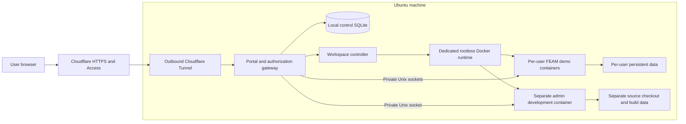

# Ubuntu web development and demo environment

Status: proposed design; no services have been installed or exposed.

Date: 2026-09-23. Repository inspected at `eceddcc`.

## Recommendation

Use this Ubuntu machine to run a small, invite-only FEAM service: **Cloudflare Tunnel + Cloudflare Access email PIN login + one isolated container per user**. Regular users open FEAM's existing CLI/TUI in a browser terminal; admins additionally get a separate browser development editor. A small local portal handles workspace ownership, start/stop/reset, and administration.

This is the lowest-cost recommended starting point. Cloudflare currently lists a **$0 Zero Trust plan for up to 50 users**, enough for 10 demo users and a small number of admins. The host software is open source; the baseline needs no paid VM, managed database, email provider, or model API. A domain, electricity, internet, and backup storage are separate costs. Prices and limits below were checked on the document date and must be rechecked before deployment. [Cloudflare pricing](https://www.cloudflare.com/plans/)

Email PIN login is close to the requested allowlist/sign-in-link experience, but it requires entering a code. If a clickable magic link is essential, use the alternative in [Authentication](#authentication). Do not deploy both authentication stacks initially.

## Requirements and scope

Confirmed requirements:

- Use this Ubuntu machine as the web-accessible development and demo host.
- Support admins and regular users, targeting up to 10 users in FEAM sandboxes.
- Regular users use the FEAM CLI/TUI and sample data; admins also get a development editor.
- Prefer free and low-cost options. Email allowlisting with passwordless login is a suitable authentication direction.

Proposed operating defaults:

- Capacity target: 10 simultaneous lightweight demo sandboxes, plus at most one active admin development workspace under the resource policy below. More admin accounts may exist without running more editors.
- Each user owns one persistent demo workspace. All data starts from synthetic fixtures.
- Regular users may run shell commands inside their container. Treat browser terminal access as code execution even when the launcher opens the TUI first.
- Idle workspaces stop after 30 minutes; data remains for 30 days after last use, with advance notice before deletion. Explicit reset requires confirmation.
- Hosted model assistance is off. Internet access from regular-user containers is off.
- This is a single-machine dev/demo service with scheduled maintenance and no high-availability promise. It does not establish HPC deployment acceptance.

## Existing machine and FEAM implementation

Read-only inspection produced the following snapshot; it is not a load test.

| Item | Observed | Design implication |
| --- | --- | --- |
| OS | Ubuntu 24.04.5 LTS, x86-64 | Pin and test compatible container/runtime packages. |
| CPU | Ryzen 5 3600, 6 physical cores / 12 threads | Suitable candidate for interactive demos; bound build parallelism. |
| RAM | About 16 GiB total; about 12 GiB available during inspection | Budget demo and development memory separately. |
| Swap | 4 GiB | Emergency margin; exclude it from capacity calculations. |
| Root disk | 183 GiB filesystem, 136 GiB available | Keep bounded system logs and image caches. |
| Home disk | ext4, about 1.7 TiB total / 1.5 TiB available | Put FEAM service storage on this disk, in its own service directory. |
| Resource controls | cgroup v2 | Verify actual CPU/memory/PID delegation before admitting users. |
| Existing runtime | Docker and containerd services active; Docker executable present | A dedicated rootless runtime remains to be configured and tested. |
| Web tooling | No `cloudflared`, `ttyd`, `code-server`, Caddy, or nginx found on the inspected PATH; checked web service units inactive | Plan these as new deployment components. |

The current shell sandbox failed to start with a network-namespace permission error. Inspection therefore used approved read-only commands outside that sandbox. This is a deployment preflight concern, not proof that Docker containers cannot run. Test the intended runtime and namespace policy explicitly; do not globally disable host protections to make the service work.

The [workspace README](../feather-mesh/README.md), [peer-access contract](data_access_contract.md), and [TUI demo runbook](tui_agent_stage1_demo.md) establish these integration constraints:

- FEAM's current interactive interface is an optional Rust TUI; there is no existing multi-user web portal in the inspected implementation.
- The Cargo binary is `mesh_cli`; the installed user command should be `feam`.
- Peer operations require `--project ROOT`. Authoritative data publication is in each provider's `serving/manifest.json`; legacy SQLite is separate.
- The demo script already creates a provider and a `client with spaces`, including Parquet and GeoTIFF fixtures and an intentionally unavailable peer.
- STAC is an unauthenticated, exact-IPv4-loopback metadata service returning local file URIs. It is not an internet dataset-download service and must remain inside the isolated workspace container.
- Existing [footprint measurements](tui_agent_stage1_acceptance.md#footprint-and-conditions) are small, sampled, single-user macOS measurements. They do not prove Ubuntu peak memory or 10-user capacity.

## Architecture



Cloudflare Tunnel connects outward from the machine and does not require a public IP or router port forwarding. Cloudflare supports proxied WebSockets, which the terminal and editor need. Test reconnects through the complete deployed path. [Tunnel documentation](https://developers.cloudflare.com/tunnel/), [WebSocket documentation](https://developers.cloudflare.com/network/websockets/)

| Component | Responsibility |
| --- | --- |
| Cloudflare DNS, Tunnel, Access | Public HTTPS, email verification, coarse access policy, routing to the private origin. |
| Portal/gateway, new component | Validate identity, enforce roles and ownership, present workspace controls, proxy authenticated HTTP/WebSockets. A small Go service with server-rendered pages is a proposed implementation; no SPA is required. |
| Local control SQLite | Accounts, roles, workspace assignments, lifecycle jobs, revocation state, audit events. Keep it completely separate from FEAM's legacy registry. |
| Workspace controller, new component | Reconcile lifecycle jobs and invoke only approved runtime templates. The gateway never gets the Docker socket. |
| Rootless Docker under a dedicated service account | Run demo containers without using the personal account's home or existing daemon as the control plane. |
| `ttyd` + FEAM | Provide an interactive terminal inside each demo container. |
| `code-server` | Provide the admin editor inside a separate development container. |
| systemd, journald, timers | Supervision, bounded logs, idle stopping, backups, and cleanup. |

Use example hostnames such as `feam.example.org` for the user portal, `admin.example.org` for all admin pages/APIs, `u-<opaque-id>.example.org` for a demo workspace, and `dev-<opaque-id>.example.org` for an admin editor. These are placeholders, not configured domains. Keep workspace content on separate origins from the portal; never proxy arbitrary user content under the portal's origin.

Configure explicit hostname routes for the initial small user pool, with an unmatched-host deny rule. All routes terminate at the authorization gateway, which listens only on loopback or a private Unix socket. Every workspace hostname maps to one server-side workspace record. A hostname or unguessable ID is not an access credential. Cache bypass applies to authenticated pages, terminal/editor traffic, and authentication responses.

The controller accepts workspace IDs and fixed actions, not arbitrary host paths, image names, command strings, or mount specifications. Lifecycle requests use structured arguments and idempotency keys. Separate Unix socket permissions restrict controller access to the gateway. Neither service runs as host root; initial OS/runtime/storage provisioning belongs to the machine operator.

## Roles and user experience

| Capability | Regular user | Admin | Machine operator |
| --- | --- | --- | --- |
| Start, stop, reset own demo | Yes | Yes | Recovery access |
| Use FEAM CLI/TUI; edit synthetic data in own sandbox | Yes | Yes | Recovery access |
| Read another user's workspace | No | No by default; explicit audited support action only | Technically possible on the host |
| List users, assign role, disable access | No | Yes | Bootstrap/recovery |
| Stop/reset another workspace | No | Yes, with confirmation for reset | Recovery access |
| Open browser development editor | No | Own assigned development workspace | Recovery access |
| Change demo release | No | Select an already tested, approved image | Prepare/approve releases |
| Host sudo, arbitrary mounts, Docker socket, personal SSH keys | No | No through the website | Local administration only |

The machine operator is an operational responsibility, not a third public signup role. Initially it can be the owner of this machine. Website admin status does not automatically grant host administration.

Regular-user flow: open the site, authenticate by email, see **My sandbox**, start it, then choose **Open FEAM** or **Open shell**. Show the FEAM version, storage usage, idle-stop policy, and reset behavior. A short walkthrough covers discovery, pinned resolution, publication, staging, withdrawal, and recovery using synthetic data.

Admin flow: use the separate admin site to view utilization and workspace status, manage approved users, stop runaway sessions, and open the development editor. The editor uses a separate checkout and branch. Changes become available to demo users only after testing and promotion of a new image.

## Authentication

### Recommended: allowlisted email PINs

Cloudflare Access emails a one-time code only when the email satisfies its Access policy; codes are single-use and expire after 10 minutes. The login page returns a generic message for disallowed addresses. This avoids operating an SMTP service or implementing token issuance. [Cloudflare email PIN documentation](https://developers.cloudflare.com/cloudflare-one/integrations/identity-providers/one-time-pin/)

1. Bootstrap the first admin locally; provide no public signup or self-promotion endpoint.
2. An admin adds an exact email address and role in the control database. Assign an immutable local user ID; do not use email strings as directory names.
3. An operator reconciliation task updates the corresponding Cloudflare policy using a narrowly scoped API credential. New accounts remain `pending` until the edge policy and local workspace assignment are ready. A manual reconciliation command is sufficient for the initial 10 accounts.
4. Users enter their email at Access, receive a PIN if allowed, and submit it to authenticate.
5. The gateway validates the Access JWT's signature, issuer, intended application audience, and time bounds using a maintained JWT library and the documented key endpoint. It then looks up the active local account and checks the requested role/workspace. Plain email headers are never authentication. [Access JWT validation](https://developers.cloudflare.com/cloudflare-one/access-controls/applications/http-apps/authorization-cookie/validating-json/)
6. Use a separate Access application/audience for admin and editor hosts, with an exact admin email list and a proposed one-hour session. User portal/demo sessions may last eight hours. Require the audience matching the requested host; a regular-user token cannot authorize an admin route.

The control database is authoritative for application authorization; Access is an additional gate. Keep policy changes versioned in private configuration, report synchronization failures, and never broaden policy to all email users or an entire domain to resolve a mismatch. Normalize email consistently with the identity provider; do not collapse dots or plus-address aliases. Bind the verified identity to the local record and handle email changes administratively.

At the tunnel, require Access JWT validation for protected hostnames as well as gateway validation. Restrict expected hostnames and proxy headers; unknown routes fail closed. Tunnel connectivity alone is not authentication. [Tunnel origin Access settings](https://developers.cloudflare.com/tunnel/reference/origin-parameters/)

Maintain local authorization on every request and WebSocket upgrade. Track open streams by local account and workspace; periodically recheck eligibility and token expiry. Disablement increments an account authorization version, rejects new traffic immediately, closes active streams within 30 seconds, and stops its containers. Edge policy/token revocation follows even if a provider API call initially fails. Removing a user from a list must not leave an already-open terminal usable.

Use host-only secure cookies for any local gateway session, with `HttpOnly`, `SameSite`, and the `__Host-` prefix; do not issue shared parent-domain portal cookies. Strip Access assertions, identity headers, and gateway cookies before proxying into user-controlled containers. The gateway consumes authentication material; sandbox processes do not need it. Enforce exact Origin checks on WebSockets and CSRF protection on lifecycle/admin actions, including sibling-subdomain requests. Administrative state changes use POST and require a fresh authorized session.

Require MFA on the Cloudflare account that controls DNS and Access. Email-only admin login is an initial synthetic-demo tradeoff; an MFA-enabled identity provider can replace it without changing workspace ownership. If stronger admin authentication is required, make provider-enforced MFA a launch condition rather than assuming mailbox verification supplies a second factor.

### Alternative: actual clickable magic links

Use **Supabase Auth Free + a free transactional email tier**, retaining the same gateway, local roles, and containers. In this variant Cloudflare Tunnel remains, but Cloudflare Access email login is replaced for these routes to avoid two sign-ins.

Supabase supports single-use magic links and `shouldCreateUser: false`; also disable public signup in provider configuration so this is enforced beyond the UI. Pre-create only allowlisted accounts administratively. [Passwordless email](https://supabase.com/docs/guides/auth/auth-email-passwordless), [signup configuration](https://supabase.com/docs/guides/auth/general-configuration)

The application checks its active allowlist before asking the provider to send a link, returns a generic response, and checks eligibility again after server-side verification. Bind the resulting verified provider user ID to the local account. Use server-held sessions and revocation; do not trust roles in user-editable profile metadata. Proposed controls: 10-minute link expiry, fixed HTTPS callback destinations, per-email and per-IP request limits, and no token/query logging. The initial GET displays a confirmation page; a deliberate POST redeems the link to reduce consumption by email scanners. [Email template and prefetch guidance](https://supabase.com/docs/guides/auth/auth-email-templates)

The built-in Supabase mail service is restricted and unsuitable for sending to arbitrary demo invitees; configure custom SMTP. Resend currently lists a free transactional allowance of 3,000 emails/month and 100/day, subject to its current plan and verified sender-domain setup. Configure SPF/DKIM and test delivery to the intended users. [Supabase SMTP](https://supabase.com/docs/guides/auth/auth-smtp), [Resend pricing](https://resend.com/pricing)

Supabase Free currently includes 50,000 monthly active users, but free projects can pause after a week of low activity. That adds a pre-demo readiness check and makes this option less convenient for an infrequently used demo. It also adds another identity service, SMTP configuration, callback/session handling, and auth-provider outage dependency. [Supabase pricing](https://supabase.com/pricing), [free-project pausing](https://supabase.com/docs/guides/platform/free-project-pausing)

Choose this alternative only if clickable links are worth the additional implementation and operations. It can fit free allowances at this scale, but does not eliminate domain, power, or backup costs.

## Sandbox boundary and FEAM integration

Use one container per demo user, including that user's provider and client projects. Separate containers have separate writable filesystems, process namespaces, terminal sessions, and caches. This models isolated FEAM workflows; it does not pretend to be a multi-node shared HPC filesystem.

The runtime should be rootless under a dedicated `feam-runner` account, with a non-root process inside each container. Use a read-only image, drop Linux capabilities, set `no-new-privileges`, retain applicable seccomp/AppArmor protection, and impose resource limits. Do not mount the personal home, host root, devices, SSH agents, runtime sockets, or controller secrets. Rootless containers reduce host privilege but share the host kernel: this boundary is appropriate for invited demo users and synthetic data, not an unrestricted hostile-code hosting service. [Docker rootless mode](https://docs.docker.com/engine/security/rootless/)

Regular demo containers use `--network none`. `ttyd` can listen on a Unix domain socket; mount only that workspace's socket directory so the gateway can reach it without giving the sandbox network access. Enable writable terminal input and origin checks, disable URL-supplied command arguments, and allow at most two browser terminal connections per workspace. The server chooses the fixed FEAM launcher or shell command. [ttyd options](https://github.com/tsl0922/ttyd)

Use restrictive per-workspace socket directories and explicit UID/GID mappings or ACLs. Back each writable socket directory with a small bounded filesystem, such as an operator-provisioned 1 MiB tmpfs with an inode limit, so it cannot bypass workspace storage limits. Prove that the gateway can connect and another sandbox cannot; do not solve rootless permission problems with world-writable sockets. Put no controller or Docker socket in these directories. Treat upstream responses as untrusted: filter authentication-related response cookies/headers and bound response sizes/timeouts.

An example container layout is:

```text
/opt/feam/                       immutable release, SDK, demo script and fixtures
/workspace/demo/provider/       this user's provider and serving manifest
/workspace/demo/client with spaces/
/workspace/cache/               this user's FEAM_CACHE_DIR
/workspace/exports/             explicitly exported user results
/tmp/                          size-limited temporary filesystem
/run/feam-terminal/             this workspace's terminal socket only
```

Build the release once outside demo sessions:

```bash
# Existing repository command; run from feather-mesh/ in a controlled build.
cargo build --release -p mesh_cli --features tui
```

Install the resulting `target/release/mesh_cli` as `/usr/local/bin/feam` in the image. Generate the existing binary fixtures during image build, install the supported Python SDK and pinned example dependencies, and package the demo script with the fixture tree it expects. Configure `FEAM_EXECUTABLE` and `FEAM_WORKSPACE` to point at that packaged layout. Users do not install packages or compile Rust to start a demo.

On first start, run the existing demo generator **inside the container** against `/workspace/demo`, then launch:

```bash
feam tui --project '/workspace/demo/client with spaces' --agent off
```

Generate the demo at its final container path because the script writes a provider symlink. Copy source fixtures into each user's workspace; never share a writable provider manifest between users. A shared immutable seed image is fine. Preserve FEAM's project paths, manifest authority, review confirmations, and recovery journal semantics.

The entire demo volume is disposable; reset stops the container, closes its sessions, creates a clean replacement generation, initializes it, verifies health, and switches the workspace record. A failed initialization leaves the old stopped volume recoverable. The controller operates on its own recorded volume IDs, never on a browser-supplied path or a user-controlled symlink. Garbage-collect old generations under a bounded retention rule.

If users try STAC, run its service and Python client in the same isolated container so loopback and local file URIs have the correct meaning. It has no application token and rejects non-`127.0.0.1` binds. Do not publish STAC directly to the internet as a substitute for the terminal. A future web dataset viewer or download API is a separate design.

Hosted assistance remains disabled. A provider API key in a shell user's environment is accessible to that user; do not inject a shared paid credential into these sandboxes. Adding hosted assistance later requires a scoped credential/proxy design and explicit per-user cost limits.

## Capacity, storage, and admission

The following numbers are proposed initial limits, not measured consumption.

| Workload | Count | Memory hard limit | CPU ceiling | Persistent storage |
| --- | ---: | ---: | ---: | ---: |
| Regular demo | Up to 10 | 512 MiB each | 0.5 logical CPU each | 2 GiB each |
| Admin development | 1 active | 4 GiB total for editor and its processes | 2 logical CPUs | 30 GiB |
| Tunnel, gateway, DB, controller | Shared | Budget 1 GiB | Low interactive overhead | 5 GiB budget including logs |
| OS, desktop, page cache, reserve | Shared | Approximately 6 GiB remains on a 16 GiB host | Remaining capacity | Existing host storage |

Ten demo limits total 5 GiB; adding one development workspace and the control plane yields about 10 GiB. Account for runtime overhead and memory already used by other host applications. The controller admits a new workspace only when both the configured aggregate budget and current host headroom permit it; show a queue or capacity message otherwise. Do not rely on every process staying below its limit by chance.

Set 128 PIDs per demo container, bounded file descriptors, and size-limited `/tmp` and `/dev/shm`; tmpfs usage counts against the memory budget. Disable additional container swap allowance so a runaway sandbox cannot create a host-wide swap storm. Add an aggregate demo cgroup ceiling, and retain host headroom even if every user reaches their cap. A 512 MiB limit is for tiny fixtures, not arbitrary large Polars or raster processing.

Rootless Docker resource flags require cgroup v2 and systemd, with appropriate controller delegation. Verify `memory`, `cpu`, and `pids` enforcement by measurement, not just accepted configuration. Ubuntu's restrictions on unprivileged namespaces may require the supported runtime/AppArmor packaging. [Docker resource controls](https://docs.docker.com/engine/security/rootless/tips/), [Ubuntu rootless prerequisites](https://docs.docker.com/engine/security/rootless/troubleshoot/)

Store service data in a dedicated directory on the large home filesystem, such as `/home/feam-service-data`, with owner-only subdirectories. The actual location is an operator deployment choice; it must not expose `/home/saif` to containers. Container memory limits do not enforce disk quotas. For an initial ten-user pool, provision fixed-size ext4 workspace image files, mounted by the operator, and bind their mountpoints into containers. Preallocate storage rather than relying on unbounded sparse growth. The web controller cannot mount arbitrary images or paths. A dedicated quota-enabled filesystem is a later alternative; existing ext4 quota support has not been verified.

Maintain a small preallocated spare pool for safe reset, serialize reset jobs if needed, and include spare volumes, Docker image storage, logs, and backups in the disk budget. Container root filesystems remain read-only so persistent writes cannot bypass the assigned workspace limit. Bound and rotate terminal/runtime logs; disable shell transcript logging by default. Refuse new starts/reset jobs when host free space falls below 15% or 20 GiB, whichever is larger, on the relevant filesystem.

Rust builds can exceed the editor's budget. Start with one build at a time and `CARGO_BUILD_JOBS=2`; measure a full build before enabling development during a full demo event. If 4 GiB is insufficient, schedule builds outside demo sessions, use already available CI artifacts, or temporarily reduce admitted demo users. Ten concurrent full development environments are outside this design's capacity claim.

## Development and release workflow

Run one `code-server` instance per active admin workspace with its own checkout, editor state, and Rust target/cache directories. Do not mount the live personal checkout or demo storage into it. The editor supports external authentication behind a proxy; it must remain reachable only through the gateway. Its socket binding is supported by the project CLI. [code-server access guide](https://coder.com/docs/code-server/guide), [code-server CLI](https://github.com/coder/code-server/blob/main/src/node/cli.ts)

Prefer a Unix socket for editor ingress as well. Development may need outbound Git/package access; use a separate restricted network or an explicit outbound proxy allowing required upstreams. Block host/LAN, metadata/link-local, other workspaces, control-plane services, and Docker APIs, including IPv6 paths. The demo container's network denial remains unchanged. Credentials, if needed, are repository-scoped and specific to the admin; never inherit host credentials. Disable automatic public port forwarding. Any future preview route needs its own owner authorization and separate origin.

Release workflow:

1. Develop on an isolated branch and run the repository's applicable checks.
2. Build a versioned image containing a tested FEAM release, fixtures, SDK, and terminal tooling. Record source commit, dependency lockfiles, and image digest.
3. Smoke-test it in a disposable staging workspace through the actual browser gateway.
4. Mark the digest as an approved demo release. New/reset workspaces use it; do not replace binaries in active sessions.
5. Drain existing sessions before migration. Keep the previous image and compatible workspace backup available for rollback; revert data as well if formats changed.

The editor has no production deployment secret or runtime socket. Host-side release automation builds or pulls approved artifacts. Restarting or rebuilding development must not restart the gateway or demo containers.

## Lifecycle and control data

Use a small local SQLite database on the local filesystem. Proposed records:

| Record | Minimum fields |
| --- | --- |
| Account | Immutable ID, exact email, verified provider identity, role, pending/active/disabled state, authorization version, timestamps. |
| Workspace | ID, owner ID, demo/dev kind, hostname, assigned image digest, recorded volume and socket IDs, generation, state, last activity. |
| Lifecycle job | ID, action, workspace ID, idempotency key, expected generation, status, bounded error detail. |
| Audit event | Time, actor ID, action, target ID, outcome, correlation ID; no credentials or terminal contents. |

Serialize start/reset/delete per workspace and reserve capacity transactionally to prevent duplicate containers from concurrent requests. Reconcile database state against container labels on controller restart; clean up orphan runtime resources only when ownership is proven. States should distinguish `stopped`, `starting`, `running`, `stopping`, `resetting`, `failed`, and `pending-delete`.

Browser disconnect should preserve a short reconnect window, using a private `tmux` session if persistent terminals are desired. Count user input or explicit activity, not transport heartbeat traffic, for idle stopping. Warn before idle shutdown. Stop gracefully so FEAM can finish or journal an in-flight mutation, then enforce a shutdown timeout. An idle stop preserves files; reset replaces demo files; account disable revokes access and stops workloads; deletion removes data after the declared retention period.

## Operations and recovery

- **Reachability:** the host must remain powered, awake, and connected during advertised demo hours. Use stable wired networking when available. Check tunnel egress, DNS, IPv4/IPv6 firewall behavior, and recovery after reboot. No public Docker, database, terminal, editor, or SSH listener is required.
- **Supervision:** systemd starts the tunnel, gateway, controller, and rootless runtime independently. Configure service-account startup at boot and fail closed when authorization storage is unavailable. A local-only health endpoint reports readiness without exposing secrets.
- **Monitoring:** keep lightweight local metrics for active sessions, resource use, container exits/OOMs, disk space, auth denials, pending policy sync, and last successful backup. An external availability check is needed to detect complete host loss; local monitoring cannot do that.
- **Audit:** retain bounded local admin and lifecycle audit logs for a proposed 30 days. Redact JWTs, email codes, cookies, secrets, and authentication URL queries. Do not rely solely on free-provider log retention.
- **Backups:** make nightly consistent SQLite backups, copy private configuration, and back up uncommitted admin work plus user exports. Synthetic demo data is reconstructible. Keep seven daily copies on a separate existing device or storage account, encrypted; another directory on the same machine is not disaster recovery. Use a tool such as restic, with credentials inaccessible to workspaces.
- **Recovery target:** initial RPO 24 hours and RTO one working day, subject to a tested restore and available replacement hardware. Restore configuration/control DB first, recreate runtime from pinned images, restore user data, invalidate old sessions, and verify ownership before reopening access.
- **Dependencies:** an internet, Cloudflare, power, or host outage makes browser access unavailable. Preserve private local recovery access for the operator. Auth outages must not trigger a public bypass.
- **Data handling:** terminal/editor traffic passes through Cloudflare's HTTPS edge, and Access handles users' email identities. Workspace storage stays on this machine. Use synthetic data for the pilot; check suitability before introducing confidential source or datasets.
- **Maintenance:** patch the OS/runtime and rebuild images on a scheduled basis; announce planned restarts. Store a short operator runbook with backup restore, policy reconciliation, release rollback, account disablement, and disk/OOM recovery.

## Cost and alternatives

| Item | Baseline cost | Qualification |
| --- | --- | --- |
| Existing Ubuntu hardware | No new compute rental | Power, wear, and internet remain real costs. |
| Cloudflare Zero Trust Free | $0 subscription for this user count | Current limit is 50 users; no paid features assumed. |
| Tunnel connector and host software | No software subscription proposed | Docker Engine/rootless, ttyd, code-server, Go, SQLite, systemd; implementation and maintenance still take time. |
| Domain | $0 incremental if a suitable domain is already owned | Otherwise an annual registration/renewal is required; choose based on current renewal price. |
| Backups | $0 incremental if existing separate storage is available | New disks or cloud storage may cost extra. |
| Email delivery | No separate SMTP service in the recommended path | Access supplies the email PIN flow. |
| Model API | $0 | Hosted agent mode is disabled. |

For electricity planning, measure wall power: average watts × operating hours ÷ 1,000 gives kWh; multiply by the applicable tariff. Do not present existing hardware as cost-free to operate. Avoid auto-upgrading services to paid plans; show quota failures explicitly and review limits before increasing scale. [Cloudflare plan limits](https://www.cloudflare.com/plans/)

| Alternative | When it helps | Why it is not the starting point |
| --- | --- | --- |
| Supabase + free SMTP magic links | Clickable links are a firm requirement | More services, mail setup, callbacks, and free-project pause behavior. |
| Direct HTTPS reverse proxy on this machine | Public address/port forwarding already works; avoid a tunnel provider | Requires ingress and certificate operations, plus a separate identity layer. |
| Private VPN access | Small trusted internal team | Adds client setup; less convenient for a browser-only external demo. |
| Full workspace platform | Many full IDE users, team templates, or more hosts | More deployment scope than ten lightweight terminals and one editor. |
| VM or microVM per user | Users are mutually untrusted or need unrestricted code execution | Stronger boundary, with more memory and operational overhead. |
| Cloud VM | Host availability becomes the limiting factor | Recurring compute/storage expense; defer until measured need. |

## Implementation phases and acceptance

All items below are future work. Document creation did not perform any installation, external account setup, deployment, or load testing.

| Phase | Deliverable | Exit condition |
| --- | --- | --- |
| 1. Local proof | Pinned FEAM image, one rootless demo container, private socket terminal, fixed-size persistent volume | FEAM walkthrough works; reset is confined; actual resource limits and namespace permissions pass. |
| 2. Identity and gateway | Domain/tunnel, user/admin Access policies, validated identity, local ownership store, minimal portal | Unlisted identities are denied; two listed users cannot reach each other's HTTP or WebSocket endpoints; admin separation passes. |
| 3. Lifecycle and development | Start/stop/reset controller, capacity admission, private admin editor, policy reconciliation | Restart/reconnect/revocation work; development changes cannot alter live demos; failed jobs recover safely. |
| 4. Ten-user acceptance | Representative concurrent browser workload and fault checks | Meets the measurable gates below, with evidence from this machine. |
| 5. Operations handoff | Backup/restore, pinned release/rollback, reboot recovery, operator runbook | Restore and release rollback demonstrated before inviting the full group. |

Required acceptance scenarios:

1. **Authentication and roles:** allowed email succeeds; unlisted email is denied; expired/replayed PIN fails; forged identity headers and wrong-audience JWTs fail. A regular user cannot open any admin API or editor path. Removal during an active terminal disconnects it within 30 seconds and prevents reconnection.
2. **Ownership and origins:** users A and B attempt each other's guessed hostname/IDs, reset endpoints, downloads if introduced, and WebSocket upgrades. All fail. Cross-origin/sibling-origin CSRF and terminal upgrade attempts fail. Sandbox-controlled responses cannot obtain portal authentication material. Direct origin/port access offers no authentication bypass.
3. **Isolation and quotas:** verify A cannot read/write B's data, host home, runtime/controller sockets, host processes, or host/LAN services. Exhaust one sandbox's memory, PIDs, CPU, and persistent disk separately; contain failure without starving the portal or other users. Verify network denial and quota enforcement, including temporary files and logs.
4. **FEAM behavior:** each sandbox completes refresh, search/detail, pinned resolve, publication, staging, withdrawal, and journal recovery against its own fixtures. Reset A leaves B byte-for-byte unchanged. Known Parquet/raster examples and optional internal STAC clients work with the packaged dependencies.
5. **Concurrent load:** ten browser terminals run a 60-minute small-fixture workload with staggered starts and simultaneous refresh/staging bursts. Proposed targets: warm start p95 ≤5 seconds, first initialization p95 ≤15 seconds, terminal input echo p95 ≤250 ms on a documented nearby connection, no host OOM, and no sustained swap thrashing. Record host and per-container peaks, network latency, and workload details. Separately test the single admin editor and a bounded build; reduce build/demo concurrency if the budget does not hold.
6. **Failure and recovery:** disconnect/reconnect, token expiration, idle stop, gateway/controller crash, host reboot, disk-full, failed policy sync, failed image start, and interrupted reset preserve isolation and yield useful states. Demonstrate backup restore and rollback to the previous demo image.

A successful localhost page or ten open idle tabs is insufficient evidence of ten usable sandboxes. Keep the acceptance report separate from this proposed design.

## Decisions needed before deployment

- Which existing domain can be used, or whether a new domain should be registered.
- Initial admin and regular-user email addresses, and advertised demo hours.
- Whether the recommended email PIN experience is sufficient or clickable links are required.
- Whether the proposed 30-day data retention and existing separate backup storage are suitable.
- Whether users remain an invited, limited-trust group; stronger isolation is required before broad public enrollment.

The local image, gateway, lifecycle controller, and isolation proof can be developed without these deployment inputs. Domain/account provisioning, email invitations, and exposing the service are subsequent implementation actions.
