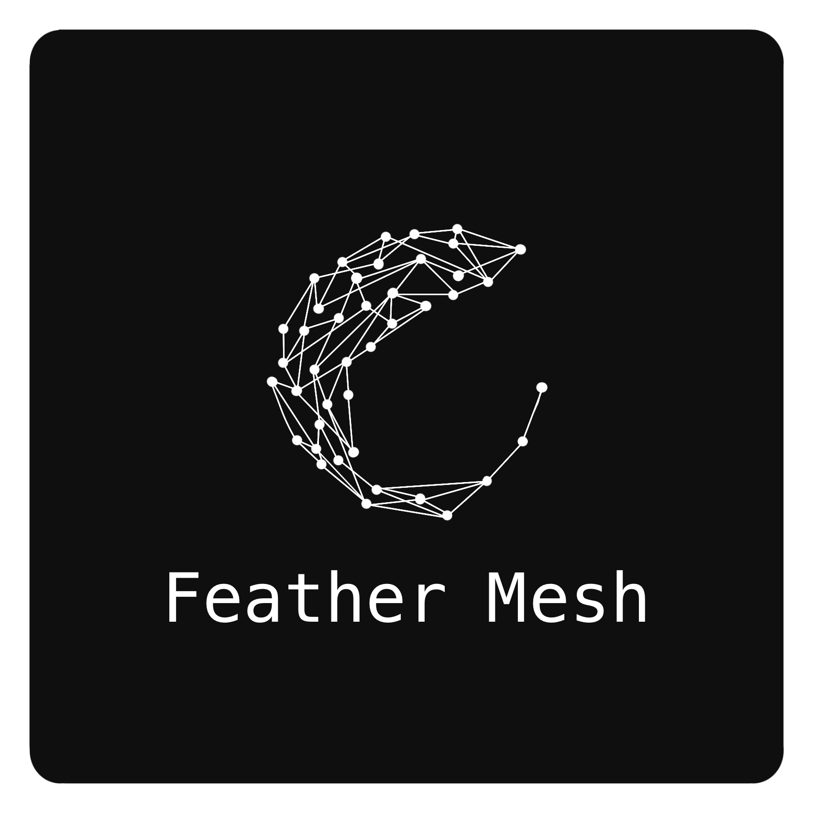

<p align="center">
    
</p>

# Feather Mesh

Feather Mesh (feam) is an HPC-native middleware layer that standardizes how teams publish, discover, and consume reusable data products without forcing teams to give up ownership of their data. It is intended to reduce duplicated work, improve cross-team interoperability, and make pipelines more reliable by replacing ad hoc path conventions with a governed product catalog and deterministic retrieval workflows.

Start here when contributing to the current Rust implementation:

- CLI crate: `mesh_cli/`
- Core business logic crate: `mesh_core/`
- Test command from this directory: `cargo test`

---

## Prerequisites

> **_NOTE:_**  Recommended to use some sort of Linux/Unix environment (WSL is a good option if you're running windows).

Make sure you have Rust installed.

### Install Rust

Using `rustup`:

```bash
curl --proto '=https' --tlsv1.2 -sSf https://sh.rustup.rs | sh
```

After installation:

```bash
rustc --version
cargo --version
```

If both return versions, you're good to go!

---

## Project Setup

### 1. Clone the Repository

```bash
git clone https://github.com/STRK-Solutions/dcat_4_hpc.git
cd dcat_4_hpc/feather-mesh
```

### 2. Install Dependencies

Rust handles dependencies automatically via `Cargo.toml`.

To fetch dependencies:

```bash
cargo fetch
```

---

## Build the Project

### Debug Build (default)

```bash
cargo build
```

Output binary will be located in:

```
target/debug/mesh_cli
```

### Release Build (optimized)

```bash
cargo build --release
```

Output binary:

```
target/release/mesh_cli
```

---

## Run the CLI

The package is still named `mesh_cli`, but the command help and user-facing surface are `feam`.

```bash
cargo run -p mesh_cli -- --help
```

Use `--registry <path>` to select a SQLite registry. If omitted, the CLI uses `registry.db` in the current directory.

### Core Workflow

```bash
cargo run -p mesh_cli -- --registry /tmp/feam.db init

cargo run -p mesh_cli -- --registry /tmp/feam.db serve ./data.csv \
  --name "Daily Observations" \
  --asset-type file \
  --version v1.0.0 \
  --owner-team Climate \
  --producer "Climate Lab" \
  --usage-policy "Internal research use" \
  --data-quality production \
  --classification internal

cargo run -p mesh_cli -- --registry /tmp/feam.db search daily
cargo run -p mesh_cli -- --registry /tmp/feam.db --format json show 1
cargo run -p mesh_cli -- --registry /tmp/feam.db lineage 1
cargo run -p mesh_cli -- --registry /tmp/feam.db consume 1 --version v1.0.0 --out ./copy.csv
```

### Commands

The implemented command surface is:

- `init`
- `serve`
- `search`
- `show`
- `consume`
- `lineage`
- `validate-metadata`
- `teams`
- `products`

Global options:

- `--registry <path>`
- `--format <table|json>`
- `--verbose`
- `--help`
- `--version`

### Exit Codes

| Code | Meaning |
| ---- | ------- |
| `0` | success |
| `1` | general runtime error |
| `2` | invalid CLI usage |
| `3` | validation failure |
| `4` | not found |
| `5` | permission or policy failure |

---

## Run Tests

Run tests from this workspace directory:

```bash
cargo test
```

---

## Formatting & Linting

Format code:

```bash
cargo fmt
```

Run Clippy:

```bash
cargo clippy
```

---

## Project Structure

```
feather-mesh/
├── Cargo.toml
├── mesh_cli/
│   ├── Cargo.toml
│   └── src/
│       └── main.rs        # CLI parsing, terminal UX, and process behavior
└── mesh_core/
    ├── Cargo.toml
    ├── src/
    │   ├── lib.rs         # Library exports
    │   ├── db.rs          # SQLite connection and schema setup
    │   ├── models/        # Domain data structures
    │   │   ├── entities/  # Persisted database row models
    │   │   └── new/       # Insertable NewX models
    │   ├── repositories/  # SQL queries and object mapping
    │   └── services/      # API-style workflow functions used by mesh_cli
    └── tests/
        └── data/          # Static test fixtures
```

`mesh_cli` is responsible for command-line parsing, terminal output, process exit behavior, and other terminal UX concerns. It should translate user input into calls against the core library, then format results for the terminal.

`mesh_core::services` defines API-style functions that expose key Feather Mesh workflows for `mesh_cli` to call, such as publishing, discovering, inspecting, and retrieving data products. Services coordinate `mesh_core::repositories` and `mesh_core::models` while keeping persistence details out of the CLI. Repository modules own SQL queries and database row mapping.

The product source of truth currently remains at the STRK-Solutions repository root as `Feather_Mesh_PDD_Revised.pdf`.

---

## Useful Cargo Commands

| Command       | Description                 |
| ------------- | --------------------------- |
| `cargo check` | Type-check without building |
| `cargo build` | Build project               |
| `cargo run`   | Build and run               |
| `cargo test`  | Run tests                   |
| `cargo clean` | Remove build artifacts      |
