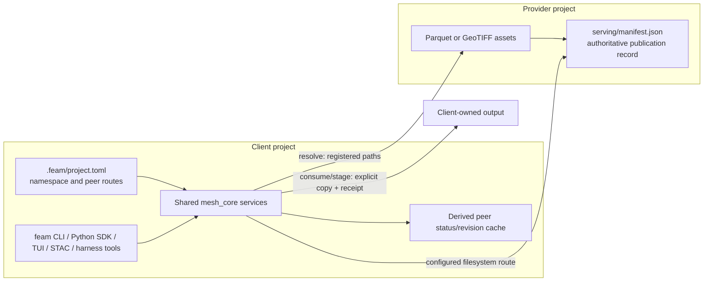
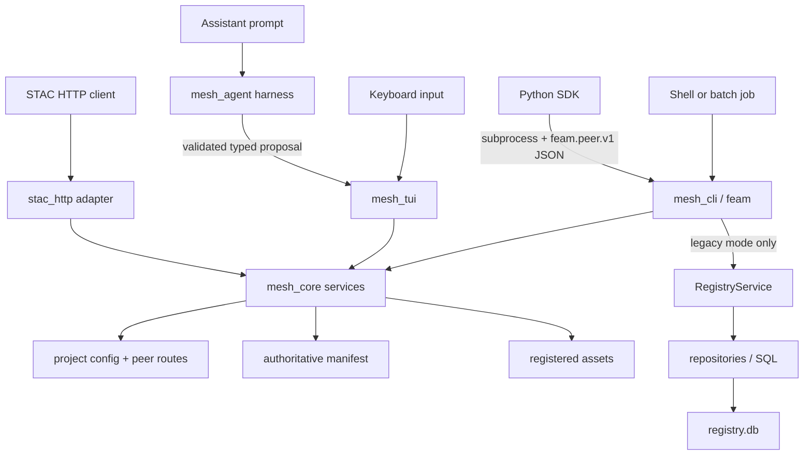

# My Feather Mesh map

Updated **2026-09-24** from the local `main` checkout at `d093c47`, after a
read-only source, test, workplan, and disposable-demo audit.

This is a personal orientation map for learning this repository. It is deliberately
not a universal specification or a new source of truth. When this map disagrees
with a requirement, contract, source file, or test, follow the authority guide in
[Which documents should I trust?](#which-documents-should-i-trust).

This file is intentionally written for me as a beginner. It answers the
questions I have actually had: what the system is, what vocabulary means, which
backend receives an action, what calls what, where Python and models enter, what
Stage 1/Stage 2 and SLURM mean, how permissions really work, how to run it, and
which completion claims still need caution.

### How to use this map

| If I need to know... | Go to... |
| --- | --- |
| What Feather Mesh is in one minute | [The 60-second explanation](#the-60-second-explanation) |
| Peer workflow versus legacy SQLite | [The two data systems](#the-two-data-systems-i-must-not-confuse) |
| What calls what after an action | [Backend call map](#what-calls-what-in-the-backend) and [user flows](#end-to-end-user-flows) |
| Which directory/file owns something | [Repository map](#repository-map) |
| CLI, TUI, Python, STAC, or agent differences | [Interfaces](#the-interfaces-different-front-doors-to-the-same-rules) |
| Where the model comes from | [Harness and model](#the-harness-model-and-where-inference-comes-from) |
| Stage 1, Stage 2, or SLURM | [Stages and SLURM](#stage-1-stage-2-and-slurm) |
| Whether the system has auth | [Authentication and permissions](#authentication-authorization-and-permissions) |
| A word I do not understand | [Terminology](#terminology-i-need-to-know) |
| What actually exists today | [Implementation status](#current-implementation-status) |
| What is wrong or still unproven | [Known issues](#known-issues-and-unproven-claims) |
| Which documentation to believe | [Document authority](#which-documents-should-i-trust) |
| How to run or demo it | [Getting started](#getting-started-and-running-the-demo) |

## The 60-second explanation

Feather Mesh is a data catalog and data-access layer for scientific teams that
share an HPC filesystem. A team keeps ownership of its data. It publishes a
versioned **data product** and enough metadata for another team to discover,
understand, and reuse it. Feather Mesh coordinates identity, metadata, routes,
validation, and provenance; the filesystem still stores the data and enforces
the actual operating-system permissions.

The current repository contains two distinct workflows:

1. The newer, project-scoped peer workflow uses `.feam/project.toml`, configured
   peer routes, and provider-owned `serving/manifest.json` files. This is the
   important architecture for current work.
2. The older workflow uses a selected SQLite `registry.db`. It remains for
   compatibility and migration, but it is not authoritative for peer data.

The easiest mistake is to blend those workflows. `--project ROOT` selects the
peer system; `--registry PATH` selects the legacy system. They intentionally
conflict.

### What Feather Mesh is and is not

| It is | It is not |
| --- | --- |
| A governed catalog and access layer over files that remain owned by provider teams | A replacement filesystem or object store |
| A way to publish exact, versioned Parquet/GeoTIFF inventories with reusable metadata | Automatic recursive discovery of every readable file |
| A project-scoped peer system where clients follow configured filesystem routes | A network peer-to-peer transfer protocol like BitTorrent |
| Shared Rust workflows exposed through CLI, TUI, Python, and STAC adapters | Four independent implementations of publication and access rules |
| An optional TUI with a bounded model harness | A model that autonomously owns the project or bypasses review |
| Designed for shared HPC filesystems and jobs | A SLURM scheduler, allocation manager, or completed HPC deployment |

“Peer-to-peer” here means provider projects remain authoritative and clients
reach them through explicitly configured filesystem routes. It does **not** mean
that Feather Mesh copies chunks between arbitrary network peers. The operating
system and shared mount still move and protect the bytes.

## Mental model



A project can be both a provider and a client. A peer route makes a provider's
serving directory reachable through the client project, often with a symbolic
link. The route does not grant filesystem permission. The manifest decides what
Feather Mesh recognizes as published; a readable but unregistered file is not a
Feather Mesh data product.

The cache is useful derived state, not a second authority. The current project
cache records refresh time, provider revision, and peer availability; catalog
and access workflows still consult configured routes and manifests. Deleting the
cache must be recoverable. Keeping a provider's physical path after removing its
configured route must not let Feather Mesh reopen it.

## The two data systems I must not confuse

| Question | Project-scoped peer workflow | Legacy SQLite workflow |
| --- | --- | --- |
| How selected? | `--project ROOT` | `--registry PATH`; some old commands default to `registry.db` if neither mode is selected |
| Authority | Provider-owned `serving/manifest.json` | Rows in one SQLite database |
| Identity | `product://namespace/product-id` plus explicit version | Primarily database IDs plus product/version records |
| Main core code | `peer.rs`, `services/peer_access.rs`, and `catalog_service.rs` | `registry_service.rs`, models, repositories, and `db.rs` |
| Where data bytes live | Provider serving directory reached through a configured client route | Source paths recorded by the registry |
| Discovery state | Current manifests plus a rebuildable per-process/host peer-status snapshot | SQL queries over authoritative registry tables |
| Intended direction | Current peer data-access architecture | Compatibility and migration path |

SQLite is not the opposite of peer-to-peer: they answer different architectural
questions. SQLite is a storage technology for a catalog. Peer-to-peer describes
who remains authoritative and how projects reach one another. A future shared
project SQLite catalog is mentioned in the TUI design, but it would be a derived
project catalog behind core services, not a return to the legacy registry as the
authority. That follow-up is not currently implemented.

## What calls what in the backend

Every supported interface eventually reaches shared Rust services. “Which
interface received it?” means the boundary where the user's action first entered
the system: command arguments, terminal keys, a Python call, an HTTP request, or
an assistant prompt. That boundary determines parsing and output, but not the
underlying publication/access rules.



Dependency direction matters: adapters depend on core; core does not depend on
terminal rendering, Python, HTTP clients, or a model. Repositories own SQL only.
The TUI calls Rust services directly instead of parsing CLI output. Python uses
the CLI JSON protocol because it is a separate process/language. The model
harness proposes typed calls but cannot directly execute peer mutations.

## End-to-end user flows

### 1. A provider publishes a version

1. A provider initializes a project with a namespace, serving directory, and
   configured owner-team strings in `.feam/project.toml`.
2. The provider places prepared Parquet or GeoTIFF files beneath the serving
   root and supplies complete metadata plus an exact asset list.
3. `feam serve`, or an equivalent reviewed TUI action, sends a typed publication
   request to the shared peer-access service.
4. Core checks the provider namespace, configured owner-team allowlist, paths,
   required metadata, duplicate version, and every declared asset. It opens
   Parquet footers or GeoTIFF metadata; an extension alone is insufficient.
5. Core calculates sizes and configured digests, obtains the publication lock,
   rechecks current revision/state, and commits a complete new manifest through
   a same-directory temporary file and atomic replacement.
6. The manifest revision advances. Only now is the version published. STAC and
   catalog views are derived from that record. Provider bytes are never deleted
   as part of publication.

Putting a file in the directory is not publication. A helper may suggest an
inventory, but only a validated manifest commit makes an asset discoverable.

### 2. A client discovers products

1. The client's `.feam/project.toml` names peer aliases, expected namespaces,
   and relative filesystem routes, often symlinks under `peers/`.
2. `refresh` opens those routes, verifies provider identity, and records a
   rebuildable status/revision snapshot. One unavailable peer is reported rather
   than silently turning “could not search” into “no products exist.”
3. Search/catalog services read bounded registered records and attach per-peer
   coverage/freshness information.
4. CLI formats a table/JSON result; the TUI renders it; the harness receives a
   bounded path-free summary; STAC projects only active raster records.

Search finds metadata. It does not itself prove that the current process can
open every data byte, and a stale cache must never become a physical-path
fallback.

### 3. A client resolves and reads in place

1. The user supplies `product://namespace/product-id` and an explicit version.
2. Core reopens the project, finds the configured route for that namespace, and
   reopens the current manifest.
3. It checks that the product/version is registered and active, validates each
   serving-root-relative asset path against traversal/link rules, and returns
   the exact inventory through the **client's route**.
4. `resolve` returns a descriptor; it does not copy the files. Python can pass
   the paths to Polars or Rasterio. Those libraries then open the files with the
   job's real operating-system permissions.

Resolution proves Feather Mesh registration and route validity at that moment.
Unless explicit integrity verification ran, it does not promise that bytes are
unchanged. A Polars `LazyFrame` can be constructed successfully and later fail
at `.collect()` if a link, permission, or file changes.

### 4. A client consumes/stages a version

1. `consume` identifies a pinned product/version and destination.
2. Core resolves again immediately before copying; it does not trust a descriptor
   retained across a long review.
3. Preflight rejects source/destination equality, hard-link or symlink aliases,
   ancestor overlap, dangerous dangling links, and receipt collisions.
4. Core copies exactly the registered inventory to a temporary destination,
   prepares the provenance receipt, and only then replaces/commits the output.
5. Success returns the client-owned copy and receipt. Provider bytes and an old
   destination must survive a failed overwrite.

Staging is explicit because copying large HPC data can be expensive. Direct
reading through the shared filesystem is the normal first-class path.

### 5. A provider withdraws a version

Withdrawal is a reviewed provider mutation that writes a revisioned tombstone
and reason. New discovery/access must treat the version as withdrawn. The data
files remain in provider storage, and Feather Mesh cannot revoke bytes already
loaded or a handle already opened outside it.

## Repository map

| Place | What lives there | Start here when... |
| --- | --- | --- |
| [`AGENTS.md`](AGENTS.md) | Durable ownership rules, task routing, validation expectations, and skill pointers | You or an agent are about to change the repo |
| [`README.md`](README.md) | Short repository landing page | You need the top-level routes |
| [`feather-mesh/`](feather-mesh/) | The active Rust workspace and supported Python adapter | You want the implementation |
| [`feather-mesh/mesh_core/`](feather-mesh/mesh_core/) | Domain types, SQLite, peer projects/manifests, repositories, and shared workflows | A business rule, manifest, resolver, validation, or persistence behavior changes |
| [`feather-mesh/mesh_cli/`](feather-mesh/mesh_cli/) | `feam` argument parsing, output, errors, and process exit behavior | A command, flag, table/JSON response, or exit code changes |
| [`feather-mesh/mesh_tui/`](feather-mesh/mesh_tui/) | Optional Ratatui terminal application, review screens, and terminal lifecycle | Interactive keyboard behavior or confirmation changes |
| [`feather-mesh/mesh_agent/`](feather-mesh/mesh_agent/) | Optional provider-neutral model router, bounded loop, and typed tool proposals | Hosted-assistant schemas, budgets, or provider translation changes |
| [`feather-mesh/python_sdk/`](feather-mesh/python_sdk/) | Supported Python subprocess adapter over `feam --format json` | Notebook, Polars, Rasterio, or Python exception behavior changes |
| [`docs/`](docs/) | Settled contracts, examples, runbooks, acceptance evidence, and older product material | You need a precise behavior or proof trail |
| [`diagrams/`](diagrams/) | Architecture and schema pictures from several stages of the project | You want visual history; verify against current contracts |
| [`.codex/skills/`](.codex/skills/) | Repository-specific AI-SDLC workflows | You need the repo's task-specific working rules |
| [`.github/workflows/`](.github/workflows/) | Rust, adapter, TUI, and agent-context CI | You want the automated evidence expected on a change |

### Important code entry points

| Question | First file to inspect |
| --- | --- |
| What commands and flags exist? | [`feather-mesh/mesh_cli/src/main.rs`](feather-mesh/mesh_cli/src/main.rs) |
| How is a peer project opened, refreshed, resolved, published, or staged? | [`feather-mesh/mesh_core/src/peer.rs`](feather-mesh/mesh_core/src/peer.rs) |
| What are the manifest, metadata, lifecycle, path, and staging rules? | [`feather-mesh/mesh_core/src/services/peer_access.rs`](feather-mesh/mesh_core/src/services/peer_access.rs) |
| How does the interactive catalog combine peer coverage? | [`feather-mesh/mesh_core/src/services/catalog_service.rs`](feather-mesh/mesh_core/src/services/catalog_service.rs) |
| How are reviewed writes prepared and rechecked? | [`feather-mesh/mesh_core/src/services/interactive_operations.rs`](feather-mesh/mesh_core/src/services/interactive_operations.rs) |
| How does the legacy SQLite workflow work? | [`feather-mesh/mesh_core/src/services/registry_service.rs`](feather-mesh/mesh_core/src/services/registry_service.rs) |
| How is SQLite accessed? | [`feather-mesh/mesh_core/src/repositories/`](feather-mesh/mesh_core/src/repositories/) and [`db.rs`](feather-mesh/mesh_core/src/db.rs) |
| How is STAC derived and served? | [`feather-mesh/mesh_core/src/stac.rs`](feather-mesh/mesh_core/src/stac.rs) and [`stac_http.rs`](feather-mesh/mesh_core/src/stac_http.rs) |
| How does the TUI own terminal state and confirmation? | [`feather-mesh/mesh_tui/src/lib.rs`](feather-mesh/mesh_tui/src/lib.rs) |
| What can the hosted assistant propose? | [`feather-mesh/mesh_agent/src/tools.rs`](feather-mesh/mesh_agent/src/tools.rs) and [`harness.rs`](feather-mesh/mesh_agent/src/harness.rs) |
| What behavior is actually tested? | [`mesh_core/tests`](feather-mesh/mesh_core/tests/), [`mesh_cli/tests`](feather-mesh/mesh_cli/tests/), [`mesh_agent/tests`](feather-mesh/mesh_agent/tests/), and [`python_sdk/tests`](feather-mesh/python_sdk/tests/) |

## The interfaces: different front doors to the same rules

| Interface | What receives the action first | What it calls | What it is for |
| --- | --- | --- | --- |
| `feam` CLI | Clap argument parser in `mesh_cli` | Shared `mesh_core` workflows; legacy mode additionally calls `RegistryService` | People, shell scripts, batch jobs, automation, and the Python adapter |
| TUI | Crossterm/Ratatui event loop in `mesh_tui` | Catalog and interactive-operation services directly | Keyboard-driven browsing, drafts, review, confirmation, recovery, and optional assistant |
| Python SDK | Python `Project` object | Runs `feam --project ... --format json` as an argument-array subprocess | Notebooks and Python batch jobs; typed descriptors, native Polars/Rasterio handoff |
| STAC HTTP | Local TCP/HTTP handler in `stac_http.rs` | Shared catalog/STAC projection over current registered raster records | Standard geospatial metadata browsing/search; it does not proxy raster bytes |
| Agent harness | `mesh_agent` provider/harness loop inside the TUI | Model provider for proposals, then local typed tools/core only after validation/review | Natural-language assistance without giving the model terminal or mutation authority |
| Legacy registry | CLI legacy dispatch | `RegistryService` → repositories → SQLite | Older central-registry-compatible workflows |

The adapter is responsible for translating at its boundary: CLI prints and exit
codes, Python exceptions, HTTP status/JSON, or TUI screens. If two interfaces
disagree about whether a product is visible or publishable, that is a bug: they
should share the same core invariant, not implement competing policies.

### Where Python enters

Python is **not** the backend and does not own publication, discovery, or
authorization rules. [`feather-mesh/python_sdk/`](feather-mesh/python_sdk/) is a
supported adapter that:

1. starts the compiled `feam`/`mesh_cli` executable without invoking a shell;
2. requests the versioned `feam.peer.v1` JSON protocol;
3. converts JSON success/error envelopes into Python descriptors/exceptions;
4. returns explicit registered paths; and
5. optionally hands table paths to `polars.scan_parquet` or raster paths to
   Rasterio.

This design prevents Python from recreating visibility rules by globbing a
directory. It also means the Python environment needs the executable and the
selected optional libraries. Basic descriptor resolution should not require all
scientific extras; Polars, Rasterio, `pystac-client`, PyArrow, and test tooling
are additional dependencies for their corresponding workflows.

### How STAC fits

STAC is a read-only geospatial **metadata projection**, not another catalog
authority. Active registered raster versions become Collections, Items, and
Assets with Feather Mesh identity fields. A standard client can search over
HTTP, then take the returned identity/local file URI back through the SDK/core
resolver and let Rasterio open the shared-file-system path.

The server has no application authentication and is metadata-only: it does not
serve TIFF bytes. Core accepts only the exact IPv4 loopback address `127.0.0.1`,
so the client must run on the same node and see the same filesystem. Any process
able to connect on that node can read the catalog metadata; filesystem permissions
still govern opening the returned raster asset.

### How the TUI works without and with a model

Manual TUI mode is a complete interface. It browses a bounded catalog, shows
peer coverage and product details, prepares publication/staging/withdrawal
operations, and owns local confirmation. A background worker keeps terminal
input responsive while synchronous core work runs; closing a worker is not a
rollback or guaranteed cancellation.

Mutations follow this sequence:

```text
user action or assistant proposal
  -> prepare typed operation and preview
  -> bind preview to current project/revision/inventory/destination
  -> show local review
  -> user confirms or denies
  -> reopen/recheck current state
  -> execute through mesh_core
  -> journal result and render authoritative outcome
```

The operation journal is a private recovery mechanism, not a second data
authority. If the process disappears after a commit but before displaying the
result, reconciliation inspects the manifest or staging receipt. It does not
blindly replay the mutation.

## The harness, model, and where inference comes from

The **harness** is local Rust orchestration in `mesh_agent`; it is not the model.
It defines bounded context, typed tool schemas, provider translation, call/time/
token/cost limits, correlation, cancellation behavior, and safe result summaries.
It sits between a TUI prompt and a model provider.

Current modes are:

| Mode | Model source | Network/key | Intended use |
| --- | --- | --- | --- |
| `--agent off` | None | None | Full manual TUI |
| `--agent fake` | Deterministic in-process scripted provider | No external traffic or paid key | Rehearsal, tests, PTY walkthroughs, and state/tool assertions; not model-quality evidence |
| `--agent hosted --agent-profile NAME` | Model explicitly named in a user-owned profile | TLS endpoint plus key from the configured environment-variable name | Stage-1 live assistant use and evaluation |
| Stage 2, planned | Small quantized model in a separate local/HPC inference runtime | No hosted fallback; site-approved local transport | Future low-footprint HPC deployment |

No model weights are bundled into `feam`, and the user does not automatically
“enable an agent” merely by installing the project. Hosted mode requires an
explicit profile outside the project, an explicitly selected tool-capable model
and provider endpoint, a credential environment variable, disclosure policy,
and limits. The actual secret must not be stored in project configuration,
arguments, logs, fixtures, or model context.

The normal user-owned profile location is
`$XDG_CONFIG_HOME/feam/agent.toml` or `~/.config/feam/agent.toml`. The profile
contains the **name** of the environment variable holding the API key, not the
key itself. The TUI selects a profile with `--agent-profile NAME`; a missing or
invalid hosted profile must leave manual mode usable rather than silently choose
a different model.

The model can answer, ask for clarification, or propose a typed tool call. The
harness validates the complete proposal. For a mutation, the TUI still prepares
the concrete operation and the human confirms locally. The model cannot create
its own approval, run arbitrary shell/Python/SQL, edit ACLs or peer links, issue
SLURM commands, or mutate a provider directly.

## Stage 1, Stage 2, and SLURM

These stages describe the **TUI/model program**, not the peer-access workplan's
P0–P8 phases.

### Stage 1: implemented development/demo system

Stage 1 uses the manual TUI plus a provider-neutral harness, deterministic fake
provider, and an explicitly configured hosted model router. Its contract,
runbook, and acceptance evidence are:

- [`docs/tui_agent_stage1_contract.md`](docs/tui_agent_stage1_contract.md)
- [`docs/tui_agent_stage1_demo.md`](docs/tui_agent_stage1_demo.md)
- [`docs/tui_agent_stage1_acceptance.md`](docs/tui_agent_stage1_acceptance.md)
- [`tui_agent_harness_stage1_workplan.md`](tui_agent_harness_stage1_workplan.md)

The recorded final candidate completed 97/100 fresh live held-out requests with
zero detected unauthorized writes/disclosures, and the final live TUI walkthrough
passed. Fake evaluation passes are useful regression evidence but do not prove
hosted model quality. Stage-1 success also does not prove target-HPC behavior.

### Stage 2: planned HPC-local inference

Stage 2 is a design direction in
[`tui_agent_harness_design.md`](tui_agent_harness_design.md), not an implemented
runtime. It would preserve the same TUI, tool meanings, confirmation boundary,
and core workflows while replacing hosted inference with a small, pinned,
quantized model served by an external local process. CPU and GPU remain open
options until measured on the target cluster. Candidate model sizes/names in the
design are experiments, not selected dependencies or shipped weights.

### What SLURM means here

SLURM is an HPC workload scheduler. Users request an **allocation**—nodes, CPU,
memory, optional GPU, and wall time—and SLURM decides when/where it runs. It is
not a database, peer route, model, or Feather Mesh permission system.

In the Stage-2 design, a deterministic runtime controller could reuse a suitable
existing allocation or request one small short-lived inference allocation,
start the local model process, show queue/loading status, and clean up only the
resources it owns. The LLM would never write `sbatch`/`srun` commands or choose
accounts, partitions, QoS, or resource limits. Queue time, launch time, model
load time, inference, and tool execution all count toward useful latency.

There is currently no completed Stage-2 local-model runtime or SLURM allocation
controller in this repository. Ordinary Feather Mesh CLI/TUI operations can run
inside an HPC job, but Feather Mesh itself does not submit that job.

## Authentication, authorization, and permissions

The phrase “there is no auth” is only accurate for part of the system. There are
several distinct controls, and mixing them causes confusion:

| Control | What exists now | What it does not do |
| --- | --- | --- |
| OS filesystem permissions/ACLs | Real enforcement when manifests/assets are opened or copied | Feather Mesh does not grant or override them |
| Configured peer routes | Scope what Feather Mesh will discover/resolve and verify expected namespace | They do not make an unreadable file readable or stop direct OS access to an otherwise permitted path |
| Manifest registration/lifecycle | Decides what Feather Mesh recognizes as published and active | It is not filesystem access control |
| `owner_teams` in project config | String allowlist checked during publication | It does not authenticate the caller's OS identity or prove group membership |
| `classification` and `usage_policy` | Governance/reuse metadata; supported catalog filters may use classification | They are not enforced read-deny policies in the current implementation |
| STAC loopback restriction | Core rejects every bind address except `127.0.0.1`; STAC itself has no token or login | Loopback does not identify a Unix user, so same-node metadata access is trusted |
| Hosted-model API key | Authenticates the client to the chosen model provider | It never authorizes a Feather Mesh mutation |
| TUI confirmation binding | Authorizes one concrete prepared local mutation after recheck | A model response cannot supply or reuse the confirmation |
| Disclosure policy | Limits which bounded context may leave for a hosted model | “Public” metadata is not automatically approved for upload |

So there is no built-in Feather Mesh login/user database or application-level
RBAC for peer reads. The real read boundary is the identity running the process
on the shared filesystem. A route or symlink is visibility/configuration, not a
permission grant. Separate producer/allowed-consumer/denied-consumer tests on the
target filesystem are still pending, so documentation must not claim completed
multi-user authorization acceptance.

## Common misunderstandings to avoid

- **`serve` usually publishes; it does not start a server.** Only `stac serve`
  starts the HTTP service.
- **Peer-to-peer is an ownership/routing model, not a network transfer protocol.**
- **A readable file is not automatically registered.** The manifest inventory is
  the Feather Mesh visibility gate.
- **Resolve is not consume.** Resolve returns paths; consume/stage copies and
  creates a receipt.
- **The cache is not the authority.** It is rebuildable status/freshness state.
- **A symlink does not grant permission.** The process identity and filesystem
  still decide whether bytes can be opened.
- **Owner-team/classification strings are not RBAC.** They are provider metadata
  policy, with actual enforcement left to project/filesystem administration.
- **Python does not reimplement the backend.** It invokes the Rust CLI protocol
  and then uses native data libraries on returned paths.
- **The harness is not the model.** It controls context/tools/review around a
  separately selected fake, hosted, or future local provider.
- **Fake mode is not an AI-quality result.** It is deterministic orchestration
  and UI regression evidence.
- **Stage 1 completion is not Stage 2 or HPC acceptance.** Local inference,
  SLURM control, separate-user mounts, and multi-node checks remain separate.
- **Historical PDFs, proposals, workplan headers, and diagrams can be stale.**
  Check the authority order and current tests before relying on a status claim.

## Terminology I need to know

### Product and HPC terms

**HPC (high-performance computing)**
A shared compute environment with batch jobs, multiple nodes, large files, and
filesystem permissions. Feather Mesh is designed to work with those realities;
it is not a replacement for the scheduler or shared filesystem.

**Data mesh**
An organizational architecture in which the teams closest to the data own and
publish it as a product, while everyone follows shared metadata and governance
rules. It does not mean one giant central database.

**DCAT (Data Catalog Vocabulary)**
A W3C vocabulary for describing datasets and catalogs. It explains the
repository name and some earlier product language. The current Rust peer
contract has a concrete Feather Mesh manifest and STAC projection, but no
implemented, validated DCAT export/profile; treat DCAT material as design
context unless a future contract and tests add that surface.

**Data product**
A named, documented, reusable scientific output. In the peer workflow its stable
identity is `product://<namespace>/<product-id>`, and access also pins a version.

**Namespace**
The stable identity of a Feather Mesh project/provider, such as `climate`. It
prevents two teams' local product IDs from colliding.

**Provider and client**
Roles in one sharing relationship. The provider publishes; the client discovers
or reads through a configured route. One project may play both roles.

**Project**
A directory containing `.feam/project.toml`. The file records schema version,
namespace, optional serving directory, configured owner-team strings, and peer routes.
Peer commands require an explicit project root.

**Serving directory / publication boundary**
The provider-controlled directory exposed to peers. Its `manifest.json` is the
authority for what Feather Mesh considers published. Files merely placed beside
it are not automatically published.

**Manifest**
The provider's authoritative, versioned JSON record of products, immutable
versions, exact asset inventories, metadata, lineage, lifecycle, and revision.
The cache, STAC output, and UI catalog are derived views.

**Publication / registration (`serve`)**
Validation followed by an atomic manifest update. It checks required reuse
metadata, exact assets, paths, formats, and format-specific descriptors before
the version becomes discoverable. Here, `serve` means publish; it usually does
not mean “start a network server.” `stac serve` is the exception.

**Asset and inventory**
An asset is one concrete file in a product version. The inventory is the fixed,
registered list of those files plus roles, media types, sizes, and optional
digests. Feather Mesh never broadens a pinned inventory with a directory glob.

**Peer route / peer link**
A client configuration entry naming an alias, expected provider namespace, and
filesystem path. It is the allowed Feather Mesh access route. A symbolic link is
one possible filesystem mechanism, not an authorization system by itself.

**Discovery, catalog, cache, and refresh**
Discovery means finding product metadata. A catalog is the queryable combined
view. The current cache is an advisory per-peer refresh snapshot containing
revision/time/error status, not a complete authoritative product catalog.
`refresh` rebuilds that snapshot; direct access still reopens the configured
route and current manifest rather than trusting stale paths.

**Coverage**
The record of which configured peers were actually available or unavailable
during a catalog operation. It prevents an empty result from falsely implying
that every peer was searched successfully.

**Resolve**
Return the exact registered paths and descriptors for a pinned, active version.
It is a direct read path and does not copy the assets.

**Resolved descriptor**
The typed result of resolution: qualified identity, version, manifest revision,
kind/format, exact assets and client access paths, sizes/digests, reuse metadata,
lineage, scientific descriptors, freshness, and integrity status. It describes
what to open; it is not the data bytes or an indefinitely valid capability.

**Consume / stage**
Explicitly copy the resolved inventory into a destination and write a provenance
receipt. In peer mode, “consume” is the CLI name for staging; it is different
from resolving data in place.

**Receipt**
The provenance sidecar written with a successful staged copy. It records the
qualified product/version, manifest revision, copied assets, digests, and time.
It proves what the staging operation recorded; it is not publication authority.

**Pinned version**
An exact product version and inventory, not “whatever files currently match.”
The record is immutable after publication, although producer storage still has
an operational obligation not to change bytes unless integrity checks detect it.

**Lifecycle and withdrawal**
Versions are `active` or `withdrawn`. Withdrawal records a tombstone and prevents
new access; it does not delete provider data or revoke a file handle already open
outside Feather Mesh.

**Lineage and provenance**
Lineage records upstream product dependencies. Provenance is broader evidence of
where a result came from: product/version, manifest revision, inventory/digests,
time, and a staging receipt.

**Metadata contract**
The required identity, reuse context, ownership, governance, inventory, lineage,
and table/raster descriptors that make a published version understandable and
machine-checkable.

**Draft**
Editable candidate publication metadata in the TUI. A draft is not discoverable
and has no publication authority. Validation prepares evidence; local review and
a successful manifest commit are still required.

**Authority / source of truth**
The record allowed to decide a fact. The provider manifest is authoritative for
peer publication; SQLite is authoritative only inside the legacy workflow;
caches, STAC, TUI state, model prose, and staging receipts are derived evidence
with narrower purposes.

**Atomic write, lock, and revision**
A lock coordinates writers. A revision detects changes/conflicts. An atomic
replacement aims to let readers observe either the old complete manifest or the
new complete manifest, never half-written JSON. Local implementation is not the
same as proving those semantics on every target HPC filesystem.

**Freshness and integrity**
Freshness says whether metadata reflects the current reachable provider/revision.
Integrity says whether bytes were actually verified against recorded size/digest.
“Current metadata” and “integrity verified” are different claims.

**Symlink, canonical path, and client route**
A symlink is a filesystem reference often used for a peer route. Canonicalization
helps detect escapes/aliases during validation, but returned paths deliberately
preserve the configured client route. A canonical provider path must not become
a fallback after the peer route disappears.

**Inspector**
Format-specific validation code. Parquet inspectors read table footers/schema;
TIFF inspectors require GeoTIFF georeferencing. A file extension alone is not
enough to publish a supported asset.

### Data-format and adapter terms

**Parquet and Polars**
Parquet is the supported columnar table format. Polars is the Python query engine
used by the SDK. `scan_table` returns a lazy query over the manifest's fixed path
list, so filters and selected columns can be pushed into execution.

**GeoTIFF and Rasterio**
GeoTIFF is the supported georeferenced raster format. Rasterio is the Python
library used to open assets and read bounded windows without loading a whole
raster into memory.

**STAC**
The SpatioTemporal Asset Catalog standard. Feather Mesh derives STAC Collections,
Items, and Assets from active raster manifest records and exposes an unauthenticated
HTTP API restricted in core to exact IPv4 loopback (`127.0.0.1`). STAC helps
discovery; Rasterio reads the pixel data under filesystem permissions.

**Adapter**
A surface translating shared core behavior for another client. The Python SDK,
STAC projection, CLI, and TUI are adapters/consumers of core rules; none may
invent its own publication or visibility policy.

**Interface and backend**
An interface is where input enters or output is presented: CLI, TUI, Python, or
HTTP. “Backend” here usually means the shared Rust core plus the authoritative
manifest/filesystem or, in legacy mode, registry service plus SQLite. A hosted
model provider is an inference backend, not a data-authority backend.

**DTO and structured protocol**
A data-transfer object is a typed request or result crossing a layer boundary.
The Python adapter uses the `feam.peer.v1` JSON protocol: one JSON value on
success and a structured JSON error on failure.

**Schema and conformance**
A schema describes the allowed structure/types of a document or protocol. A
conformance class is a declared portion of a standard such as STAC API. Valid
static JSON is useful evidence but does not prove that live HTTP methods,
authentication, filtering, pagination, and failures conform.

### Implementation and assistant terms

**CLI (command-line interface)**
The noninteractive `feam` command surface used by people, scripts, notebooks,
and the Python adapter. The Rust package and built Cargo artifact are still
named `mesh_cli`, while help and user-facing documentation call the tool `feam`.

**Exit code and structured error kind**
An exit code is the small process status used by shell automation: 0 success, 1
runtime, 2 CLI usage, 3 validation, 4 not found, and 5 permission/policy. The
peer JSON error also carries a more precise machine kind such as
`dataset_not_registered`, `peer_unavailable`, or `integrity_failed`.

**SQLite and WAL**
SQLite is the embedded database used by the legacy registry. WAL is its
write-ahead-log mode. Neither is the authority for peer publications, and the
peer cache is deliberately not a shared SQLite/WAL database on an HPC mount.

**Crate and Cargo workspace**
A crate is a Rust package. The workspace groups `mesh_core`, `mesh_cli`,
`mesh_tui`, and `mesh_agent` so they can share versions and validation commands.

**Model, repository, and service**
In the legacy SQLite path, models are Rust data structures, repositories own SQL
and row mapping, and services coordinate user workflows. In the peer path, the
shared service layer owns manifests, validation, resolution, and staging even
though those operations do not use legacy SQL.

**TUI**
The terminal user interface. It calls core services directly, owns rendering and
terminal restoration, and asks for review before mutations.

**Agent harness / router / model profile**
The optional harness sends bounded context and typed tool schemas to a configured
hosted model through a provider-neutral interface. A profile selects endpoint,
model, credential environment-variable name, and limits. The harness cannot
confirm its own writes or mutate peers directly.

**Hosted model, local model, quantization, and inference runtime**
A hosted model runs behind an external API. A local model would run on a machine
or HPC node controlled by the deployment. Quantization stores/executes weights at
lower precision to reduce memory/compute. The inference runtime is the separate
process that loads those weights and exposes generation; Stage 2 plans this but
does not embed it into the `feam` binary.

**Prepared operation, confirmation binding, and recheck**
Before a TUI mutation, core builds a preview tied to the project configuration,
manifest revision, inventory, and destination state. Confirmation applies only
to that exact preview; core rechecks material state before committing.

**Operation journal and reconciliation**
The TUI records minimal private intent before a mutation and its outcome after.
After an interrupted or uncertain operation, reconciliation inspects authoritative
manifest or receipt state. It does not blindly replay the write.

**AI-SDLC in this repository**
The agent-assisted software-development lifecycle is the combination of
`AGENTS.md`, task-specific skills in `.codex/skills/`, source-of-truth routing,
tests, and CI evidence. It tells an agent where a change belongs and what proof
is required; it is not the runtime `mesh_agent` feature.

## Current implementation status

This table is the safest short answer to “does it exist?” as of the local
2026-09-24 audit. “Implemented locally” is deliberately narrower than “accepted
on the target HPC system.”

| Surface | Current status | Important boundary |
| --- | --- | --- |
| Legacy SQLite CLI | Implemented and tested | Separate compatibility workflow; not peer authority |
| Project/peer config, manifests, publication, discovery, resolve, staging, withdrawal | Implemented locally in Rust and exercised through CLI/core tests | Target-filesystem concurrency and separate-identity proof remain pending |
| Parquet and GeoTIFF inspectors | Implemented for the pinned Rust dependencies | Footer/metadata validation is not a full read of every data page/pixel |
| Python SDK | Implemented supported subprocess adapter; prior installed-package/Polars evidence is recorded | Scientific/test dependencies are optional and absent from the current global Python environment |
| STAC projection and HTTP service | Implemented without credentials; core enforces exact `127.0.0.1`, with real-client/Rasterio coverage | Same-node processes can read metadata; some negative/conformance coverage remains incomplete |
| Manual TUI | Implemented and locally runnable | Requires an explicit peer project; it never falls back to legacy SQLite |
| Fake harness provider | Implemented; deterministic evaluations pass | Proves orchestration/state assertions, not model intelligence |
| Hosted model harness | Stage-1 implementation and live acceptance recorded | Requires explicit profile, key, disclosure policy, provider/model, and budget |
| Local quantized model | Planned Stage 2 | No weights/runtime are bundled or automatically downloaded |
| SLURM runtime controller | Planned Stage 2 | No implemented allocation/job-management surface |
| Target-HPC acceptance | Pending | Separate identities, target filesystem, multi-node cache, and representative I/O are unproven |
| DCAT export/profile | Not implemented as a validated current surface | DCAT remains project/design context |
| Shared project SQLite catalog | Planned follow-up in the TUI design | Distinct from both manifest authority and the legacy registry |

### Evidence observed in this checkout

The 2026-09-24 audit and STAC authentication-removal validation observed:

- `cargo fmt -- --check` passed;
- `cargo clippy --workspace --all-targets --all-features -- -D warnings` passed;
- `cargo test --workspace --all-features` passed all 81 Rust tests when loopback
  binding was permitted; the sandboxed attempt failed only because five HTTP
  tests could not bind a local socket;
- the disposable demo initialized provider/client projects, published table and
  raster versions, refreshed one available and one intentionally unavailable
  peer, searched, resolved exactly two registered Parquet shards, staged them,
  and wrote a receipt;
- the TUI launched in fake-agent mode, displayed three versions/two peers, and
  restored the terminal normally; and
- both fake evaluation corpora passed all state/tool assertions.

The global Python 3.13 environment did **not** contain the optional dependencies,
so isolated environments were used. `/tmp/feam-context-venv` passed the structural
context check and its 13 checker tests. A fresh `/tmp/feam-sdk-stac-venv` install
then passed all four SDK tests: native Polars, subprocess protocol behavior,
credential-free paginated STAC, schema validation, identity round-trip, and the
known Rasterio window. A direct live request also returned `HTTP/1.1 200 OK`
without credentials and exposed the expected `climate--temperature` collection.

## Known issues and unproven claims

These are the important gaps found by comparing plans/contracts to source/tests.
They should be treated as findings, not silently explained away by a “complete”
label.

### High: implementation-status documents contradict each other

- [`data_access.md`](data_access.md) still says proposed commands/APIs do not
  exist and its “current gaps” section describes features that now exist.
- [`data_access_implementation_workplan.md`](data_access_implementation_workplan.md)
  opens by saying P0–P8 have not started, leaves all detailed boxes unchecked,
  then ends with P0–P7 “Complete (local)” and P8 local handoff complete/HPC pending.
- The implementation substantially exists, so the opening/proposal language is
  stale. The execution record is more current, but “complete” still overstates
  some item-level evidence below.

### Resolved locally: STAC now enforces exact IPv4 loopback

On 2026-09-24 the bearer-token layer was removed and `stac_http::serve` gained a
core validation gate that rejects every bind except `127.0.0.1:PORT`. The CLI
test rejects `0.0.0.0` and the removed `--token-file` flag. This intentionally
trusts same-node metadata clients and does not enable another-node access.
Generated self/next links still use the request `Host` header, but the listener
cannot now be exposed on a non-loopback interface through this API.

### Medium: peer OS permission failures map like generic I/O

The stable CLI meaning says permission/policy failures use exit code 5. In the
peer error mapping, `PeerError::Io`, including an OS `PermissionDenied`, maps to
runtime code 1. The legacy path has a specific permission conversion. Project
CLI tests do not demonstrate a real peer filesystem-denial exit despite the
workplan requesting it. The peer `exit_code()` mapping also currently lives on
`PeerError` inside `mesh_core`, even though the documented ownership boundary
says core should expose domain errors while `mesh_cli` owns process exit codes.

### Medium: phase-completion evidence is incomplete

- P0 requested multiple raster assets/granules and a partitioned example; the
  fixture set has one GeoTIFF and two unpartitioned registered Parquet shards.
- P2 requested concurrent-writer, interrupted-write, revision-conflict, and
  projection-failure injection. Existing tests cover many state/path failures,
  but no actual concurrent-writer/fault-injection suite was found.
- P4 requested permission-error and safe-overwrite public CLI coverage; peer
  permission denial is not covered as required.
- P7's real-client test covers credential-free loopback search, spatial/time
  filtering, empty results, pagination, withdrawal cursor conflict, identity
  round-trip, and a known Rasterio window. Rust/CLI tests reject non-loopback
  binding. It does not cover every required invalid query/limit/cursor, refreshed publication, removed
  route, or peer-failure case.
- Search links advertise `application/geo+json`, while the current HTTP writer
  sends `Content-Type: application/json` for every response.

### Expected limitation: application auth is deliberately thin

No Feather Mesh login or read-RBAC database exists. Configured owner-team strings
are not authenticated identity. Classification/usage policy are metadata. This
is acceptable only if documentation stays honest that OS identities, mount
permissions, groups, and ACLs enforce real access. The required target test with
producer, permitted consumer, and denied consumer is still pending.

### Target-HPC gates remain open

The [HPC checklist](docs/data_access_hpc_checklist.md) still needs real evidence
for separate identities, atomic manifest behavior on the target mount,
multi-node/local-cache behavior, link/lifecycle races, representative Rasterio/
Polars performance, and staging recovery. Local mocks, passing Rust tests, a
hosted model, or a SLURM design do not complete those gates.

## Which documents should I trust?

Use this order rather than assuming every document describes the same milestone:

1. **Explicit task instructions** decide the requested outcome.
2. [`data_access.md`](data_access.md) contains confirmed peer-access intent and
   requirements; [`docs/data_access_contract.md`](docs/data_access_contract.md)
   contains the settled implementation contract. The former's opening
   “not implemented” text and current-gap snapshot are stale; do not treat those
   sentences as current inventory.
3. Current source and tests establish observed behavior. A requirement can still
   demand more than current behavior, and code existence alone does not prove an
   unchecked acceptance criterion.
4. For the TUI/assistant, use the implemented
   [`docs/tui_agent_stage1_contract.md`](docs/tui_agent_stage1_contract.md), the
   [demo runbook](docs/tui_agent_stage1_demo.md), and the
   [acceptance record](docs/tui_agent_stage1_acceptance.md). The broader
   [`tui_agent_harness_design.md`](tui_agent_harness_design.md) still contains
   proposed Stage-2 behavior and some historical baseline statements.
5. Workplans explain delivery order and retain execution records. Their opening
   status text or unchecked boxes may predate later implementation, so read the
   execution record and source before treating a plan as current status. An
   execution-record “complete” claim is still reviewable against its own tasks.
6. The proposal, PDDs, older agent plan, diagrams, and exit-outcome documents are
   valuable product history. Some describe the earlier central-registry design
   and must not override the current peer contract.

The current local implementation and adapter tests are substantial, but actual
target-filesystem, separate-identity, multi-node, and representative HPC I/O
acceptance remains pending in
[`docs/data_access_hpc_checklist.md`](docs/data_access_hpc_checklist.md).

## Getting started and running the demo

Run Rust commands from [`feather-mesh/`](feather-mesh/). Rust/Cargo are required;
Python is only required for fixture regeneration, SDK/scientific workflows, and
some acceptance tooling.

### Build the useful demo feature set

```bash
cd feather-mesh
cargo build -p mesh_cli --features agent-hosted
cargo build -p mesh_tui --features test-driver --example terminal_probe
cargo build -p mesh_agent --all-features --example stage1_eval
```

`target/debug/mesh_cli` is the local Cargo artifact even though the public
command name is `feam`. The default CLI build has no TUI dependencies; `tui`
adds manual interaction, and `agent-hosted` includes TUI plus hosted-provider
support. Fake mode is safe to demonstrate without model traffic.

### Create a disposable provider/client pair

```bash
scripts/tui_agent_stage1_demo.sh /tmp/feam-stage1-demo --reset
```

The script requires an absolute path, marks the directory it owns, and refuses
to reset arbitrary nonempty directories. It creates:

- a `climate` provider with observations v1/v2 and temperature v1;
- a consumer project whose path contains spaces;
- a valid peer alias and an intentionally unavailable peer;
- two registered Parquet shards plus a readable unregistered shard; and
- a small registered GeoTIFF with known pixels.

During the 2026-09-24 audit an equivalent ready copy was created at
`/tmp/feam-demo-ready-20260924`; `/tmp` may disappear after cleanup or reboot,
so the reset script is the reproducible source.

### Follow the simplest user flow

```bash
target/debug/mesh_cli \
  --project '/tmp/feam-stage1-demo/client with spaces' \
  search observations

target/debug/mesh_cli \
  --project '/tmp/feam-stage1-demo/client with spaces' \
  --format json resolve product://climate/observations --version v1

target/debug/mesh_cli \
  --project '/tmp/feam-stage1-demo/client with spaces' \
  consume product://climate/observations --version v1 \
  --out /tmp/feam-staged-observations

target/debug/mesh_cli \
  --project '/tmp/feam-stage1-demo/client with spaces' \
  tui --agent fake
```

What to point out in a demo:

1. search returns two versions from only the valid peer while still showing peer
   coverage/availability in the TUI;
2. resolve returns exactly two registered shards and excludes the readable
   unregistered file;
3. consume makes a client-owned copy plus receipt, while resolve did not copy;
4. fake assistant mode exercises bounded tools without an external model/key;
5. mutations show a concrete local review before execution; and
6. the unavailable peer, unregistered shard, or changed route demonstrates that
   catalog visibility is not simply “whatever path is readable.”

For a manual-only TUI, use `--agent off`. For a live hosted model, first follow
the private-profile/key/budget steps in the
[demo runbook](docs/tui_agent_stage1_demo.md); never improvise a production key
in project files or command history.

### Optional Python/Polars/Rasterio/STAC setup

Use a fresh virtual environment rather than assuming the system Python has the
extras:

```bash
python3 -m venv /tmp/feam-sdk-venv
/tmp/feam-sdk-venv/bin/python -m pip install './python_sdk[table,raster,test]'
FEAM_E2E=1 FEAM_EXECUTABLE="$(pwd)/target/debug/mesh_cli" \
  /tmp/feam-sdk-venv/bin/python -m pytest python_sdk/tests
```

The integration suite covers a native Polars lazy query over only registered
shards, subprocess success/error behavior, credential-free paginated STAC search,
identity round-trip, and a known Rasterio window. Start STAC on the enforced
loopback address:

```bash
target/debug/mesh_cli \
  --project '/tmp/feam-stage1-demo/client with spaces' \
  stac serve --addr 127.0.0.1:8080
```

`--token-file` no longer exists. A non-`127.0.0.1` address is rejected before the
listener opens.

## A sensible learning path

1. Read this map and the short [root README](README.md).
2. Read the [workspace README](feather-mesh/README.md) through “Project-scoped
   peer access.” Do not try every optional feature yet.
3. Read the [peer contract](docs/data_access_contract.md). Keep the mental model
   above beside it.
4. Follow one CLI path in [`main.rs`](feather-mesh/mesh_cli/src/main.rs), then
   follow its call into [`peer.rs`](feather-mesh/mesh_core/src/peer.rs) and
   [`peer_access.rs`](feather-mesh/mesh_core/src/services/peer_access.rs).
5. Read a focused test with the implementation:
   [`peer_access_tests.rs`](feather-mesh/mesh_core/tests/peer_access_tests.rs) for
   core rules or
   [`cli_workflow_tests.rs`](feather-mesh/mesh_cli/tests/cli_workflow_tests.rs)
   for the user-facing contract.
6. Use [`docs/data_access_examples.md`](docs/data_access_examples.md) to connect
   the Rust resolver to Python, Polars, Rasterio, and STAC.
7. Only then branch into the [TUI/agent design](tui_agent_harness_design.md),
   [Stage-1 contract](docs/tui_agent_stage1_contract.md), and acceptance evidence.

## Testing and evidence by scope

Run Rust commands from `feather-mesh/`:

```bash
cargo run -p mesh_cli -- --help
cargo test -p mesh_core
cargo test -p mesh_cli
cargo test -p mesh_agent --all-features
cargo test --workspace --all-features
```

Before finishing Rust changes, the repository expects:

```bash
cargo fmt -- --check
cargo clippy --workspace --all-targets --all-features -- -D warnings
cargo test --workspace --all-features
```

Use focused checks while iterating, then validate every changed public surface:

| Change | Minimum relevant evidence to locate |
| --- | --- |
| Core peer rule | Core unit/integration tests plus affected CLI/SDK/STAC/TUI adapters |
| CLI parsing/output/error/exit | `mesh_cli/tests/cli_workflow_tests.rs` and the CLI-contract skill |
| Python SDK | Fresh install outside source, real subprocess, native Polars query, typed failures |
| STAC | Pinned schema plus live tokenless `pystac-client` pagination, rejected non-loopback binding, and Rasterio window |
| TUI | Rust workflow tests, real PTY restoration/walkthrough, manual review behavior |
| Harness/provider | Fake state/tool tests, failure/stream tests, and explicit live acceptance when claimed |
| Agent context/docs | Structural checker **and** human semantic review; one does not replace the other |
| HPC claim | Actual target filesystem, separate identities, and multi-node evidence |

The optional surfaces have concrete commands in the workspace README, Python
SDK README, demo runbook, and CI workflows. A local Rust-only pass cannot prove
Python/STAC, hosted-model, PTY, or target-HPC behavior. A static STAC JSON file
cannot prove the HTTP API. A fake provider cannot prove model quality. A local
permission mock cannot prove a real multi-user mount.

## How the repo skills help

- [`feam-rust-workflow`](.codex/skills/feam-rust-workflow/SKILL.md): Rust
  implementation, tests, refactors, Cargo failures, formatting, and Clippy.
- [`feam-cli-contract`](.codex/skills/feam-cli-contract/SKILL.md): commands,
  flags, output, JSON, errors, exit codes, and CLI workflow tests.
- [`feam-peer-data-access`](.codex/skills/feam-peer-data-access/SKILL.md):
  manifests, projects, routes, cache/refresh, resolve/stage, SDK, and STAC.
- [`feam-agent-context-maintainer`](.codex/skills/feam-agent-context-maintainer/SKILL.md):
  onboarding, READMEs, `AGENTS.md`, repo structure, CI, and source-of-truth drift.

Those skills are routing aids for agents. `AGENTS.md` remains the concise front
door, while contracts and tests remain the evidence for behavior.

## Questions worth investigating next

- Run the provider/client fixture and compare
  `.feam/project.toml`, `serving/manifest.json`, `cache status`, a resolved JSON
  descriptor, the staged directory, and its receipt. This connects every record
  in the mental model to a real file.
- Start at one branch in [`mesh_cli/src/main.rs`](feather-mesh/mesh_cli/src/main.rs),
  then follow the public facade in
  [`mesh_core/src/peer.rs`](feather-mesh/mesh_core/src/peer.rs) into
  [`peer_access.rs`](feather-mesh/mesh_core/src/services/peer_access.rs). Repeat
  for the legacy branch into `registry_service.rs` and repositories.
- Trace a published raster from manifest record through
  [`stac.rs`](feather-mesh/mesh_core/src/stac.rs), the live HTTP response,
  SDK identity resolution, and a Rasterio window. Then trace a table through the
  fixed manifest inventory to a native Polars `LazyFrame` and `.collect()`.
- Read [`peer_access_tests.rs`](feather-mesh/mesh_core/tests/peer_access_tests.rs)
  beside the required-negative-evidence table in the peer-access skill. Mark
  which concurrent writer, interruption, permission, removed-route, and staging
  recovery cases have real public-boundary proof.
- Follow a TUI mutation through
  [`interactive_operations.rs`](feather-mesh/mesh_core/src/services/interactive_operations.rs),
  [`operation_journal.rs`](feather-mesh/mesh_core/src/services/operation_journal.rs),
  [`mesh_tui/src/lib.rs`](feather-mesh/mesh_tui/src/lib.rs), and the session tests.
- Follow an assistant request through
  [`tools.rs`](feather-mesh/mesh_agent/src/tools.rs),
  [`harness.rs`](feather-mesh/mesh_agent/src/harness.rs), the provider adapter,
  the TUI review, and finally core. Identify exactly where untrusted model text
  becomes a validated typed proposal and where human authority remains local.
- Compare the Stage-1 acceptance report with Stage 2 section 9 in
  [`tui_agent_harness_design.md`](tui_agent_harness_design.md). Everything about
  quantized weights, a local inference process, SLURM allocation, and cluster
  latency is still a measurement/design task rather than current behavior.
- Work through every row of the
  [HPC checklist](docs/data_access_hpc_checklist.md) on the actual shared mount
  with separate producer/consumer identities and at least two nodes before
  changing “pending” to “accepted.”
