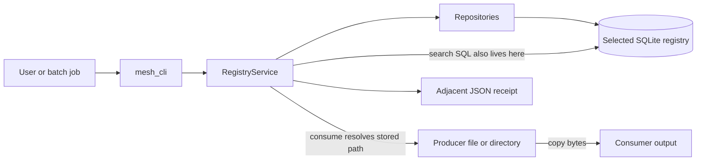
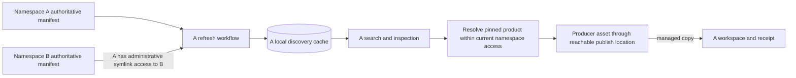

# Feather Mesh repository and project map

Assessment date: **2026-09-19**, America/Toronto. Snapshot: local `main` at `10b684f`, whose latest commit is dated 2026-07-05. This review covers the Rust workspace, tests, CI configuration, planning documents, revised PDF, and selected architecture/schema diagrams. Remote branches, live CI results, deployments, and actual HPC installations were not inspected. Repository routing was updated on **2026-09-22** after archiving the earlier prototype; the original runtime findings were not rerun.

**Overall finding:** Feather Mesh has a functioning Rust CLI and SQLite catalog prototype. Its main producer-to-consumer demonstration works, and all 32 existing tests pass. The intended peer-to-peer system described by the revised PDD is still largely unimplemented: there are no authoritative per-team manifests, namespace resolution, symlink-scoped discovery, or catalog refresh workflows. Existing copy behavior also has confirmed data-loss and incorrect-source defects that need attention before use with valuable data.

## 1. Product intent and competing sources of truth

The user's description agrees with [Feather_Mesh_PDD_Revised.pdf](Feather_Mesh_PDD_Revised.pdf), particularly sections 5, 6, 9, 10, and 14. That document defines a filesystem-mediated peer-to-peer system:

- Each lab/team namespace owns a publish directory and an authoritative manifest of its products and versions.
- Administratively established symlinks determine which other namespaces are discoverable. Access is directional, and ordinary filesystem permissions still apply.
- Each namespace builds a local cached catalog from its own and reachable peers' manifests. Search uses this cache, with a configurable refresh window of up to 24 hours and freshness reporting.
- Namespace selection uses `--namespace`, then `FEAM_NAMESPACE`, then the current directory's group ownership.
- Consumption defaults to **managed copy** into the consumer's workspace. Symbolic links govern peer visibility and source access; the PDD does **not** require consumed outputs to be symlinks.
- Symlink creation, modification, and removal are administrative tasks outside `feam`. Missing symlink-management commands are therefore not a product gap by themselves.

This peer-to-peer design does not require a network protocol or a central registry API. The missing work is primarily namespace-aware filesystem coordination, manifest persistence, discovery, and source resolution.

| Source | What it describes | Assessment |
| --- | --- | --- |
| [Revised PDF](Feather_Mesh_PDD_Revised.pdf) | Distributed authoritative manifests, namespace access topology, local discovery caches, managed copy | Best match for the user's stated product direction; the Rust README explicitly identifies this PDF as product source of truth |
| [Markdown PDD](docs/feam_pdd.md) | A central metadata registry/database, derived search index, registry API, policy/audit components | Substantively different architecture; it is not an equivalent text version of the revised PDF |
| [Project exit outcomes](docs/project_exit_outcomes.md) | SQLite registry, managed copy, auditability, versioning, metadata quality | Useful older acceptance criteria, but omits the revised manifest/cache/namespace contract |
| [Proposal](proposal.md) | Centralized metadata for decentralized lab-owned data | Historical framing; its `images/con_model.png` link points to a nonexistent directory |
| [High-level diagram](diagrams/capstone.HighLevel.png) | Centralized metadata store and shared platform | Reflects the older architecture |
| [Schema V2 diagram](diagrams/Registry%20Schema%20V2.png) | Relational teams/products/versions/metadata/lineage | Broadly maps to the Rust model but omits current `producer` and `usage_policy` columns and shows classification as nullable |
| [CLI PRD](mesh_cli_prd.md), [CLI spec](cli_spec_list.md), [implementation workplan](mesh_cli_implementation_workplan.md) | Local registry bootstrap and managed-copy commands | Present but untracked in this worktree; many unchecked items are already implemented |
| [Agent workplan](feather-mesh/.agents/feather_mesh_workplan.md) | Older implementation phases | Untracked and stale: still calls the CLI a placeholder and the service team-only |

**Implication:** the code is a useful implementation of an earlier milestone. Completing the older CLI checklist would still leave the central features of the revised product missing. Future work should reconcile these documents before treating any one checklist as V1 completion.

## 2. Repository map

| Location | Responsibility and current state |
| --- | --- |
| [README.md](README.md) | Repository overview and routing to the Rust implementation |
| [AGENTS.md](AGENTS.md) and [.codex/skills](.codex/skills) | Rust-first contributor guidance, crate boundaries, validation and CLI conventions |
| [feather-mesh/Cargo.toml](feather-mesh/Cargo.toml) | Rust workspace with two crates; shared dependency versions and a tracked lockfile |
| [mesh_cli/src/main.rs](feather-mesh/mesh_cli/src/main.rs) | 515 lines containing Clap arguments, dispatch, table/JSON output, and exit codes |
| [mesh_core/src/domain.rs](feather-mesh/mesh_core/src/domain.rs) | Typed asset/quality/classification vocabularies, text/ID validation, source reference and error types |
| [mesh_core/src/db.rs](feather-mesh/mesh_core/src/db.rs) | SQLite opening, WAL, foreign keys, schema creation and limited legacy-schema upgrades |
| [mesh_core/src/models](feather-mesh/mesh_core/src/models) | Persisted entity structs separated from insertable `New*` structs |
| [mesh_core/src/repositories](feather-mesh/mesh_core/src/repositories) | SQL insertion, lookup, filtering, and row mapping for five domain tables |
| [RegistryService](feather-mesh/mesh_core/src/services/registry_service.rs) | 676 lines implementing publication, discovery, inspection, lineage, and file/directory consumption |
| [mesh_core/tests](feather-mesh/mesh_core/tests) | Repository/service integration tests and one small climate CSV fixture |
| [mesh_cli/tests/cli_workflow_tests.rs](feather-mesh/mesh_cli/tests/cli_workflow_tests.rs) | Four CLI tests, including the main file-copy demonstration |
| [.github/workflows/rust.yml](.github/workflows/rust.yml) | Ubuntu build, format check, Clippy, and tests on main pushes and pull requests |
| [docs](docs), [diagrams](diagrams), [imgs](imgs), root PDF/plans | Product descriptions, acceptance criteria, architecture illustrations, and branding |

Both Rust crates are version `0.1.0`, edition 2024. The main dependencies are `clap`, `rusqlite` with bundled SQLite, `serde`, `serde_json`, `chrono`, and `thiserror`. The dependency footprint and crate structure are small and understandable.

## 3. Architecture that exists today

Every normal command opens and initializes the database selected by `--registry`; the default is `registry.db` in the process's current directory. There is no namespace context or peer scan. `serve` is a catalog mutation, not a server process. `search`, `show`, and `lineage` read that same selected database. `consume` interprets its stored source path directly in the consumer process.

The intended relationship, which is **not implemented**, is:

SQLite could remain useful as a derived local cache. Today it is the authoritative catalog, so retaining it would require changing its role, introducing manifest import/rebuild behavior, and defining the cache's namespace/host scope.

**Data model:** `teams` own `data_products`; products have `data_product_versions`; each version can have `metadata` and downstream `lineage_dependencies`. Foreign keys and unique indexes enforce some relationships. Version labels are unique within a product, while `source_path` is globally unique across all versions. Product names are not unique. Upstream lineage references are free text with an optional version, not foreign keys to validated upstream versions. The metadata table's `namespace` is a metadata qualifier, not an implemented team access context.

## 4. Capability map

“Implemented” below means a working local-registry capability; it does not imply the revised peer-to-peer acceptance criteria are satisfied.

| Capability | State | Actual behavior or missing piece |
| --- | --- | --- |
| Registry initialization | Implemented | Idempotent schema creation, WAL and foreign keys; a legacy migration test exists |
| Publish initial product/version | Implemented | `serve` creates/fetches a team and transactionally writes a new product, version, and optional direct lineage |
| Controlled metadata vocabularies | Implemented | Seven asset labels; `production/qualified/unverified`; `public/internal/restricted` |
| Keystone metadata completeness | Partial | `intended_use` is optional; paths are only checked for nonemptiness; no filesystem-derived technical metadata |
| Search | Partial | Name/source-path substring matching and owner/type/quality/classification filters; latest inserted version only |
| Rich metadata discovery | Missing | No generic `--filter`, description/intended-use search, metadata key/value search, pagination, or search index |
| Product inspection | Implemented locally | Numeric ID or exact stored source path; optional pinned version; latest means highest version row ID, not semantic version ordering |
| Further versions of an existing product | Core API only | `register_data_product_version` exists, but CLI `serve` cannot target an existing product |
| Immutable published versions | Partial | No CLI edit command and duplicate labels are constrained; underlying files/symlink targets can change undetected |
| Direct lineage | Partial | Stored references and best-effort context by exact source path; no namespace URI resolution, graph traversal, or upstream-version validation |
| File/directory consumption | Partial | Real recursive copies and JSON receipts, with unsafe overlap handling and incomplete symlink behavior |
| Filesystem access enforcement | Partial | Actual file reads respect process permissions; there is no namespace publication/visibility boundary |
| Metadata validation command | Partial | Reuses `ServeRequest` validation; JSON decoding failures become runtime errors; initializes a database first |
| Table/JSON and script use | Implemented baseline | Noninteractive commands, JSON responses, exit mapping 0–5; errors remain plain stderr text |
| Namespace selection and membership | Missing | No `--namespace`, Rust `FEAM_NAMESPACE` handling, group-owner inference, or producer ownership check |
| Authoritative publish manifests | Missing | No manifest format, publication writer, atomic manifest updates, or manifest version history |
| Symlink-scoped peer discovery | Missing | No reachable-peer traversal or namespace-specific result sets |
| Cache refresh/status/freshness | Missing | No `cache` commands, schedule, freshness metadata, or partial-peer-failure handling |
| Lifecycle and operations | Missing or minimal | No retraction/archive workflow, structured audit history, transfer recovery, or deployment runbook |
| DCAT profile | Design only | Domain terminology exists; no concrete DCAT export/profile validation implementation found |

The CLI currently exposes `init`, `serve`, `search`, `show`, `consume`, `lineage`, `validate-metadata`, `teams`, and `products`. Its package and emitted executable are `mesh_cli`; there is no Cargo binary target named `feam`. The command is branded `feam`, and documented execution uses `cargo run -p mesh_cli -- ...`. The accepted `--verbose` flag currently has no behavioral effect.

## 5. Findings requiring attention

### A. The revised product's access and catalog model is absent — architectural blocker

The Rust path from CLI to SQLite never resolves a calling namespace, inspects a publish directory, or reads a peer manifest. Any caller able to use the selected registry can query its catalog without a check against a namespace's current symlink topology. Team names and producer names are supplied as metadata; they are not verified identities or memberships.

This means a multi-team demonstration using one database would demonstrate a shared catalog, not the revised peer-to-peer visibility boundary. Namespace-qualified identities are also needed before independent registries/manifests can be combined: local integer IDs alone are not globally meaningful. Evidence: [CLI dispatch](feather-mesh/mesh_cli/src/main.rs#L135), [search](feather-mesh/mesh_core/src/services/registry_service.rs#L343), and [reference parsing](feather-mesh/mesh_core/src/services/registry_service.rs#L616).

### B. Overwrite can delete the published source — confirmed data-loss defect

`consume <id> --version v1 --out <source> --overwrite` removes the source before attempting to copy it. A temporary-file probe returned exit 1 and the source no longer existed. The implementation removes an existing destination before checking whether source and destination identify the same object or overlap.

Source/output equality, aliases, ancestor/descendant directories, and receipt/source collisions need explicit handling. Copying into a temporary destination and committing only after success would also avoid discarding existing output before a replacement is ready. Evidence: [consume](feather-mesh/mesh_core/src/services/registry_service.rs#L457), [copy_source](feather-mesh/mesh_core/src/services/registry_service.rs#L585), and [remove_existing](feather-mesh/mesh_core/src/services/registry_service.rs#L652). Only the identical-file case was executed during this review; other overlap cases are source-review risks.

### C. Relative paths can silently retrieve the wrong data — confirmed correctness defect

Publication preserves the supplied path without anchoring it to the producer's context. Publishing `relative.csv` in directory A and consuming from directory B, which contains a different `relative.csv`, successfully copies B's file. The receipt still reports the requested product/version.

The revised PDF requires an absolute producer path and a separate cross-namespace resolution strategy. Simply canonicalizing every symlink would not implement that strategy because the access route and namespace identity also matter. Evidence: [SourceReference](feather-mesh/mesh_core/src/domain.rs#L116) and [consume](feather-mesh/mesh_core/src/services/registry_service.rs#L457).

### D. Symbolic-link support is incidental and inconsistent — confirmed behavior

A top-level symlink to a file is followed, and its bytes are copied to a regular output file. A directory containing a symlink fails with “unsupported entry type” and leaves an output directory behind. A dangling destination symlink is treated as nonexistent by the overwrite guard; consuming without `--overwrite` succeeds and creates the symlink's target.

These are different from the missing peer-manifest traversal, but matter for real HPC asset trees. The product needs explicit rules for links encountered inside assets, broken links, destination links, allowed roots, and changes during resolution. Evidence: [copy_source and recursive copying](feather-mesh/mesh_core/src/services/registry_service.rs#L585).

### E. Version labels do not yet provide reproducible product identity — confirmed and structural gaps

Publishing the same product name with a different source and version creates a second product ID. Reusing the first source for another version fails with a raw SQLite uniqueness error, exit 1. The lower-level core API can add versions to an existing product, but the CLI cannot express that workflow.

Separately, changing a source file after publication changes what a pinned consume retrieves; the probe succeeded with the new bytes and `checksum: null`. No content snapshot or integrity check protects the published version. `producer`, `usage_policy`, and `intended_use` live on the product row rather than in complete per-version snapshots. Although there is a generic per-version metadata table, normal serve/show workflows do not use it to capture or expose those snapshots.

Evidence: [serve](feather-mesh/mesh_core/src/services/registry_service.rs#L284), [version registration](feather-mesh/mesh_core/src/services/registry_service.rs#L207), [schema](feather-mesh/mesh_core/src/db.rs), and [receipt construction](feather-mesh/mesh_core/src/services/registry_service.rs#L470).

### F. Discovery and publication do not establish permitted, usable assets — confirmed gap

`serve` succeeds for a nonexistent source without `intended_use`. The declared asset type is not checked against the source's actual type. Search exposes a product whose source cannot be read; a temporary file with permissions removed still appeared in search, while consume correctly returned permission exit 5.

Classification and usage policy are descriptive metadata, and a caller can provide any owner team name. That is insufficient for the revised model's namespace-scoped publication and visibility. Access checks should enforce the namespace model while continuing to rely on filesystem permissions for actual reads. Evidence: [request validation](feather-mesh/mesh_core/src/services/registry_service.rs#L268) and [search](feather-mesh/mesh_core/src/services/registry_service.rs#L343).

### G. Read operations require a writable catalog; shared HPC database use is unresolved

Every command initializes/migrates the registry, including search and metadata validation. Search against a read-only registry failed with “attempt to write a readonly database.” Validating an invalid metadata file created a registry before returning its error. Consequently, catalog consumers cannot simply be given read-only access to the current database.

The database enables WAL. SQLite's official documentation requires processes sharing a WAL database to be on the same host and states that WAL does not work over a network filesystem. A common database or namespace cache accessed directly from multiple HPC nodes therefore cannot be assumed safe under this design. This is an architectural constraint, not an observed cluster failure; no cluster was tested. [SQLite WAL documentation](https://www.sqlite.org/wal.html), [database initialization](feather-mesh/mesh_core/src/db.rs#L18).

The revised architecture allows a better separation between authoritative manifests and disposable discovery caches, but cache placement and concurrent access still need a concrete deployment contract. Schema migration also uses ad hoc column checks rather than a versioned migration history; adding unique indexes can fail on legacy duplicate data without a reconciliation path.

### H. Lineage and operational receipts are incomplete evidence

An upstream reference with `@v999` was accepted even though only `v1` existed. Lineage then attached the existing source path's product context to the unverified `v999` label. `product://namespace/name` references are not resolved as product identities. There is no transitive graph or cycle handling.

Receipts record product ID, version, source, output, and retrieval time, but checksum is always null and namespace/actor context is absent. A receipt is written after copying and may fail independently; interrupted copies have no resume or cleanup protocol. No structured audit subsystem exists. Evidence: [lineage context lookup](feather-mesh/mesh_core/src/services/registry_service.rs#L533) and [consume](feather-mesh/mesh_core/src/services/registry_service.rs#L457).

### I. Layering and project documentation need consolidation

The CLI correctly calls core workflows instead of repositories. However, `search_products` contains SQL and row mapping inside the service, contrary to [AGENTS.md](AGENTS.md) and the [repository-layer guidance](feather-mesh/mesh_core/src/repositories/README.md). It loads catalog summaries before filtering in Rust; there is no bounded result/page mechanism. This is adequate for a small demonstration but has not been measured at catalog scale.

The larger maintenance issue is conflicting product context: the revised PDF, Markdown PDD, diagrams, and untracked workplans lead contributors toward different systems. Root guidance correctly identifies the primary Rust implementation, but the older workplans substantially understate what is already built.

## 6. Verification and confidence

Checks ran locally on **Darwin arm64**, Rust/Cargo **1.94.0**, using cached dependencies. The offline/locked options prevented dependency resolution changes.

| Check, run from `feather-mesh/` | Result |
| --- | --- |
| `cargo fmt -- --check` | Passed |
| `cargo clippy --offline --locked -- -D warnings` | Passed |
| `cargo test --offline --locked` | Passed: 32 tests, 0 failures |

The test distribution is 19 core unit tests, four repository tests, four service tests, one fixture test, and four CLI integration tests. Several unit tests cover model construction/serialization. The principal CLI integration test covers init → serve → search → show → empty lineage → file consume → receipt. Another tests validation, not-found, and destination-exists exit codes; destination-exists is not a real filesystem permission-denial test.

Additional CLI probes used disposable files and databases in temporary directories, cleaned up afterward:

| Probe | Observed result |
| --- | --- |
| Serve nonexistent source with omitted intended use | Exit 0, published |
| Publish same name at two different source paths | Two distinct product IDs |
| Publish another version at an already registered source | Exit 1, unique-source constraint failure |
| Consume a top-level file symlink | Exit 0; regular copied file |
| Change source after publishing, then consume pinned version | Exit 0; changed bytes, null checksum |
| Consume a directory containing a symlink | Exit 1; output directory remains |
| Consume relative source from another directory | Exit 0; copied that directory's different file |
| Consume onto the source with overwrite | Exit 1; source deleted |
| Consume onto dangling destination symlink, without overwrite | Exit 0; symlink target created |
| Search for source with read permission removed | Product visible; subsequent consume exits 5 |
| Validate `{}` | Exit 1 for missing field; registry created first |
| Validate otherwise valid metadata with missing source and no intended use | Exit 0 |
| Record nonexistent upstream version | Publication succeeds; lineage shows unverified label with source-matched context |
| Search a read-only registry | Exit 1; attempted database write |
| `--namespace lab_a search` or `cache status` | Exit 2; unsupported CLI surface |
| `show product://lab_a/example` | Exit 4; interpreted as an unmatched source path |

These probes establish behavior on this machine, not a deployed HPC system. They are review evidence, not new committed regression tests. No source implementation or existing test files were changed during this assessment.

**Coverage gaps:** no committed tests demonstrate namespace isolation, manifests, peer/cache lifecycle, actual cross-user/group sharing, symbolic-link edge cases, overlapping copy paths, integrity after mutation, read-only catalog use, transfer interruption, concurrent publishers, catalog scale, or an actual HPC filesystem. Existing tests also do not comprehensively cover metadata validation commands, missing versions/sources, directory consumption, or populated lineage through the CLI.

## 7. Project maturity and delivery state

| Dimension | Assessment |
| --- | --- |
| Product framing | Clear problem and revised peer-to-peer model, but conflicting retained specifications |
| Core implementation | Useful early Rust implementation with real persistence and workflows; neither an empty scaffold nor a completed peer-to-peer system |
| Demo readiness | Current local file workflow is demonstrable; use disposable data until copy defects are fixed |
| Revised V1 readiness | Incomplete: missing the manifest/namespace/cache architecture and cross-team acceptance evidence |
| Engineering baseline | Format, lint, tests, transactions, typed request values, error categories, and CI configuration are established |
| Deployment readiness | No demonstrated multi-user/HPC installation, release automation, cluster runbook, or filesystem/concurrency validation |
| Reproducibility and governance | Version labels and direct lineage exist; immutable assets, reliable version snapshots, namespace identity, and operational history remain incomplete |
| Measured product value | No adoption, reuse, discovery-latency, or avoided-computation measurements found; the fixture and test demonstrate functionality only |

The local history shows model/repository work, documentation alignment, the CLI workflow implementation, and agent-context additions. That is evidence of progress through a catalog prototype milestone; commit dates alone do not establish current team activity or project abandonment.

Repository hygiene is secondary but visible: `.DS_Store` is tracked and locally modified; the three root CLI planning documents and `feather-mesh/.agents/` were already untracked. No tracked license file, pinned Rust toolchain file, or release/distribution workflow was found. The existing CI defines one Ubuntu job; its live status was not checked. These pre-existing files and changes were left intact.

## 8. Recommended implementation order

This is a proposed path from the current code to the stated product, not an assertion that these decisions or changes have already been made.

| Priority | Work | Completion evidence |
| --- | --- | --- |
| 1 — Prevent incorrect or destructive retrieval | Guard source/output/receipt overlaps; anchor source identities; define destination and nested-symlink behavior; stage copies safely | Regression cases for the confirmed copy failures pass and original sources remain intact on failure |
| 2 — Reconcile product contract | Make the revised PDF's architecture available in maintained text; update exit outcomes, diagrams, and obsolete plans | One consistent description of namespace, manifests, cache, symlink visibility, and managed copy |
| 3 — Establish namespace publication | Resolve namespace context and ownership; define stable namespace-qualified product IDs, manifest schema, atomic updates, and publication permissions | Two independent teams can publish versioned products into their own authoritative manifests without a shared authoritative database |
| 4 — Implement scoped discovery | Read own/reachable manifests; build a derived cache; add refresh/status, freshness, and failure reporting | A sees its own and granted B products; ungranted C is absent; behavior after grant removal and peer failure is explicit and tested |
| 5 — Complete versioned retrieval and lineage | Append versions to a stable product, preserve metadata snapshots, resolve producer paths through namespace context, verify upstream versions and integrity | Pinned retrieval identifies the intended bytes; lineage retains namespace/version provenance even when a peer becomes unavailable |
| 6 — Validate HPC operation | Test separate users/groups, concurrent publication, cache placement, large directories, interrupted jobs, and restricted filesystem access | Repeatable two-team scenario on the target filesystem with documented failure/recovery behavior |
| 7 — Package and document delivery | Provide an actual `feam` executable/install path, operational guidance, metadata examples, and appropriate release checks | A new user can install and complete the namespace-scoped workflow using only the documented steps |

Keep the current crate boundaries. Add manifest, namespace, cache, and source-resolution workflows in core; keep CLI parsing/output in `mesh_cli` and move search SQL/row mapping into repositories. Reuse existing domain validation and DTOs where their semantics remain correct. A central network service is not a prerequisite for the revised design.

Before implementing peer discovery, formalize the remaining ambiguities in the revised PDD:

- **Reachability:** whether discovery follows only direct peer links or traverses transitively; permitted directory layout, cycles, aliases, and duplicate namespace identities.
- **Revocation versus stale caches:** the PDD permits retention of cached peer state after refresh failure while also describing visibility as a hard access boundary. Specify when removed grants hide entries and how consume rechecks current access.
- **Path mapping:** how a manifest's producer-side absolute `source_path` maps through the reachable publish directory to the consumer's filesystem view.
- **Immutability:** which producer guarantees, snapshots, or integrity checks establish stable version contents when files and links remain owner-controlled.
- **Concurrency:** how multiple publishers update one manifest and where each namespace's cache lives when jobs run on multiple hosts.

The most useful next milestone is a tested two-namespace filesystem workflow: B publishes a manifest, A discovers B only through its configured access link, A consumes a pinned version, and loss of that access produces the specified visibility and retrieval behavior. That would demonstrate the defining Feather Mesh capability beyond the local catalog workflow already present.
