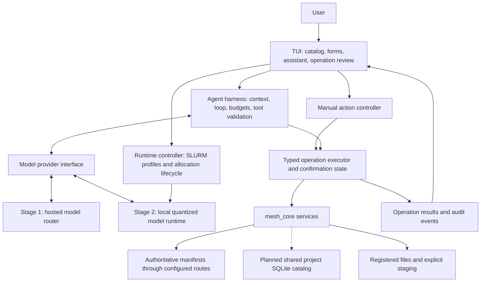

# Feather Mesh TUI and Agent Harness Design

Status: **Draft v0.3 — for iteration; not an implementation contract.**

Date: **2026-09-22**.

Implementation status: Stage-1 implementation has begun on the feature branch.
Optional `mesh_tui` and `mesh_agent` crates, a manifest-backed bounded catalog
interface, review-bound operations, and a private operation journal now exist.
The implementation decisions are in [the Stage-1 contract](docs/tui_agent_stage1_contract.md).
This local code is not evidence of hosted-model quality, live-router success,
or target-HPC acceptance; those gates remain explicit.

Implementation handoff: [stage-1 workplan](tui_agent_harness_stage1_workplan.md), covering the manual TUI and hosted-model development/demo stage.

Repository baseline: `558e187` (`Merge feature/data-access-implementation`), including `0569b4f` (`Implement peer data access workflow`).

## 1. Direction

Build an interactive terminal application for `feam` that is useful without a model and can also host a domain-specific agent. Users should be able to browse, understand, publish, resolve, and stage Feather Mesh products through forms and keyboard navigation, or ask an assistant to carry out those same workflows.

Deliver the assistant in two stages:

1. **Stage 1 — development and demonstration:** connect to a model router using the user's API key. Use capable hosted models to establish the interaction design, tool contract, evaluation suite, and reproducible demo environment.
2. **Stage 2 — HPC deployment:** run a small quantized model within the HPC environment, optionally post-trained for feam tasks. Keep the TUI, tool semantics, permissions, and workflow engine consistent with stage 1.

The central architectural decision is to separate **interaction**, **agent orchestration**, **model inference**, and **Feather Mesh operations**. The model proposes actions; the harness validates and coordinates them; existing Rust services enforce publication and access rules. Changing the inference backend must not change the meaning of a feam operation.

**Confirmed HPC direction:** keep CPU and GPU deployment equally open. Both must have a very low compute footprint so users avoid long SLURM allocation waits before inference. Optimize the complete request-to-answer delay, including queueing and model startup, rather than choosing a backend on generation speed alone. The exact resource envelope and deployment topology remain open for iteration. All new commands, crates, settings, tools, and performance targets below are proposals unless identified as existing behavior.

**Planned follow-up:** a shared project catalog backed by SQLite can be completed in the near future. Initial TUI and harness work can use existing discovery services while keeping a common catalog interface for this addition. The shared catalog's storage/publication mechanism remains to be selected; it is not a prerequisite for starting the TUI.

## 2. Current repository foundation

The settled [peer-data-access contract](docs/data_access_contract.md) governs data behavior. The earlier [requirements](data_access.md) explain intent, while the [implementation workplan's execution record](data_access_implementation_workplan.md#8-execution-record-for-the-implementing-agent) records local validation. Earlier gap assessments in those documents predate the latest implementation.

| Area | Present in this baseline | Design implication |
| --- | --- | --- |
| Rust workspace | `mesh_core` and `mesh_cli`; the public command is `feam`, while the Cargo artifact remains `mesh_cli` | Add interactive functionality without changing existing script interfaces |
| Project access | Explicit project config, configured peer routes, namespaces, and pinned versions | Every TUI session binds to one explicit project |
| Publication | Authoritative provider manifest, metadata and format validation, immutable version inventory, withdrawal | Forms and agent actions call the same services |
| Discovery and access | Registered product listing, refresh/cache status, current-route resolution, optional integrity verification, explicit staging | Direct reads remain the default access workflow; copying is an explicit choice |
| Python | Supported subprocess SDK; native Polars lazy scans and raster resolution | Generate examples using the supported SDK; no second resolver in the harness |
| STAC | Derived raster metadata and authenticated loopback HTTP service | Reuse existing raster identity and metadata; do not make STAC a catalog authority |
| Agent/TUI | No implementation in the workspace | UI, model transport, tool execution control, and evaluation are new work |
| HPC evidence | Local validation is recorded; target-filesystem, separate-identity, and multi-node acceptance remain pending | A local-model demonstration alone cannot establish HPC readiness |

Primary implementation anchors: [CLI dispatch](feather-mesh/mesh_cli/src/main.rs), [peer services](feather-mesh/mesh_core/src/services/peer_access.rs), [public peer re-export](feather-mesh/mesh_core/src/peer.rs), [Python SDK](feather-mesh/python_sdk/README.md), and [STAC HTTP adapter](feather-mesh/mesh_core/src/stac_http.rs).

### 2.1 Existing limits relevant to this design

Source inspection establishes several boundaries that the implementation must address explicitly:

- `list_registered` reads current manifests and skips unavailable routes. The TUI must combine listing with peer-health information so an empty result does not imply every peer was searched successfully.
- The current refresh snapshot stores peer revision, time, and error information. It does not contain a complete offline product catalog. Persistent offline browsing would require a separate, deliberately stale metadata snapshot.
- Peer CLI search currently matches namespace, product ID, and name. Other parsed search filters are not applied in that branch. Rich filters need shared service behavior and parity tests before the TUI advertises them.
- Core calls are synchronous. Publication inspection, hashing, and staging have no interactive progress/cancellation API. A background worker prevents UI blocking but does not itself make an operation cancellable.
- `stage` accepts an already resolved descriptor. The interactive flow must resolve again immediately before staging, rather than execute a descriptor retained across a long conversation or approval delay.
- The contract calls for explicit legacy registry selection, but `run_legacy` still defaults to `registry.db` when `--project` is absent. The proposed TUI requires explicit project selection and never enters that fallback. Existing CLI divergence is separate follow-up work.

These are design inputs from reading the source, not newly executed runtime findings. This document does not change their implementation.

## 3. Scope and user outcomes

### 3.1 Initial supported workflows

| User | Outcome | Interactive route | Assistant route |
| --- | --- | --- | --- |
| Consumer | Find a suitable published product | Search, filter, inspect versions and reuse metadata | “Find a production-quality observations table and explain its limitations” |
| Consumer | Read a pinned version in place | Resolve; inspect inventory; copy a CLI or SDK example | “Help me open v3 in Polars without copying the data” |
| Consumer | Stage data for a job | Select version and destination; review size and overwrite behavior | “Stage this version into my job inputs” |
| Producer | Publish prepared files | Fill a metadata form, select an exact inventory, validate, review, publish | “Help me complete this publication metadata” |
| Producer | Withdraw a version | Review local namespace, version, and reason; confirm | “Withdraw this local version with this reason” |
| Either | Diagnose access or metadata failures | Peer status, validation errors, retry or corrective guidance | “Why can I no longer resolve this product?” |

Publication assistance may explain missing fields and suggest wording. It must leave unknown scientific meaning, usage policy, classification, contact, and lineage for the producer to supply or confirm. It must not invent scientific facts to pass validation.

### 3.2 Boundaries for the first release

- Prioritize project-scoped peer workflows. The planned SQLite catalog supports this same project experience. Support for the earlier registry workflow is a separate scope decision, with an explicitly selected workspace mode and separate service adapter if needed.
- Cover initialization, publication, discovery, product details, lineage, teams, refresh, cache status, resolution, staging, and withdrawal. Expose STAC metadata and connection guidance first; managing a long-lived STAC server can follow.
- Generate reviewable CLI/Python examples, but do not execute arbitrary shell commands, Python programs, notebook cells, or user-authored scheduler jobs. A deterministic runtime controller may provision inference using preconfigured SLURM profiles; this is separate from the model's tool set.
- Do not edit ACLs, peer symlinks, or peer configuration through the agent initially. Present missing configuration and corrective instructions.
- Do not require a vector database, browser UI, central service, or Python installation for the TUI itself. Python remains necessary only for users choosing the SDK workflows.

## 4. Terminal experience

Proposed entry point:

```text
feam tui --project /absolute/path/to/project
```

Optional proposed flags are `--agent off` and `--agent-profile NAME`. Starting the TUI without credentials still gives a complete manual interface. Initialization is an explicit action when the selected root has no project config; opening a directory must not silently create a project or registry. Reject non-terminal input/output with guidance to use existing CLI commands.

```text
+--------------------------------------------------------------------------------+
| feam | Project: client | Peers: 2 available, 1 unavailable | Agent: local / off  |
+----------------+---------------------------------------+-----------------------+
| Catalog        | Search: observations                  | Assistant             |
| Peers          |                                       | Find a table I can    |
| Publish        | climate/observations   v3   table      | use in Polars.        |
| Operations     | climate/temperature    v1   raster     |                       |
| Settings       |                                       | Found observations v3 |
|                | Selected version                      | [View evidence]       |
|                | Quality, policy, limitations, lineage | [Resolve version]     |
|                | Inventory, revision, peer health      |                       |
+----------------+---------------------------------------+-----------------------+
| / Search | Tab Focus | Enter Open | ? Help | Ctrl+C Stop | Command palette      |
+--------------------------------------------------------------------------------+
```

The assistant panel is optional and collapses on small terminals. At 80×24, show one main panel at a time. Support SSH/tmux use, resizing, keyboard-only operation, readable no-color output, and no dependence on mouse input or special fonts. Keep a visible focus indicator and contextual key hints.

The catalog and forms are the primary application state. Assistant results can select a product, populate a draft, or open a review screen; users should not have to copy identifiers from chat to finish a task. Render metadata and model output as untrusted text, escaping terminal control sequences and disabling automatic terminal hyperlinks/clipboard actions.

Each operation shows its identity, input summary, state, elapsed time, and result. Distinguish **working**, **waiting for input**, **awaiting confirmation**, **completed**, **failed**, **cancelled before commit**, and **outcome needs reconciliation**. For inference, also distinguish **awaiting allocation**, **loading model**, and **ready**; show the SLURM job ID and pending reason when available. Users can continue permitted manual workflows while inference waits. Use progress bars only when the service reports real progress.

### 4.1 Example interactions

**Discover and use:** search → inspect metadata and limitations → explicitly choose a version → resolve the exact inventory → copy a supported SDK example. No copy is necessary. Explain that a later lazy query may fail if permissions, peer routes, or bytes change.

**Publish:** choose files beneath the serving root → provide required metadata → run physical validation → inspect the final version record and inventory → confirm publication → display the returned manifest revision. Inventory preparation never makes an unregistered file discoverable.

**Stage:** choose a pinned product/version → choose destination → inspect registered size, destination state, receipt path, and overwrite policy → confirm → revalidate current access → stage → display the receipt. An assistant's prose is never evidence that the copy succeeded.

## 5. Architecture and ownership



Proposed workspace layout:

| Component | Responsibility |
| --- | --- |
| `mesh_cli` | Existing command parsing/output/exit behavior; dispatch the new `tui` subcommand |
| New `mesh_tui` library crate | Terminal lifecycle, rendering, forms, navigation, user confirmations, manual action controller |
| New `mesh_agent` library crate | Model-independent loop, provider adapters, tool schemas, bounded context, budgets, evaluation hooks; separate deterministic runtime-controller module |
| `mesh_core::services` additions | Shared typed operations, previews/preflight, current-state checks, operation outcomes and progress hooks where needed |
| Separate local inference process | Load and run stage-2 weights; no filesystem tools or feam execution privileges exposed through the model interface |

Keep display formatting in the interactive/CLI layers and domain validation in core. Store confirmation state outside the model; the model cannot supply an approval token. Both the manual controller and agent call the same operation executor. `mesh_core` must not depend on the TUI or model client.

Put discovery behind a shared core catalog interface with bounded queries and explicit freshness/coverage results. Initially it can read manifests through existing services; the planned SQLite implementation can satisfy the same interface. SQL and row mapping belong in `mesh_core::repositories`. The TUI and agent tools must not depend on database paths, tables, or raw SQL.

Use direct Rust calls for the in-process TUI. Parsing terminal output would add a brittle second interface, and wrapping subprocess JSON offers little benefit for another Rust component. Preserve `feam.peer.v1` for the existing SDK and independently version the proposed agent tool contract as `feam.agent.tools.v1`.

**Suggested stack:** Ratatui with a compatible Crossterm backend for rendering/input, plus an async runtime and HTTP client for model transport. Ratatui provides terminal backends and a testing backend; pin compatible dependency versions when implementation starts. This is a stack proposal, not a new repository dependency. [Ratatui backend documentation](https://ratatui.rs/concepts/backends/).

Run blocking core work on a bounded worker pool, initially serializing mutations per project. Send typed events to the UI through bounded channels. Restore terminal state on errors, normal exits, and supported signals. Cancel model streaming independently from data operations; never treat dropping a worker handle as rollback.

Keep TUI and hosted-model dependencies behind build features so existing CLI-only deployments retain a small dependency surface. Stage 2 loads weights through an external runtime rather than embedding them in the feam binary.

## 6. Agent harness contract

### 6.1 Execution loop

```text
User request
  -> build bounded context for the selected project and approved model profile
  -> ask model for an answer, clarification, or typed tool proposal
  -> parse complete response and validate tool name/arguments
  -> check operation scope, current state, and resource budget
  -> obtain user confirmation when the operation requires it
  -> execute through shared Rust services
  -> record typed result and provide a permitted summary to the model
  -> continue within limits, ask the user, or finish with evidence
```

Allow one active assistant run per session and execute one proposed tool call at a time initially. Normalize provider responses into a common representation. Do not execute partial streamed arguments or extract shell commands from prose. Invalid arguments produce structured feedback; allow one repair attempt, then return control to the user.

Initial configurable limits: at most eight tool calls per user request, two minutes of model-request time, bounded response/context tokens, and a hosted-cost budget. Human confirmation time and approved long-running copies are tracked separately. Detect repeated identical calls without useful progress. A budget stop leaves the catalog and manual workflows usable.

### 6.2 Proposed tools

Tool arguments exclude a model-selected project root: the harness injects the session's selected project. Names below describe the proposed tool contract, not existing CLI commands.

| Tool | Inputs and result | Execution policy |
| --- | --- | --- |
| `catalog.search` | Bounded query/filter/page → qualified references, versions, revision and coverage status | Read-only; only implemented filters advertised |
| `product.inspect` | Qualified reference and version → metadata, lineage, descriptors | Read-only; identify unavailable peers and withdrawn versions |
| `product.resolve` | Reference, version, optional asset, integrity option → exact registered inventory | Read-only; explicit high-I/O consent for full integrity reads |
| `peers.status` | Current session → configured peer health and recorded refresh times | Read-only |
| `catalog.refresh` | Current session → refreshed status and per-peer errors | Initially a local cache write; future shared-catalog publication requires a separate explicit action and project write permission |
| `publication.validate` | Structured draft with exact assets → validated preview or field errors | No publication; disclose potentially substantial inspection/hash I/O |
| `publication.publish` | Validated draft handle → authoritative commit result | Confirm exact draft, namespace, version, and inventory |
| `product.stage` | Reference, version, destination, overwrite choice → receipt/result | Confirm destination and size; overwrite separately explicit |
| `product.withdraw` | Local qualified reference, version, reason → tombstone/revision | Confirm every withdrawal; reject other namespaces |
| `help.lookup` | Topic → bounded bundled documentation excerpts | Read-only, versioned with the application |

Forms, draft editing, and snippet rendering use deterministic application code where possible. Publication/withdrawal tools can be introduced after read-only assistance is stable. A separate `execute_shell`, arbitrary filesystem reader, or generic HTTP tool is outside the initial contract.

Tools return structured status, stable error kind, operation ID, product/version/revision where applicable, and a bounded result summary. Paths and large inventories stay in the local UI unless the selected context policy permits them. Provider-facing handles may represent local drafts, assets, or destinations; the harness validates and resolves these handles rather than trusting fabricated paths.

### 6.3 Confirmation and changing state

An assistant request can authorize discovery and inspection within the selected project. Publication, staging, overwrite, and withdrawal open concrete review screens. Manual form submission is itself the confirmation for its displayed action; avoid duplicating prompts for the same unchanged inputs.

Bind confirmation to normalized arguments, project identity/configuration, relevant manifest revisions, draft/inventory digest, and destination state. Any material change invalidates the confirmation. Recheck current peer routes, lifecycle, and inventory immediately before execution. Shared core operations must check relevant preconditions under their mutation lock where possible; a UI-only revision comparison is insufficient for concurrent publication.

Treat file contents, metadata descriptions, retrieved help excerpts, and tool results as data. Instructions inside them cannot broaden tools, authorize disclosure, change the project, or bypass confirmation. A model's own statement that an action is safe is not an authorization decision.

### 6.4 Results, cancellation, and recovery

Record intent before a mutation and its authoritative result afterward. An internal operation ID helps correlate events but does not make existing operations idempotent. Retry read-only calls with bounded backoff. After a timeout or disconnect during a mutation, reconcile manifest/receipt state before proposing another attempt.

Distinguish `committed`, `failed_before_commit`, `committed_with_followup_error`, and `outcome_unknown`. For publication conflicts after an uncertain response, reopen and compare the authoritative record. Do not report success from generated text, infer rollback from a lost response, or silently repeat a write.

Initially, cancellation stops generation and prevents new tool starts. Once a synchronous mutation has started, show “waiting for operation to finish” unless the core service supports a tested safe cancellation point. Cooperative cancellation/progress for copying and hashing is follow-up core work with commit-boundary tests. Resume a saved conversation only after reopening the project and revalidating references; previous confirmations do not survive session restart.

## 7. Context, local state, and configuration

Keep model context small and structured: user request, selected product/version, current tool schemas, relevant metadata, recent results, and short bundled help. Retrieve catalog entries through feam tools. Do not upload an entire manifest tree or use model memory as a substitute for current discovery.

Store authoritative operation state outside the model context. Summarization must preserve pinned references, revisions, unresolved errors, and pending user choices. When context is exhausted, stop or start a fresh bounded task; never silently remove constraints and continue.

Keep settings in separate locations:

| Location | Proposed contents |
| --- | --- |
| Existing `.feam/project.toml` | Existing project/peer schema, unchanged by this draft |
| User config directory, e.g. `~/.config/feam/agent.toml` | Named model profiles, endpoint, model identifier, credential environment-variable name, limits |
| Site-managed policy/config, if supplied | Allowed inference endpoints and resource/disclosure restrictions; local profiles may only narrow these |
| Private per-user/session state directory | Minimal operation journal and optional conversation history; restricted permissions and bounded retention |
| Node-local runtime/cache directory | Runtime token/socket, temporary model files if needed, existing per-process peer-cache location |

Do not add agent keys to the strict existing project schema or place secrets in the serving tree. Require deliberate trust before loading any future project-supplied agent settings. Session journals are per session and are not shared SQLite/WAL files across nodes. Journals may contain sensitive paths/metadata, so transcript saving and export are explicit options.

Example profile, **proposed schema only**:

```toml
schema_version = 1
default_profile = "demo-router"

[profiles.demo-router]
backend = "router"
base_url = "https://openrouter.ai/api/v1"
model = "<explicitly-selected-model-id>"
api_key_env = "FEAM_ROUTER_API_KEY"
context_policy = "demo-approved-metadata"
max_tool_calls = 8

[profiles.hpc-local]
backend = "local"
base_url = "http://127.0.0.1:<allocated-port>/v1"
model = "<pinned-local-model-id>"
api_key_env = "FEAM_LOCAL_RUNTIME_TOKEN"
context_policy = "local-only"
allow_remote_fallback = false
max_tool_calls = 8
```

SLURM runtime profiles additionally specify the approved account/partition/QoS, CPU count, memory, optional GPU resource, time limit, startup timeout, idle timeout, and maximum session lifetime. These are deployment inputs, never values chosen by the model. Avoid hard-coding cluster names or assuming access to an interactive partition.

Missing keys, models, or endpoints disable the assistant with a specific corrective message. Manual feam workflows remain available. Profile changes start a new model context and clear pending proposals/confirmations to prevent accidental disclosure or reuse across backends.

### 7.1 Planned shared project catalog

Provide one logical catalog per project that team members use for discovery. SQLite would index registered products, versions, metadata, inventories, manifest revisions, and peer observation status. Provider manifests remain authoritative, and resolution/staging continue to check current registration, routes, lifecycle, and caller access through core services. Private conversations, credentials, and operation journals remain separate from the shared catalog.

The recommended first option to evaluate is **published read-only SQLite snapshots**:

1. An authorized refresh operation reads the project's configured provider manifests and builds a complete database privately.
2. It publishes a self-contained database under a unique generation name, with no dependency on live WAL/journal files, then atomically updates a small current-generation reference.
3. Readers pin that immutable generation. New readers can select the next generation; an open database is never overwritten in place. Refresh records per-peer revisions and observation times, without claiming a globally simultaneous snapshot across providers.
4. Serialize generation publication, check project configuration and relevant revision changes, and define bounded retention and safe cleanup for old readers. Validate these operations on the target filesystem before accepting the deployment.

This provides one team-facing catalog with versioned files underneath and no required resident database service. A possible snapshot location is `.feam/catalog/`; that layout is a proposal, not a change to the existing project schema or cache contract.

The alternative is **one live SQLite database behind a small authenticated service**, with the database and its accessing processes on the same host/local storage. This adds service availability and deployment work. Direct multi-node access to a mutable SQLite WAL file is unsuitable: WAL requires participating processes on the same host. [SQLite WAL documentation](https://www.sqlite.org/wal.html). SQLite documents a proxy/service approach for remote clients and the additional constraints of direct network-filesystem access. [SQLite network guidance](https://www.sqlite.org/useovernet.html).

Only metadata intended for the shared project's audience belongs in the shared catalog; file-level database access exposes its stored rows. Cached entries carry freshness and coverage information. Removed or retargeted peers and withdrawn versions cannot become readable through cached paths. Existing legacy database rows need explicit validation/migration if imported; reusing SQLite does not automatically make those rows valid peer publications.

Choose between snapshots and a service in the shared-catalog feature design. Define generation/schema compatibility, refresh permissions, failure recovery, and stale-result behavior there, and update the data-access contract before implementation changes its current cache semantics. Measure catalog build/load time, query latency, shared-storage I/O, and memory so catalog startup does not undermine the low-footprint inference goals. The TUI can ship with the initial catalog implementation while this feature proceeds independently.

## 8. Stage 1: hosted development and demo environment

### 8.1 Provider adapter

Start with one router adapter, with OpenRouter as a concrete candidate, behind a provider-neutral interface. The interface handles request construction, streamed text/tool events, cancellation, usage reporting, capability checks, and normalized failures. Require a selected model and tested tool-calling support; “compatible API” alone is insufficient.

For OpenRouter, explicitly require supported parameters, select allowed upstream providers, and configure retention/data-collection restrictions. Disable automatic fallback outside the tested provider/model set. These controls are available in its routing API; they do not determine whether a particular project is approved for external disclosure. [Provider routing documentation](https://openrouter.ai/docs/guides/routing/provider-selection). Validate the full tool-call/result exchange against the selected model. [Tool calling documentation](https://openrouter.ai/docs/guides/features/tool-calling).

Read the API key from the configured environment variable or an optional OS credential store. Never pass it to the model, display it, include it in logs, or persist it in project files. Use TLS for hosted endpoints and avoid credential-bearing redirects.

Use synthetic demo data by default. Before sending a request, show the active external endpoint and the categories of context that may leave the machine. The serialization boundary must enforce the selected policy for user text and tool results, including metadata, identifiers, paths, and error strings. A `public` classification does not automatically authorize upload. Disallowed context is blocked or omitted with an explicit limitation; it is not silently sent to make the request work.

Show token usage and estimated cost when available; mark unknown costs as unknown. Budget estimates require configured prices or returned usage and may lag actual billing. Use provider/account spending limits for a hard financial cap. Handle rate limits, exhausted quota, authentication failures, transport errors, and malformed responses without losing application state.

### 8.2 Reproducible demo

Create a disposable provider/client project pair using the existing [peer-access fixtures](feather-mesh/mesh_core/tests/data/peer_access/README.md). Include a registered Parquet table, a registered GeoTIFF, an unregistered file, and an unavailable peer. Keep the demo reset script scoped to its own generated directory.

The walkthrough should demonstrate manual browsing, equivalent assistant discovery, a pinned SDK example, a corrected metadata draft, confirmed staging, withdrawal, and a changed-route failure. Record actual tool results in the UI. A deterministic fake provider supports CI and rehearsals; clearly label replay mode. Live hosted acceptance uses a real key and records the selected model/provider and evaluation date.

Stage-1 deliverables include the manual TUI, provider adapter, tested tool contract, bounded agent loop, operation review/recovery screens, demo setup/runbook, and an evaluation corpus usable unchanged in stage 2. No cloud account or paid request is required for ordinary CI.

## 9. Stage 2: small quantized model on HPC

### 9.1 Deployment shape

Keep **CPU and GPU profiles as equal candidates**, with selection driven by measured allocation wait, startup cost, task quality, and resource use. Support two placements: a co-located TUI/runtime inside an existing interactive allocation, and a lightweight TUI on a site-approved interactive host connected to an allocated runtime through an authenticated site-approved transport. The latter lets users browse and see queue status while waiting. Login-host permission for the lightweight TUI does not imply permission for inference, hashing, or bulk staging there; operation placement must respect the selected execution profile.

The runtime controller first checks for a compatible existing allocation with sufficient explicitly available resources. Otherwise, it requests one small inference allocation from a configured profile. It uses fixed executable paths and argument arrays, tracks the job it owns, and exposes status/cancel controls. It does not let the LLM issue scheduler commands or change accounts, QoS, resource limits, or partition selection.

Evaluate `llama.cpp` as the first runtime candidate. It provides a local server and schema-constrained generation, but tool parsing depends on the model and chat template. Pin and test the runtime, model, tokenizer, template, quantization, and request format as one release unit. [Server documentation](https://github.com/ggml-org/llama.cpp/blob/master/tools/server/README.md), [function-calling documentation](https://github.com/ggml-org/llama.cpp/blob/master/docs/function-calling.md).

Stage model artifacts ahead of time through the site's approved installation process. Record checksums, origin, license, and build target; verify artifacts offline at startup. Do not auto-download models or fall back to hosted inference. Prebuilt CPU targets and optional accelerator builds must match the actual compute nodes; a developer laptop binary is not deployment evidence.

Loopback alone does not isolate users on a multi-user node. Use a per-session runtime credential and restricted files, or a verified user-private socket transport. Remote placement additionally needs the site's approved authenticated connection/tunnel. Bind only the intended interface and clean up the owned runtime after the session/allocation ends. Never cancel a user's pre-existing allocation when cleaning up an inference step. Cap thread count, context length, concurrent requests, and resident models within the allocation. Avoid launching a model per MPI rank.

An administrator-managed inference service is an alternative if individual job queueing cannot meet the interaction target. Evaluate its aggregate idle resource cost, authentication, quotas, isolation, and network policy. It is a deployment decision, not an assumed dependency.

### 9.2 SLURM scheduling and perceived latency

The primary performance measure is:

```text
request-to-first-useful-action
  = allocation queue time
  + job/step launch time
  + model staging/load time
  + prompt processing and action generation
  + required feam tool execution
```

Report first-use latency and subsequent warm-turn latency separately. A fast GPU answer after a long queue can be worse than a slower CPU answer available immediately; the reverse can hold when a suitable GPU is already allocated or shared. The design must measure both cases.

SLURM backfill considers requested resources and runtime, including memory and generic resources. Accurate short time limits can make jobs eligible for gaps before higher-priority work, but queue time also depends on priority, partition/QoS, scheduler configuration, and current load. Small requests therefore improve the opportunity for a quick start without guaranteeing one. Treat this as a design inference from SLURM's scheduling behavior and validate it on the target cluster. [SLURM scheduling guide](https://slurm.schedmd.com/sched_config.html).

| Technique | Proposed behavior | Measurement/tradeoff |
| --- | --- | --- |
| Reuse an existing allocation | Start one bounded inference step only when the allocation permits it and has spare resources | Avoids a fresh allocation queue, but step contention and application interference still need measurement |
| Small CPU profile | Begin experiments with one task, one CPU, and 1–2 GiB total job memory; increase only with evidence | Low resource demand versus prompt-processing/generation latency |
| Small GPU profile | Measure the smallest site-supported GPU allocation with minimal supporting CPU/RAM; consider supported sharing or an already allocated GPU | Faster inference may not compensate for resource scarcity or a whole GPU reserved for a tiny workload |
| Short accurate walltime | Start with a 5-minute inference-session profile including startup; compare shorter/longer limits | Backfill fit versus model reloads, queue re-entry, and interrupted conversations |
| Brief warm session | Reuse the loaded model across turns; initial 60–120 second idle timeout within the allocation's hard lifetime | Amortizes startup without retaining idle resources indefinitely |
| Lightweight model loading | Preinstall a pinned compact artifact; measure shared-storage load against node-local staging | Startup I/O and disk use can dominate a short session |
| Bounded context and output | Compact schemas, small retrieved metadata slices, short action proposals | Reduces memory, CPU/GPU time, and repeated prompt processing |

Reuse requires a compatible job step and real remaining resources; an existing job ID alone is insufficient. SLURM can create an allocation or launch work within one, so test the site's job-step behavior rather than treating all steps as immediately available. [SLURM `srun` documentation](https://slurm.schedmd.com/srun.html). GPU sharing, including MPS/MIG-related configurations, depends on site setup; do not assume an arbitrary fractional GPU request is supported. [SLURM GRES documentation](https://slurm.schedmd.com/gres.html).

Use one outstanding inference allocation request per session. Poll at a configurable modest interval with backoff, show pending reasons and estimates as estimates, and allow cancellation. Do not submit competing CPU/GPU requests and keep whichever starts first. Choosing or changing a profile is a deterministic user/site decision based on recorded experience; a model cannot create a resubmission loop. Budget allocation lifetime for loading and useful work honestly.

If waiting exceeds a configurable interaction budget, initially 30 seconds, show the elapsed wait and offer continued waiting, cancellation, or manual assistance. This threshold is a UX trigger, not a promise of a 30-second queue. Preserve the user's request so it can resume after the runtime is ready, and prevent cancelled requests from executing later.

On idle expiry, allocation timeout, or preemption, keep conversation and operation state outside the inference process. Release only resources owned by the runtime controller. Reconnect/reload requires current project checks and fresh confirmation for pending mutations. An active feam mutation follows the core operation's recovery semantics even if inference disappears.

For CPU and GPU profiles, report p50/p95 queue, launch, load, first useful action, and warm-turn times across realistic busy and quiet periods. Report CPU-seconds, GiB-seconds, GPU allocation-seconds/VRAM, idle allocation time, and task success alongside latency. If no profile meets the interactive target, decide explicitly between allocation reuse, a site-managed warm service, narrower assistant scope, or accepting queued assistance.

### 9.3 Model selection and footprint

Choose the smallest model that passes feam task evaluations. Start by measuring approximately 0.5–2B parameter instruction models at 4-bit and a higher-precision baseline. Qwen3-0.6B and Qwen3-1.7B are concrete candidates to test, not selections or claims of sufficient feam performance. Verify their permitted use and exact runtime/template compatibility. [Official 0.6B model card](https://huggingface.co/Qwen/Qwen3-0.6B), [official 1.7B model card](https://huggingface.co/Qwen/Qwen3-1.7B).

If the smaller candidates fail, compare targeted post-training, a constrained task scope, and a 3–4B fallback against the measured resource budget. Do not assume aggressive quantization or a larger model will improve end-to-end task success without testing.

The nominal weight storage is `parameters × bits / 8`: 1B parameters at 4 bits is approximately 0.5 GB. That excludes quantization metadata, tokenizer, KV cache, runtime buffers, and application memory. Measure peak resident memory during representative multi-turn tool use; model-file size is not a RAM requirement.

**Provisional engineering targets, not observed performance:**

| Metric | Initial target and measurement conditions |
| --- | --- |
| Hardware choice | CPU and GPU evaluated equally; no default winner before cluster measurements |
| TUI/harness memory | At most 100 MiB on a bounded catalog page, excluding inference |
| CPU allocation envelope | Target one task/CPU and 1–2 GiB total requested RAM, including co-located feam overhead and measured headroom |
| GPU allocation envelope | Smallest site-supported schedulable resource; report total host RAM, VRAM, and allocated GPU share/device |
| Runtime memory | Target ≤1 GiB peak host RSS initially; ≤2 GiB total job envelope as a provisional ceiling, not a demonstrated capability |
| Concurrency | One session, one inference request, one loaded model |
| Context | Start at 2K tokens, compare 4K only if quality requires it; count tool schemas and response allowance |
| First-use latency | Aspirational p95 request-to-first-useful-action ≤30 seconds, including SLURM wait/startup, on a named partition/load sample |
| Warm latency | Aspirational p95 complete simple tool proposal ≤10 seconds on the selected resource profile |
| Allocation duration | Initially 5 minutes maximum per inference session; 60–120 second idle expiry, subject to site limits |
| UI response | Input/render work remains responsive within 100 ms while inference or I/O runs |
| Offline operation | No external network required; no remote fallback, telemetry, or runtime downloads |

These targets may conflict for a given model and cluster. Measure before committing to them, and reduce model/task/context scope before assuming more resources are the answer. Capture cold model load, prompt-processing rate, generation rate, total task latency, tool-call count, and quality before/after quantization. Agree on release limits once the target cluster and actual SLURM scheduling behavior are known.

### 9.4 Making a small model useful

Give the model a narrow feam vocabulary, compact schemas, short examples, and only the tools relevant to the current workflow. Keep catalog lookup, validation, identity resolution, path checks, and snippet generation deterministic. Use structured output or grammar constraints when supported, followed by the same independent Rust validation used for hosted models. Grammar support covers a subset of schemas and does not establish semantic correctness. [llama.cpp grammar documentation](https://github.com/ggml-org/llama.cpp/blob/master/grammars/README.md).

Prefer short action proposals and clarification over lengthy reasoning output. Evaluate prompt/template settings explicitly. If the model cannot select a valid next action reliably, return the user to a filled form or manual workflow. Do not add execution privileges to compensate for model limitations.

### 9.5 Optional post-training

Treat post-training as an evidence-driven branch after measuring an unmodified baseline:

1. Build consented or synthetic tasks covering discovery, pinned resolution, publication metadata, ambiguity, typed failures, and unsafe-action rejection. Include paraphrases, missing information, and unavailable peers.
2. Store user requests, validated tool arguments/results, concise answers, and expected outcomes. Exclude credentials, private data, and hidden reasoning. Check any hosted-output training restrictions before using stage-1 traces.
3. Split by project, product family, and task template so similar generated examples do not leak into held-out tests. Freeze the test set before tuning.
4. Try supervised adapter tuning, such as LoRA, on tool selection, argument construction, and clarification. Train in a separate development allocation; HPC inference must not require the training stack.
5. Quantize the chosen artifact and rerun the full evaluation, comparing base, tuned, and quantized variants. Retain the previous passing model for rollback.

Do not train the model to memorize live catalog paths or replace policy enforcement. Post-training is justified only if its measured gains exceed simpler prompt, schema, retrieval, or UI improvements.

## 10. Compatibility and implementation prerequisites

The new subcommand must preserve existing noninteractive CLI output, JSON schemas, errors, and exit meanings. TUI rendering must never contaminate SDK stdout/stderr. Unsupported feature builds should make TUI availability clear. Normal TUI exit succeeds even if a handled in-session operation failed; launch failures use existing applicable CLI error semantics and tests.

Before mutation-capable assistance, add shared operations that support concrete previews, relevant execution-time preconditions, and honest commit outcomes. Reuse existing publication, resolution, and staging validators instead of copying their logic into `mesh_agent`. Explicitly verify the local provider namespace before withdrawal; the existing CLI branch extracts the product ID from the supplied reference.

Before advertising rich browsing, establish bounded results and per-peer coverage reporting in core. Rendering a short page does not bound the memory/time needed by the existing full-manifest listing. Measure realistic catalog sizes and implement the planned shared SQLite index behind the same catalog interface when its feature is delivered.

The initial implementation reads live manifests. With the planned shared catalog, browsing may read a published metadata generation and must display its age and coverage. If stale results remain visible after a peer disappears, label them with observation time and disable new access until resolution succeeds. No catalog implementation may use cached paths to bypass current access checks.

## 11. Validation and acceptance

Separate deterministic application tests from model-quality evaluation. A fluent explanation is not proof of correct tool execution.

| Layer | Required evidence |
| --- | --- |
| Manual TUI | Keyboard flows, small-terminal layout, resize, lost focus, clean terminal restoration, unavailable model, and a complete model-free workflow |
| Core/adapters | Same identity, version, revision, inventory, lifecycle, and error semantics through CLI, TUI, and agent tools |
| Harness | Unknown tools/fields, malformed and partial calls, fabricated handles, repeated loops, budgets, denial, cancellation, and project/backend changes |
| Mutation control | Exact confirmation binding, state change during review, rejected cross-namespace withdrawal, uncertain response, duplicate retry, and commit-aware recovery |
| Prompt/data boundaries | Adversarial metadata and errors cannot trigger commands, disclosure, project changes, or confirmation; terminal controls are escaped |
| Hosted provider | Real authenticated request, tool exchange, streaming, usage, rate-limit/auth failure, and configured routing restrictions |
| Local provider | Same tasks through the pinned runtime/model/template; offline startup, CPU/GPU resource profiles, cross-user endpoint isolation, cold/warm measurements |
| Runtime controller | Existing-allocation checks, one outstanding request, pending/cancel races, bounded polling, model-load failure, idle expiry, preemption, and cleanup limited to owned jobs/steps |
| Shared catalog follow-up | Equivalent discovery results, explicit freshness/coverage, concurrent refresh/read behavior, interrupted generation publication, configuration changes, safe generation retention, audience permissions, and target-filesystem evidence |
| Existing SDK/STAC | Run affected integration suites whenever shared services or protocol behavior changes; existing runtime and schema evidence still applies |
| HPC | Actual scheduler placement, separate identities, target filesystem, multi-node cache placement, allocation termination, and CPU/GPU queue/startup/latency/resource measurements across representative load |

Start with at least 100 held-out tasks spanning successful workflows, ambiguity, access failures, and adversarial inputs. Define expected state and allowed tool sequences, rather than scoring wording. Run both stages against the same fixtures and policy. Initial proposed release gates are ≥90% correct end-to-end completion for the supported task set and zero unauthorized mutations/disclosures in the adversarial suite. Report sample counts, repeated runs, failure categories, and uncertainty; a passing finite suite is not a universal guarantee.

Useful failure cases include missing versions, unreadable peers, withdrawn products, extra unregistered shards, source/destination aliases, failed overwrites, receipt failure, expensive integrity checks, invalid publication formats, changing manifests, and a model claiming success without a successful tool result.

For Rust implementation, run existing workspace checks from `feather-mesh/`:

```bash
cargo fmt -- --check
cargo clippy -- -D warnings
cargo test
```

Add concrete commands for new crates, build-feature combinations, provider tests, demo setup, and model evaluations when those components exist. Update CI and agent guidance in the same implementation phase. No new runnable test commands or passing runtime results are implied by this design document. Preserve the separate [peer-access HPC acceptance checklist](docs/data_access_hpc_checklist.md), and add inference/TUI evidence alongside it.

## 12. Delivery sequence

| Milestone | Scope | Exit evidence |
| --- | --- | --- |
| M0 — Design agreement | Set workflows, confirmation rules, data-disclosure policy, low-footprint CPU/GPU envelopes, and target SLURM profiles | Reviewed decisions and explicit remaining questions |
| M1 — Manual TUI | New entry point, catalog/details/peers, forms, direct resolution, shared operation executor | Complete manual consumer/producer workflows; CLI parity and terminal tests |
| M2 — Read-only hosted assistant | Provider adapter, context policy, discovery/inspection tools, budgets, fake provider | Live router walkthrough and deterministic harness tests |
| M3 — Full stage-1 demonstration | Confirmed publication/staging/withdrawal, operation journal/recovery, demo environment | End-to-end demo and frozen baseline evaluation report |
| Independent near-term follow-up — Shared catalog | Project SQLite catalog behind the common discovery interface; select snapshots or service and settle its contract | Team discovery and refresh/recovery tests, measured footprint, and target-storage evidence; initial TUI work can proceed before this feature |
| M4 — Local small-model baseline | Pinned runtime, quantized candidates, offline configuration, runtime controller, CPU/GPU profile experiments | Comparative quality, memory, and request-to-action report including allocation wait/startup |
| M5 — Optional specialization | Post-training only if baseline deficiencies justify it | Held-out gains retained after quantization; reproducible artifact and rollback |
| M6 — HPC acceptance | Site deployment package/runbook, scheduler and identity tests, target-mount evidence | Measured resource compliance and signed-off target-environment results |

Begin small-model experiments once the read-only tool contract stabilizes in M2, and gather target-cluster queue/profile measurements as early as access permits. Use those results to simplify context and schemas before M3 locks in interactions that only a large hosted model can handle. Scheduler evidence is a design input, not just a final deployment check.

## 13. Decisions to iterate on

| Decision | Draft position | What would change it |
| --- | --- | --- |
| Initial TUI scope | Peer workflows, with manual and assistant paths | Need for legacy registry parity in the first demo |
| Technology | Rust TUI and harness; direct core service calls | Packaging or team constraints established during prototyping |
| Shared project catalog | Planned near-term SQLite feature; read-only snapshots recommended for evaluation, service alternative open | Refresh frequency, target-filesystem evidence, team visibility, and operational requirements |
| Stage-1 router/model | One router adapter; OpenRouter candidate; explicit model selection | Account availability, approved data policy, quality, cost |
| Agent authority | Automatic scoped reads; reviewed mutations; no general execution tools | A concrete later workflow with an independently reviewed tool boundary |
| Stage-2 hardware | CPU and GPU equally open, as requested | Queue-inclusive latency, task quality, and total resource measurements |
| Stage-2 placement | Reuse a compatible allocation or provision one small, short inference session; lightweight TUI may run separately | Site policy, step contention, transport, and measured queue times |
| Footprint | Initial 1–2 GiB CPU job envelope, smallest supported GPU resource, 2K context | Measured model quality, runtime memory, and scheduler availability |
| Scheduling strategy | Accurate small requests, bounded warm reuse, visible pending state | Partition/QoS limits, sharing policy, and busy-period measurements |
| Model and quantization | Benchmark small candidates; no selected production model | Held-out quality and target-node measurements |
| Post-training | Optional after baseline evaluation | Specific recurring errors that simpler changes do not resolve |
| Session retention | Minimal private operation journal; optional transcript | User/site retention needs and replay requirements |
| Legacy/STAC process management | Later extension | Demo priorities or operational demand |

For the next revision, the most useful inputs are the target cluster's partitions/QoS and minimum allocations, GPU sharing support, typical CPU/GPU queue times, availability of existing user allocations, hosted router/account preference, and the two or three workflows that should headline the first demonstration.

## 14. Revision history

| Version | Date | Change |
| --- | --- | --- |
| 0.1 | 2026-09-22 | Initial repo-grounded TUI design, shared harness/tool contract, two-stage inference plan, evaluation strategy, and open decisions |
| 0.2 | 2026-09-22 | Incorporated CPU/GPU neutrality and very low compute footprint as user requirements; added SLURM allocation strategy, queue-inclusive latency targets, runtime lifecycle, and tighter provisional resource envelopes |
| 0.3 | 2026-09-22 | Recorded shared project SQLite catalog as a planned near-term follow-up; added catalog interface, snapshot/service options, authority/freshness boundaries, and independent delivery/validation scope |
| 0.4 | 2026-09-22 | Recorded initial optional TUI/agent implementation, `feam.catalog.v1`, review-bound journalled operations, and the Stage-1 contract/demo/acceptance records; live router and HPC evidence remain pending |
